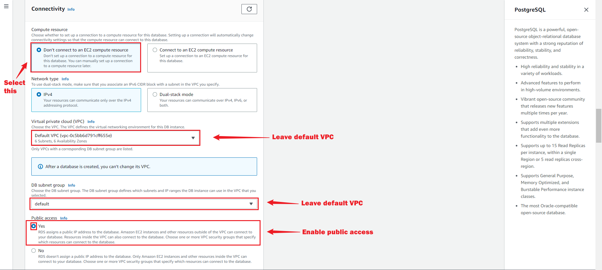

## Prerequisites  
Before creating your PostgreSQL connection, you must have:

- An SQL client
- A running PostgreSQL server
- A database, schema and Table  

## Getting Started 
### Step 1: Setup A PostgreSQL database server in AWS using RDS  

#### Creating an RDS account  
1. Log in to the [AWS Management Console](https://aws.amazon.com/)   

2. Click on the left navigation pane called **services** click on database and select **RDS**.   
   

3. Click on Create database in the Create Database section.  
   

#### Create Database  
Now you have options to select your engine.  

1. Select standard create and choose the PostgreSQL icon.   
   

2. Select the **Free tier** template.   
   

>**Note** Multi-AZ deployment is not available for the free tier, you will have to pay for it. Using a Multi-AZ deployment automatically provisions and maintains a synchronous standby replica in a different Availability Zone.   

##### Settings   
   

- DB Instance Identifier: Type a name unique to the region your DB instance has been set in.  

- Master Username: This is the username that would be used to log in to your DB instance.  

- Master Password: Type a password that takes the given constraints into consideration.  

- Confirm password: Type the password again.   

##### Instance configuration and storage
1. Leave the default Instance configuration.  

2. Select the gp2 storage type, it's efficient and cost effective for our intended use.  

3. Turn off autoscaling to avoid extra cost. Unless your use-case requires it.   
   

##### Connectivity  
1. Leave the default VPC and subnet group.  

2. Enable public access, this allocates an IP to your database instance and allows direct connection to the database from your own device.  
   

3. Select **Create new VPC security group**. This would create a security group that allows connection from the IP address of the device that you are currently using, to the database you created.

4. Leave Database port on 5432   

5. Select the password method of authentication.
   

6. Enable or disable performance insight depending on your database needs. We disabled it for this tutorial.  

7. Set a database name. If you do not provide one, Amazon RDS will not create a database on the instance being created.   
   

8. Set your preferred backup retention period.  

9. Enable or disable backup replication, based on your database needs. We disabled it for this tutorial.  
   

10. Leave Deletion protection unchecked, checking the box prevents you from being able to delete the database.  
   

11. Click on **Create Database**  
   

12. Your DB is now being created.  
   

#### Download an SQL client  
After the database instance is successfully created and its status changes to "available," you will be able to connect to a database on the DB instance through a standard SQL client. To accomplish this, we will download SQL Workbench, which is a popular SQL client, as part of the next step.   

1. Go to the [SQL Workbench website](http://www.sql-workbench.net/downloads.html) and **"click Generic package for all systems including all optional libraries."**  
   

2. Next, click [here](https://jdbc.postgresql.org/) to download the latest JDBC driver from the PostgreSQL website.  
   

3. Click here to select the latest version of the driver.  
   

#### Connect to the PostgreSQL Database  
In this step you would connect to the database you just created, using SQL Workbench.    

###### Pre-Connection steps 
1. Confirm the creation of your database.  
   

2. Click into the database and navigate to security groups.     
   

3. Edit the inbound rule to ensure your current IP is granted access to the database.  
   

###### Connection steps  
1. Take note of your databases' endpoint and port.  
   

2. Install the SQL workbench.   

3. Open the program and a dialog box appears. Fill in the appropriate details.  
   

- **Driver:** The PostgreSQL driver being used is org.postgresql.Driver. To modify the driver definition, select it from the drop-down menu, and when prompted, choose to edit it. In the subsequent dialog box, click on the folder icon to select the driver that was downloaded in the previous step.   

- **URL:** To locate your JDBC URL, refer to the Amazon RDS console and copy your endpoint. After "jdbc:postgresql://", enter or paste the endpoint (including port) of the DB Instance. Then, append a forward slash and the name of your database instance at the end of the URL. As an illustration, the URL may look like this: jdbc:postgresql://rds-postgresql-.cg034hpkmmjt.us-east-1.rds.amazonaws.com/dbname.  

- **Username:** Enter the username that was set up for the Amazon RDS database. In this tutorial, the username is 'jay'.  

- **Password:** Enter the password that was set up for the Amazon RDS database.   

*Click **"Ok" when you're done.*  

- You are now connected to the database.  
   

- You can start creating tables, inserting data and running queries from SQL Workbench.   
   

   

### Step 2: Finish Your Connection in Vanus Cloud  
1. Write a name for your connection, and from the list of sources, choose PostgreSQL CDC.    
   

2. Provide the following credentials: 
- Host 
- Port 
- Username 
- Password 
- Database 
- Schemas 
- Tables   

3. Click next to continue. 

Learn more about Vanus and Vanus Cloud in our [documentation](https://docs.vanus.ai/getting-started/what-is-vanus)