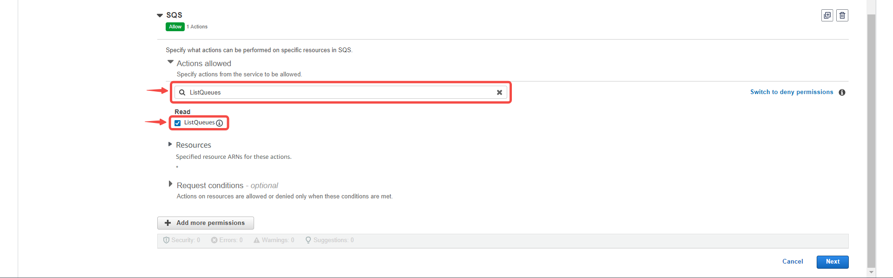
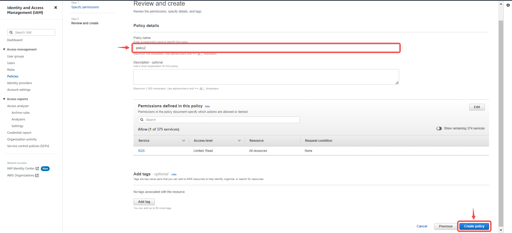
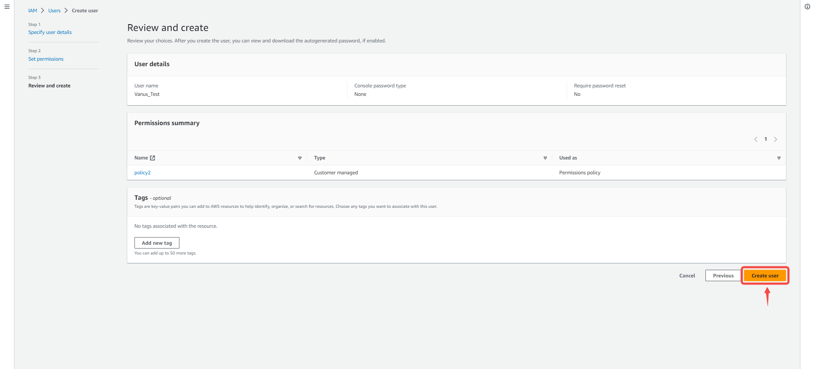
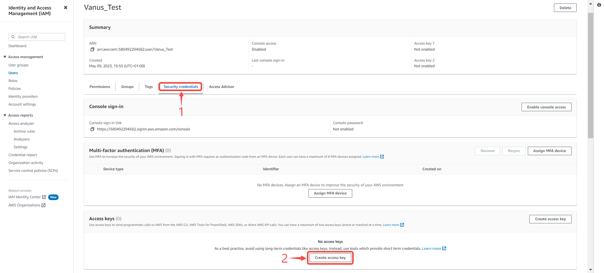
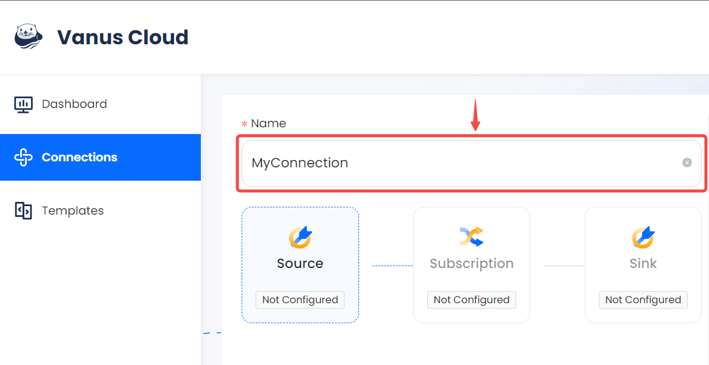
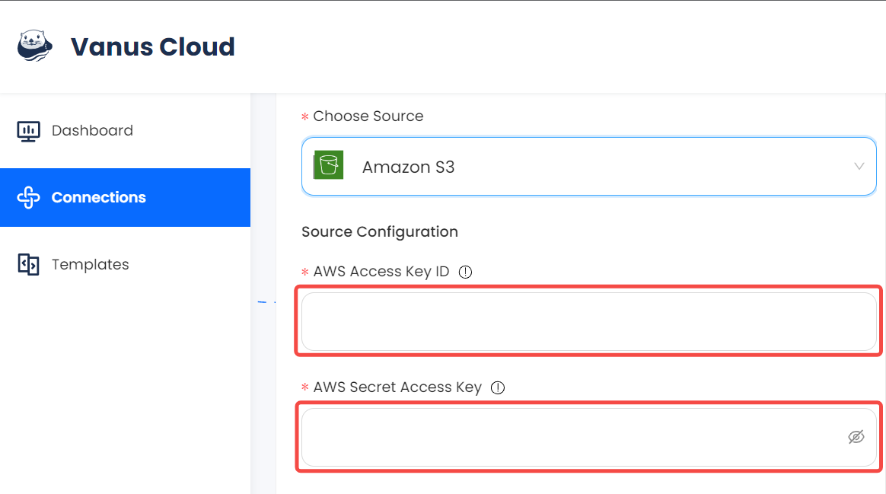
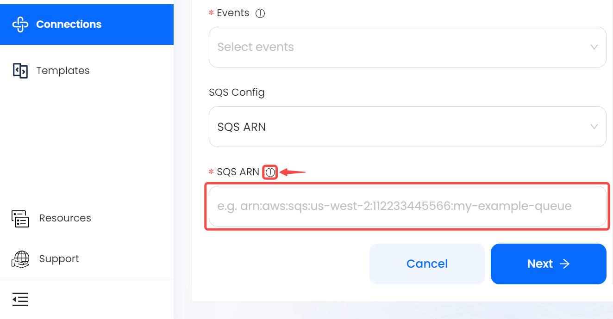

# Pr#
# Prerequisites

Before obtaining S3 events, you must have:
- An AWS Account

---

**Perform the following steps to configure your Amazon S3 Source:**

# Step 1: Create a new AWS user

1. Log in to the AWS [Management Console](https://aws.amazon.com) using your root account credentials.
2. Navigate to the [IAM](https://console.aws.amazon.com/iam/) service by searching for IAM and click the IAM service.
   
3. Click on the **Users tab** in the left navigation menu, and then click the **Add user** button.
   
4. Write the name for your user and click **next**.
   
5. Select **Attach policy directly**, and **Create policy**.
   
6. Search for s3 and select it.
   
7. Next search for the following policy. 
   - PutBucketNotification
   
8. Click **Add more permissions**.

9. Now search for SQS.

10. Next search for the following policies.

    - ListQueues
    - GetQueueUrl
    - ReceiveMessage
    - GetQueueAttributes
    - CreateQueue
    - SetQueueAttributes
    - DeleteMessage
11. Press **Next** and proceed to the next page.

12. Name your policy and click **Create policy**. 
   
13. Return back to your previous `TAB`.
    
14. Search for your custom policy and add it to your account, and press **Next**.
    
15. Review and press **Create user**.
    

---

# Step 2: Create an Create Access Key
1. Now click on the user you just created.
   
2. Under **Security and credential** scroll down the page to `Access Key`, and Click **Create access key**.
   
3. Select Command line interface CLI, and press **Next**.
   
4. Click **Create access key**.
   
5. Save your `Access key` and `Secret key` safely.
   

---

## Step 3: Config your connection

To obtain S3 Bucket events using the S3 source connector in Vanus Cloud, follow these steps:

1. Write a connection name without any spaces.
   
2. Enter your `Access Key` and `Secret Key` in Vanus Cloud.
   
3. Now let go back to AWS under the [Amazon S3 service](https://s3.console.aws.amazon.com/s3/buckets).
   
4. At this point you can either **Create a new bucket** or **select a existent bucket**.

5. Once selected or created go to your bucket property and copy and paste the **ARN** to Vanus Cloud.
   
6. Specify the kind of event you want to receive from the list
   
7. Under SQS config you can choose to create a new SQS by selecting Region or if you already have a SQS provide the ARN.
   
8. Click **Next** and continue the configuration.

---

Learn more about Vanus and Vanus Cloud in our [documentation](https://docs.vanus.ai).
