--- 
hide_table_of_contents: true
hide_title: true
---

### Prerequisites

- An [**Amazon Web Services**](https://aws.amazon.com) account.
- A [**Vanus Cloud Account**](https://cloud.vanus.ai).

---

**Perform the following steps to configure your Amazon S3 Source.**

### Step 1: Create a new AWS user

1. Log in to the AWS [**Management Console**](https://aws.amazon.com) using your root account credentials.

2. Navigate to the [**IAM**](https://console.aws.amazon.com/iam/) service by searching for **IAM**① and click the **IAM**② service.

3. Click on the **Users**③ tab in the left navigation menu, and then click the **Create user**④ button.

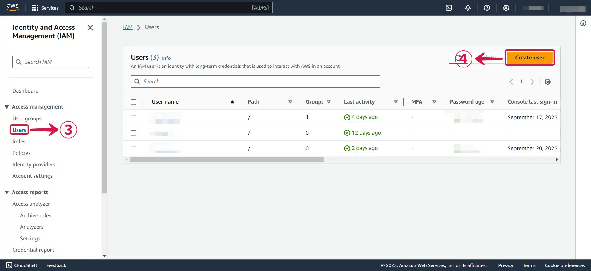

4. Write your **User name**⑤ and click **Next**⑥.

5. Select **Attach policies directly**⑦, and click on **Create policy**⑧.

6. Click on **Choose a service**⑨ to open the dropdown menu.

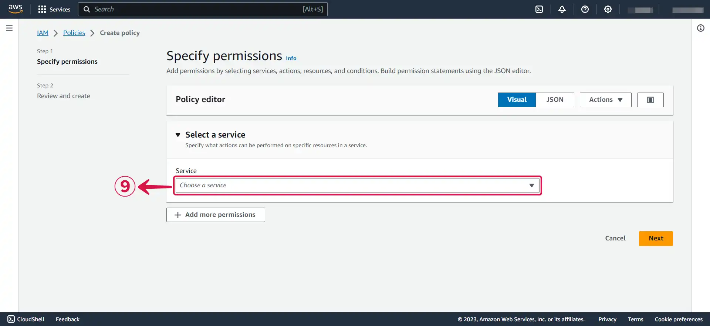

7. **Search**⑩ for s3 and **click on it**⑪.

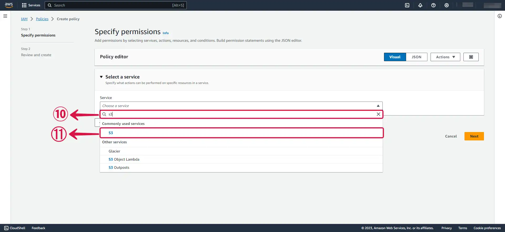

8. Search for the following policy: **PutBucketNotification**⑫, and **tick the box**⑬ to select it.

9. Click **Add more permissions**⑭.

10. Now **search for SQS**⑮ and **click on it**⑯.

11. **Search**⑰ for the following policies.

- ListQueues
- GetQueueUrl
- ReceiveMessage
- GetQueueAttributes
- CreateQueue
- SetQueueAttributes
- DeleteMessage

12. Press **Next**⑱ and proceed to the next page.

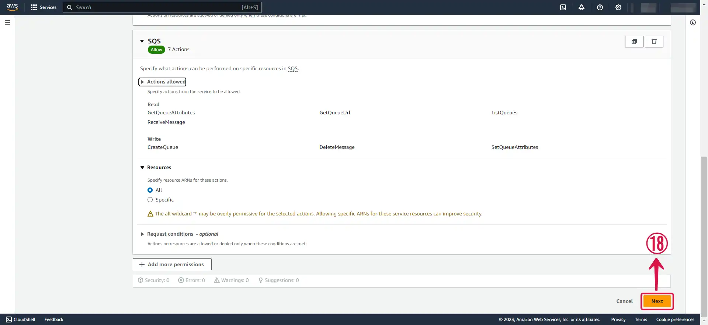

13. **Name**⑲ your policy.

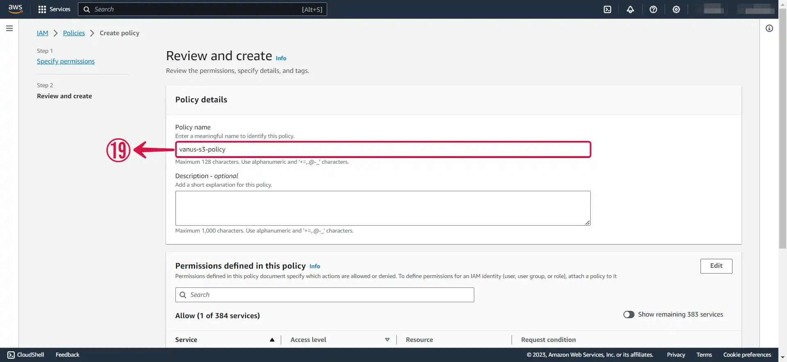

14. Click **Create policy**⑳.

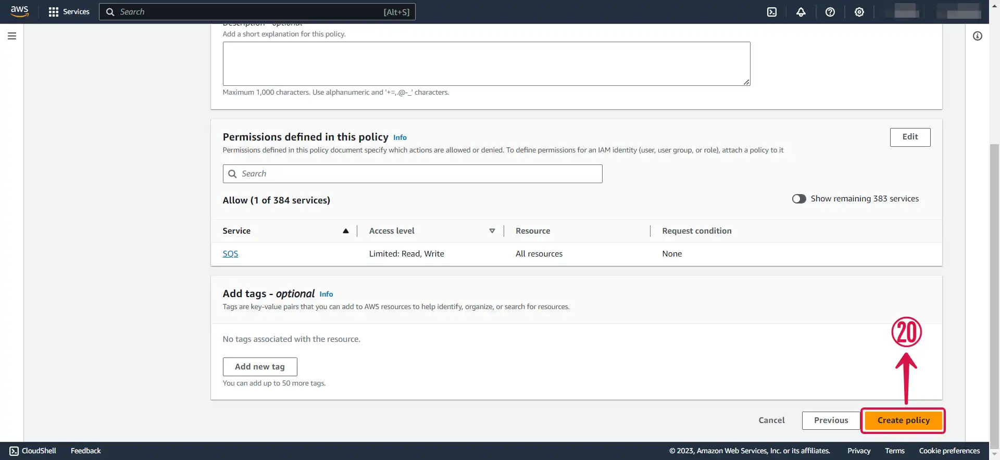

15. Return back to your **previous `TAB`㉑**.

16. **Refresh**㉒ the policy list, **search**㉓ for your custom policy, **check the box**㉔ next to it to add it to your account, and then click on **Next**㉕.

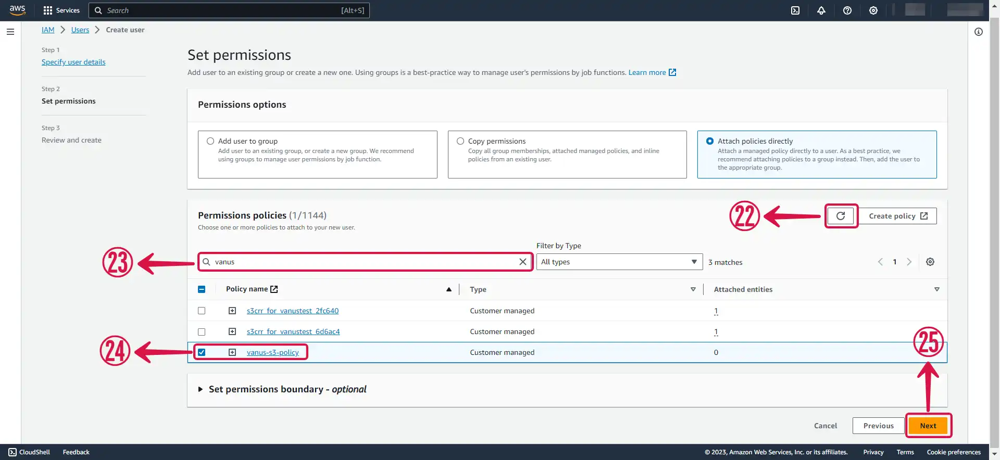

17. Review and press **Create user**㉖.

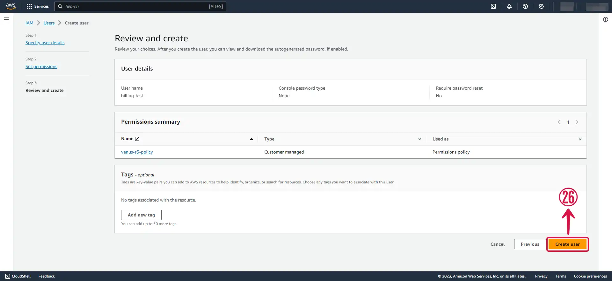

---

### Step 2: Create an Access key and Secret access Key

1. Now click on the **user**① you just created.

2. Under **Security credentials**② scroll down the page to `Access Keys`, and Click **Create access key**③.

3. Select **Command Line Interface (CLI)④**, tick the **Confirmation box**⑤ and click **Next**⑥.

4. Click **Create access key**⑦.

5. Download your **`Access key`** and **`Secret access key`** by clicking the **Download .csv file**⑧ button, and then click **Done**⑨.

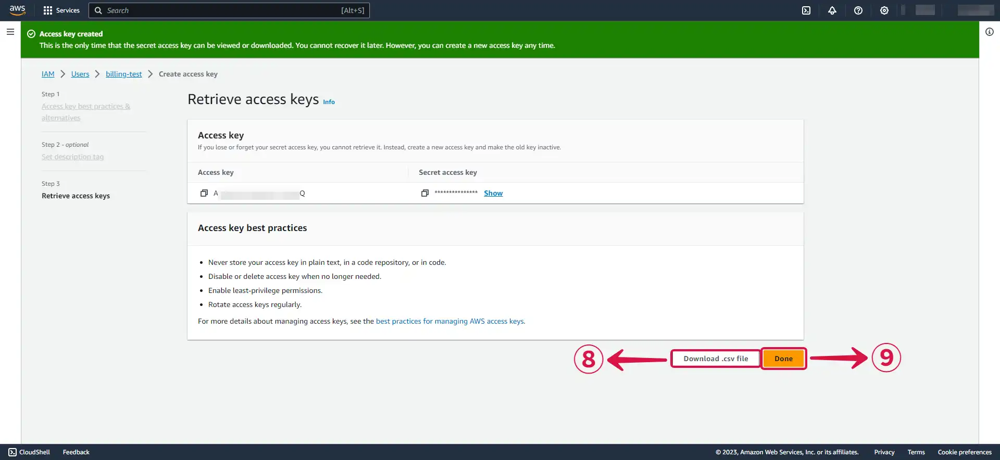

---

### Step 3: Amazon S3 Connection Settings

1. Write a **Name**① for your connection in Vanus Connect.

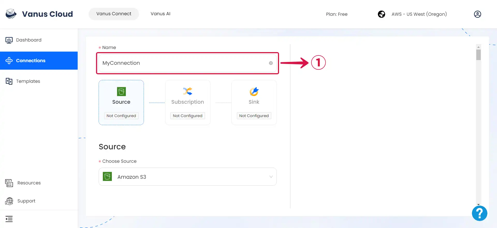

2. Enter your **`Access Key`②** and **`Secret access Key`③** in Vanus Connect.

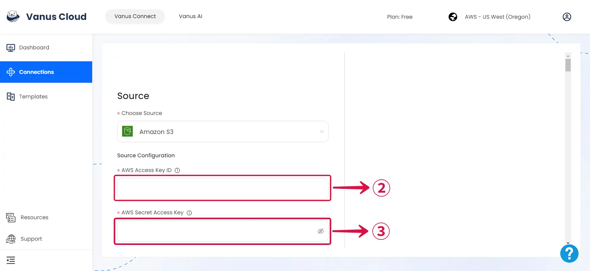

3. Navigate to the [**Amazon S3 service**](https://s3.console.aws.amazon.com/s3/buckets).

:::note
At this point, you can either Create a new bucket or select an existing bucket.
:::

4. Create a new bucket by clicking the **Create bucket**④ button.

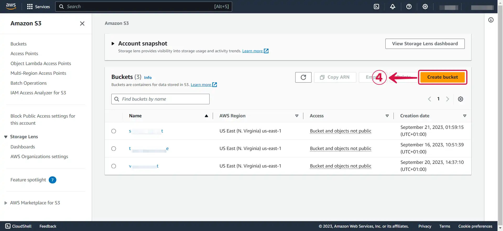

5. Specify a **Bucket name**⑤ and select your desired **AWS Region**⑥.

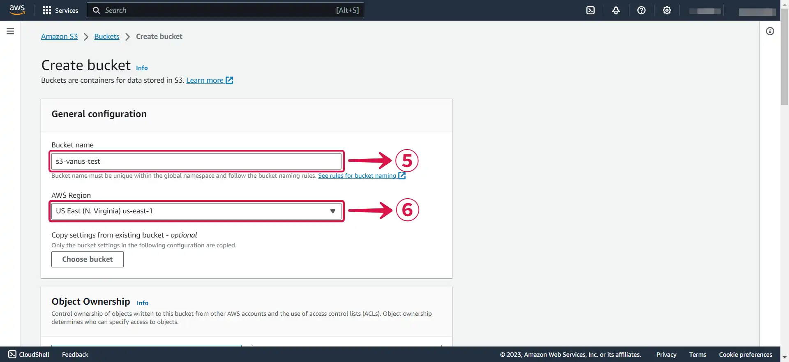

6. Click on **Create bucket**⑦ to finish creating your bucket.

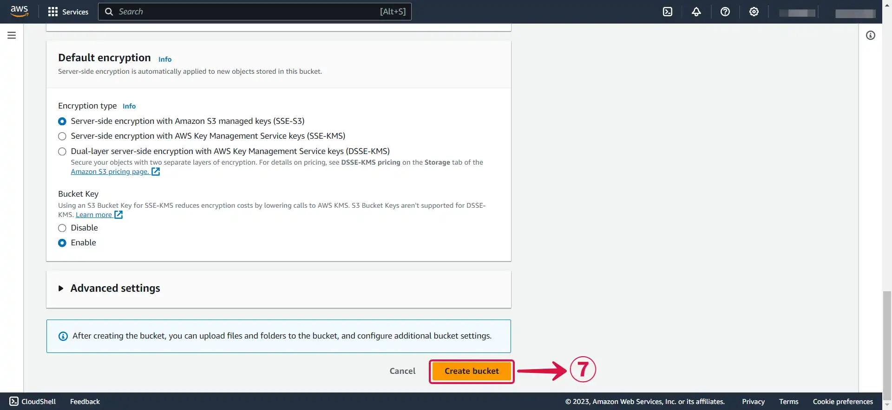

7. Once selected or created, click on the **bucket name**⑧.

8. Go to your bucket **Properties**⑨ and copy the **ARN**⑩.

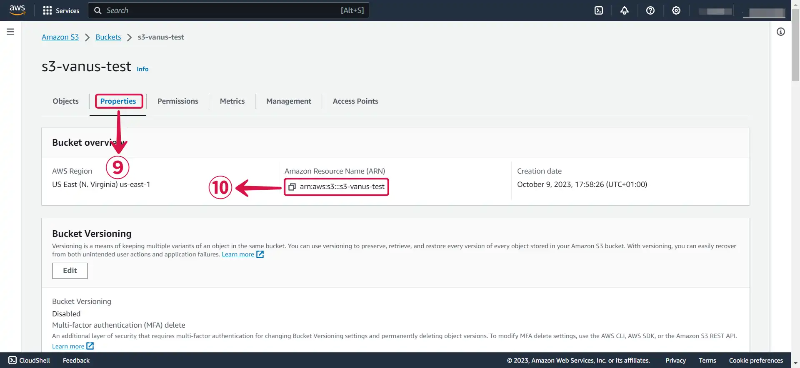

9. Paste your **Bucket ARN**⑪ into vanus connect, Specify the kind of **Events**⑫ you want to receive from the list.

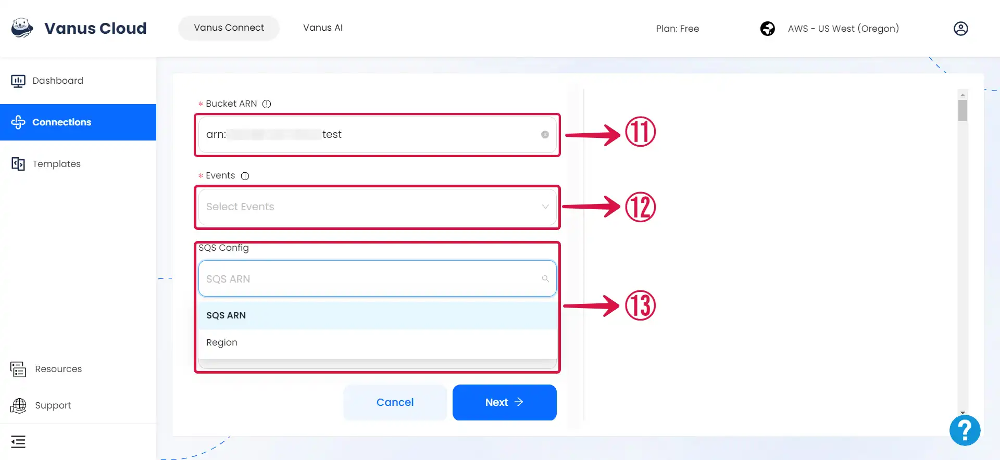

:::note
Under **SQS config**⑬, you can choose to create a new SQS by selecting region, or if you already have an SQS, provide the ARN.
:::

10. Set your desired **SQS Region**⑭ and click **Next**⑮ to continue the configuration.

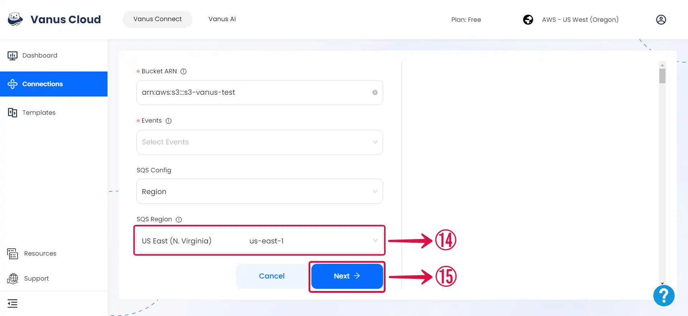

---

Learn more about Vanus and Vanus Connect in our [**documentation**](https://docs.vanus.ai).
