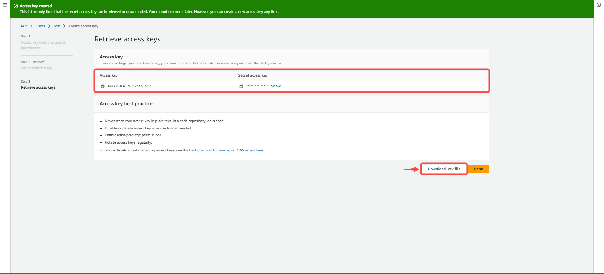

--- 
hide_table_of_contents: true
hide_title: true
---

### Prerequisites

- An [AWS Account](https://aws.amazon.com) 

---

**Perform the following steps to configure your Amazon SNS Source**

### Step 1: Create a new AWS user 

Create a new user and set the proper IAM policy. 

#### Create a user 

1. Log in to the [AWS Management Console](https://aws.amazon.com/) using your root account credentials. 

2. Navigate to the IAM service by typing **IAM** in the search bar and selecting it from the drop down menu. 
  

3. Click on the Users tab in the left navigation menu. 
  

4. Click on the **Add users** button. 
  

5. Write the name of your user and click **Next**. 
  

6. Select **attach policies directly**. 
  

7. Search for **AmazonSNS**; select `AmazonSNSFullAccess` and click **next** 
  

8. Review and click on **Create user**. 
  

#### Create Access Key 

1. click on the user you just created. 
  

2. Click on **Security credentials** and **Create access key**. 
  

3. Select Command line interface (CLI), accept recommendations and click **Next**. 
  

4. Click on **Create access key**.  
  

5. Copy your **access key** and **secret access key** and keep them safe. Additionally, you can click on **Download.csv file** to download the file containing your credentials as a backup in case you misplace or lose the copied keys. 
 

6. Click on **Done**

7. Your Access Key has been created and is active.  
  

---

### Step 2: Create an SNS topic 

1. Navigate to the **Simple Notification Service** page by typing **SNS** in the search bar and selecting it from the drop down menu. 
  

2. Click on **Topics**. 
  

3. Click on **Create topic**. 
  

4. Select topic type, name your topic, and select a display name for the topic. 
  

5. Leave the other settings on default and click **Create topic**. 
  

6. Copy your SNS topic ARN, it would be needed when creating your connection in Vanus. 
  

---

### Step 3: Amazon SNS Connection Settings 

1. Write a connection name without any spaces.  
  

2. Enter your Access Key ID, Secret Access key, SNS ARN and click **Next** to continue the configuration.  
  

---

Learn more about Vanus and Vanus Cloud in our [documentation](https://docs.vanus.ai).
