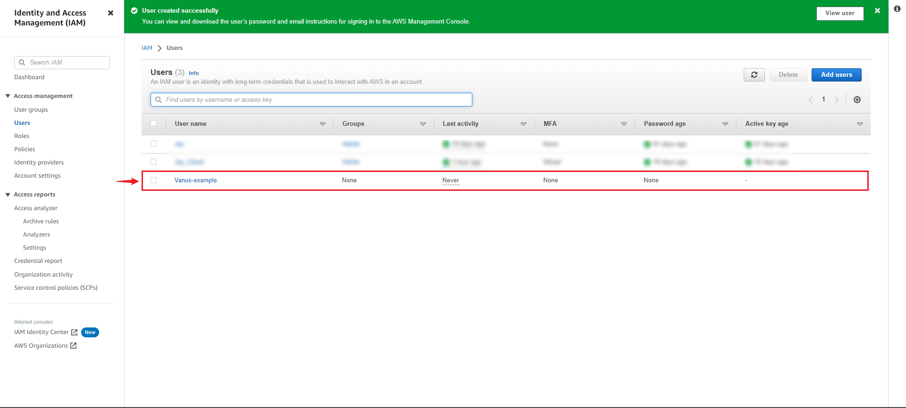

#
# Prerequisites

Before obtaining SNS events, you must have:

- Have an AWS SNS Topic.
- AWS IAM Access Key.
- AWS permissions for the IAM user:
  - sns:Subscribe
  - sns:ConfirmSubscription
  - sns:Unsubscribe

---

**Perform the following steps to configure your Amazon SNS Source:**

## Step 1: Create a New AWS User

1. Log in to the AWS [Management Console](https://aws.amazon.com) using your root account credentials.
2. Navigate to the [IAM](https://console.aws.amazon.com/iam/) service by clicking on the Services menu and selecting IAM.
   
3. Click on the **Users tab** in the left navigation menu, and then click the **Add user** button.
   
4. Write the name for your user and click **next**. 

5. Select **attach policy directly**, and **Create policy**.
   
6. Select the Service `Cost Explore Service` and search for the following policy.
    - "PutObject",
    - "GetObject",
    - "GetObjectVersion",
    - "DeleteObject",
    - "DeleteObjectVersion"
   
7. Press **next** and proceed to the next page, name your policy and click **create policy**.
8. Return back to your previous `TAB`.
9. Search for your custom policy and add it to your account, and press **next**.
   
10. Review and press **create user**.

---

## Step 2: Create an Create Access Key

1. Now click on the user you just created.
   
2. Under **Security and credential** scroll down the page to `Access Key`, and Click **Create access key**.
   
3. Select Command line interface CLI, and press **next**.
   
4. Save your access key and secret key safely.
   

---

## Step 3: Config your Connection

1. Write a connection name without any spaces.
   
2. Enter the following credentials:

   - Port
   - Access Key ID
   - Secret Access Key
   - SNS ARN
   - Endpoint
   - Protocol

     

3. To get **SNS ARN**, **Endpoint** and **Protocol**, let's go back to our Amazon Web Services Account. 

4. To obtain the **SNS ARN**, Search for **SNS** and Click on it to open the SNS Console. 
 

5. Click on **topics** 

5. Click on the **Create Topic** Button. 

6. Select the type as **FIFO** and name the Topic. Scroll down and click the **Create topic** button to create a Topic. 

6. Copy the **SNS ARN** and paste on the field in Vanus Cloud and click **Next** to continue.  

---

Learn more about Vanus and Vanus Cloud in our [documentation](https://docs.vanus.ai).
