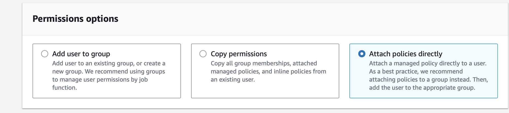

## Prerequisites

Before obtaining SQS events, you must have:

- Have an AWS SQS Queue.
- AWS IAM Access Key.
- AWS permissions for the IAM user:
  - sqs:GetQueueUrl
  - sqs:ReceiveMessage
  - sqs:DeleteMessage

## Getting Started

### Step 1: Create a new AWS user

Create a new user and set the proper IAM policy.

1. Log in to the AWS Management Console using your root account credentials.
2. Navigate to the IAM service by clicking on the Services menu and selecting IAM.
   
3. Click on the Users tab in the left navigation menu, and then click the Add user button.
   
4. Write the name for your user and click next.
5. Select attach policy directly, and Create policy.
   
6. Search for the Service `sqs` and select `AmazonSQSFullAccess`
   
7. Press next and review.
8. Review and press create user.
9. Now click on the user you just created.
10. Go to `Access Key` Click Create access key.
    
11. Select Command line interface CLI, and press next.
12. Save your access key and secret key safely.
    

### Step 2: Config your connection

To obtain Amazon SQS events using the SQS source connector in Vanus Cloud, follow these steps:

1. Write a connection name without any spaces.  
   
2. Enter your Access Key and Secret Key in Vanus Cloud.  
   
3. Click next to continue.  

Learn more about Vanus and Vanus Cloud in our [documentation](https://docs.vanus.ai).
