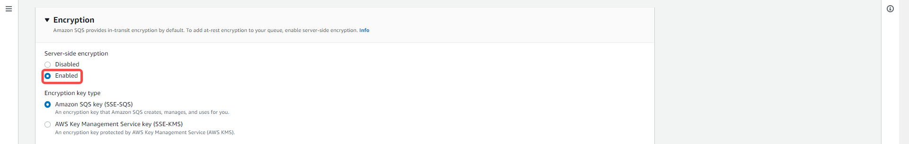

--- 
hide_table_of_contents: true
hide_title: true
---

## Prerequisites

- An [AWS Account](https://aws.amazon.com) 
- An AWS SQS Queue 
- AWS IAM Access Key 
- AWS permission for the IAM user: 
  - AmazonSQSFullAccess

---

**Perform the following steps to configure your Amazon SQS Source**

## Step 1: Create a new AWS user 

Create a new user and set the proper IAM policy. 

### Create a user 

1. Log in to the [AWS Management Console](https://aws.amazon.com/) using your root account credentials. 

2. Navigate to the IAM service by typing **IAM** in the search bar and selecting it from the drop down menu. 
  

3. Click on the Users tab in the left navigation menu. 
  

4. Click on the **Add users** button. 
  

5. Write the name of your user and click **Next**. 
  

6. Select **attach policies directly**. 
  

7. Search for `AmazonSQSFullAccess`, select it and click **next** 
  

8. Review and click on **Create user**. 
  

### Create Access Key 

1. click on the user you just created. 
  

2. Click on **Security credentials**. 
  

3. Click on **Create access key**. 
  

4. Select Command line interface (CLI), accept recommendations and click **Next**. 
  

5. Click on **Create access key**.  
  

6. Copy your **access key** and **secret access key** and keep them safe. Additionally, you can click on **Download.csv file** to download the file containing your credentials as a backup in case you misplace or lose the copied keys. 
  

7. Click on **Done**. 

8. Your Access Key has been created and is active.  
  

---

## Step 2: Create an SQS Queue on AWS 

1. Navigate to the **Simple Queue Service** page by typing **SQS** in the search bar and selecting it from the drop down menu. 
  

2. Click on **Create queue**. 
  

3. Select the type of queue you want to create and name your queue. 
  

4. Leave the configuration on default setting, or change them to suit your needs. 
  

- **Visibility timeout:** This is a setting that determines how long a message received from a queue will remain hidden from other consumers. When a message is received from an Amazon SQS queue by a consumer, the visibility timeout starts. If the consumer fails to process and delete the message before the visibility timeout expires, the message becomes visible to other consumers. 

- **Message retention period:** This refers to the length of time a message is kept in a queue if it is not deleted. Messages that exceed the maximum message retention period are automatically deleted by Amazon SQS. 

- **Delivery Delay:** This determines the amount of time before the first delivery of each message added to the queue. During the delay period, any messages sent to the queue are not visible to consumers. 

- **Receive message wait time:** This refers to the maximum duration that polling will wait for messages to become available for receiving. 

5. Enable encryption and select your preferred encryption key type. 
  

6. Choose your preferred Access Policy method, define who can send messages to the queue, and define who can receive messages from the queue.  
  

7. Click on **Create queue**.  
  

8. Copy your SQS Arn, it would be needed when creating your connection in Vanus. 
  

---

## Step 3: Amazon SQS Connection Settings   

1. Write a connection name without any spaces.  
  

2. Enter your Access Key ID, Secret Access key, SQS ARN and click **Next** to continue the configuration.  
  

---

Learn more about Vanus and Vanus Cloud in our [documentation](https://docs.vanus.ai).
