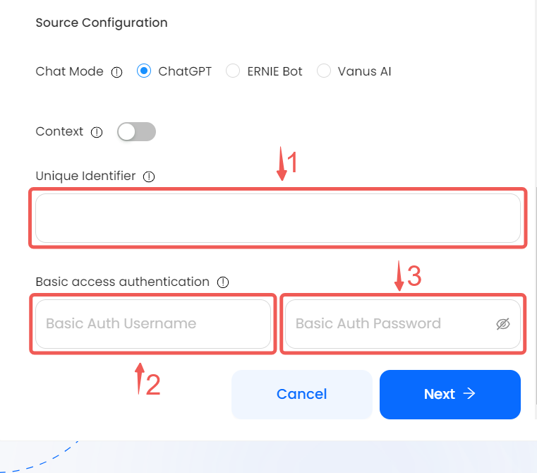
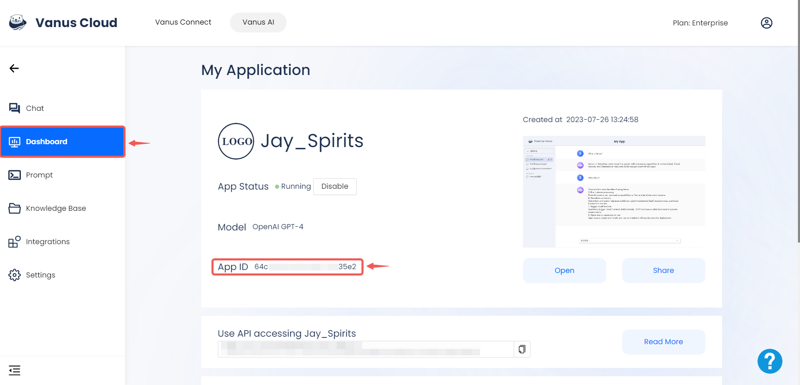
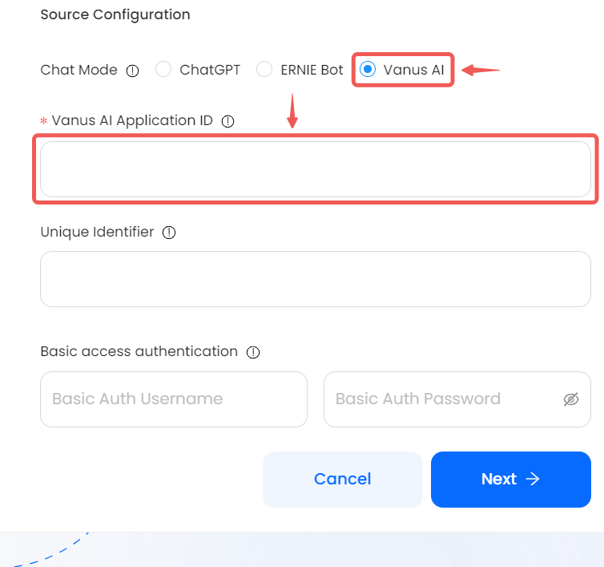

--- 
hide_table_of_contents: true
hide_title: true
---

### Prerequisites

- Have the ability to send HTTP requests.

---

**Perform the following steps to configure your ChatAI Source.**

### ChatAI Connection Settings

1. Write a name for your connection in Vanus Connect.
    

2. After creating the connection, there are a few more steps. Click the link to open a new page with all the details on how to complete the connection. 

     

3. Fill in the various required configurations
    - **Chat Mode:** Select Chat Mode (ChatGPT, Ernie Bot or Vanus AI); default is ChatGPT.

    - **Context (optional):** set Context to on if you would like for ChatGPT to remember previous messages.

    - **Unique Identifier (optional):** The unique identifier differentiates among multiple conversations using the same Connection. Example identifier: conv1 identifier: conv2, etc.

    - **Basic Auth Username (optional):** A method for a HTTP user agent to provide a username when making a request.

    - **Basic Auth Password (optional):** A method for a HTTP user agent to provide a password when making a request.  
      

   :::Note
   By choosing "Vanus AI," you can harness the power of your custom AI application within the Vanus AI platform, utilizing its extensive knowledge to enhance your chat experience.
   :::

   - Head to the Vanus AI's platform dashboard and copy your app ID.
    

   - paste your app id in the provided field.
    

4. Fill in the remaining essential configuration details and then proceed by clicking **Next**.

---

Learn more about Vanus and Vanus Connect in our [documentation](https://docs.vanus.ai).
