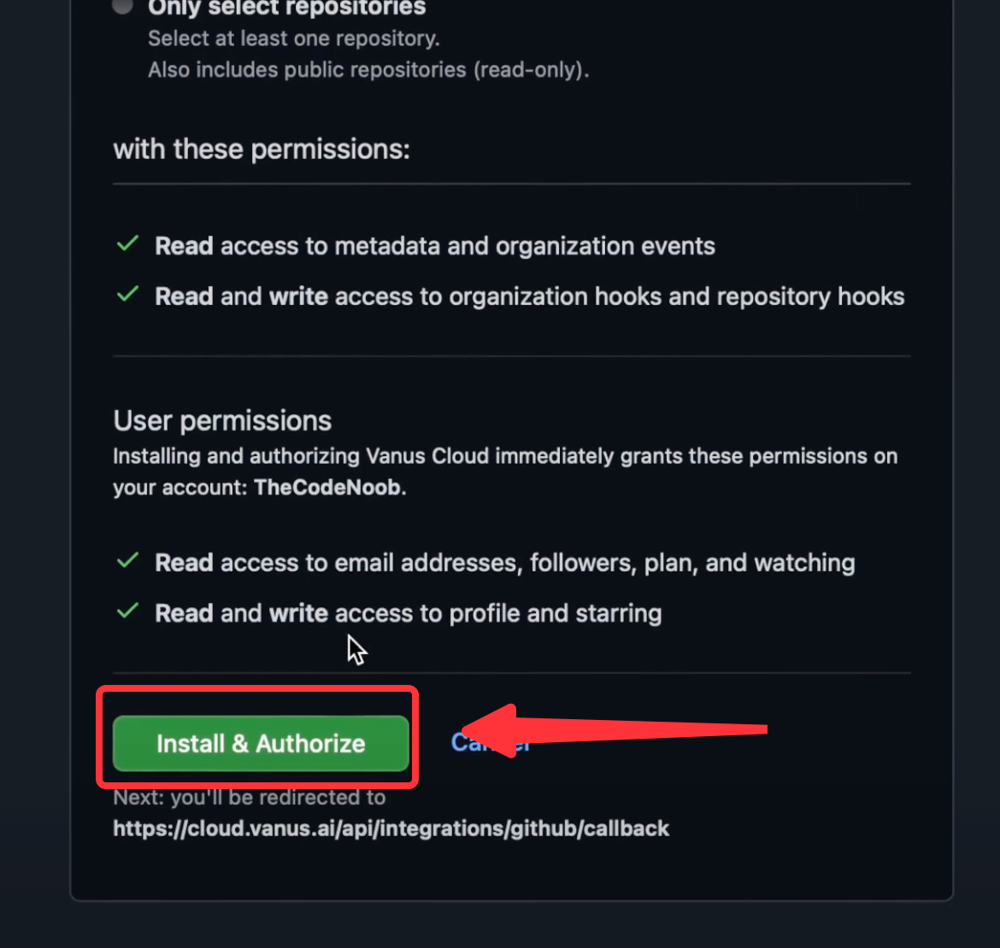

## Prerequisites

- GitHub Account with proper permissions(`Admin` or `Owner`) to your repository
- GitHub Repositories

## Getting Started

1. Write a connection name without any spaces.
   
2. Click `Authorize` to authorize to your GitHub account.

3. Configure Vanus cloud with your account.

4. **Install and Authorize** Vanus to read repos and create webhooks.

5. Select a repository to connect and click **`Next`** to save the GitHub Source.

Learn more about Vanus and Vanus Cloud in our [documentation](https://docs.vanus.ai).
