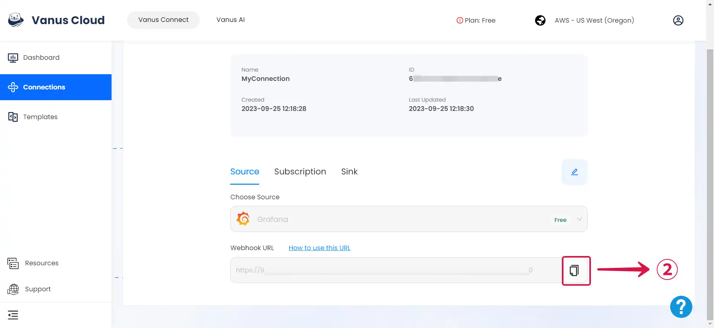

--- 
hide_table_of_contents: true
hide_title: true
---

### Prerequisites

- A [**Vanus Cloud account**](https://cloud.vanus.ai)
- A Grafana instance or an [**account in the Grafana cloud**](https://grafana.com/)

---

**Perform the following steps to configure your Grafana Source.**

### Grafana Connection Settings

1. Write a **Name**① for your connection in Vanus Connect.

2. After creating the connection, there are a few more steps. Simply click the **document**② link to open a new page with all the details on how to complete the connection.

3. Click **Next**③ and continue the configuration.

### Configuring Grafana to send Events

1. Click on your **created connection**①.

2. Click the **copy**② icon to copy the Webhook URL.

3. Log in to your [**Grafana Account**](https://grafana.com).

4. Click on the **hamburger button**③, navigate to **Alerts & IRM**④, and select **Alerting**⑤.

5. Select **Contact points**⑥, and click on **Add contact point**⑦.

6. **Name**⑧ your contact point, click on integration and select **webhook**⑨, provide the payload **URL**⑩ from Vanus Connect, and **Save contact point**⑪.

---

Learn more about Vanus and Vanus Connect in our [**documentation**](https://docs.vanus.ai).
