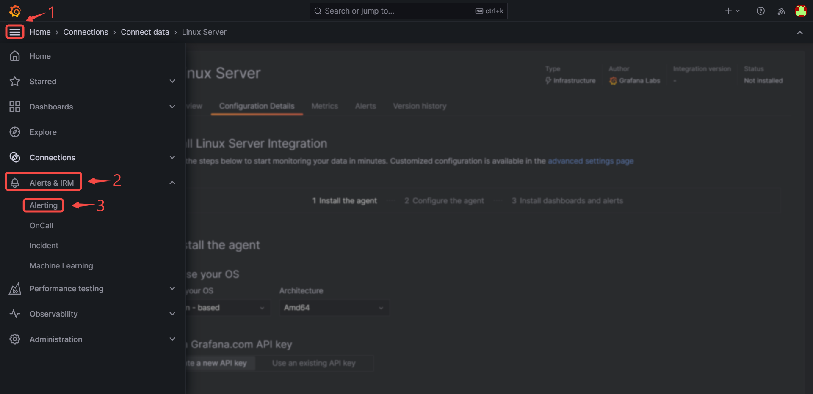

# Prerequisites

- A Grafana instance or an account in Grafana cloud

# Getting Started

Perform the following steps to configure your Grafana Source:

## Create a Connection

1.  Write a name for your connection.
   
2. From the list of sources, choose **Grafana**.

3. After you finish creating the connection, there will be more steps. Please click the link to open a new tab with the following instruction. 
   
4. Click **`Next`** to save the Grafana Source. 

# **Configuring Grafana to send Events**

1. Click the copy icon to copy the Webhook URL.
   
2. Log in to your [Grafana](https://grafana.com) account.
3. Navigate to the **Alert & IRM** menu in the **Menu** Tab, and click on **Alerting**.

4. Click on the **Contact Points**, and click on **Add contact point**.

5. Name your contact point, click on integration, select webhook, provide the payload URL from Vanus Cloud, and **Save contact point**.

Learn more about Vanus and Vanus Cloud in our [documentation](https://docs.vanus.ai).
