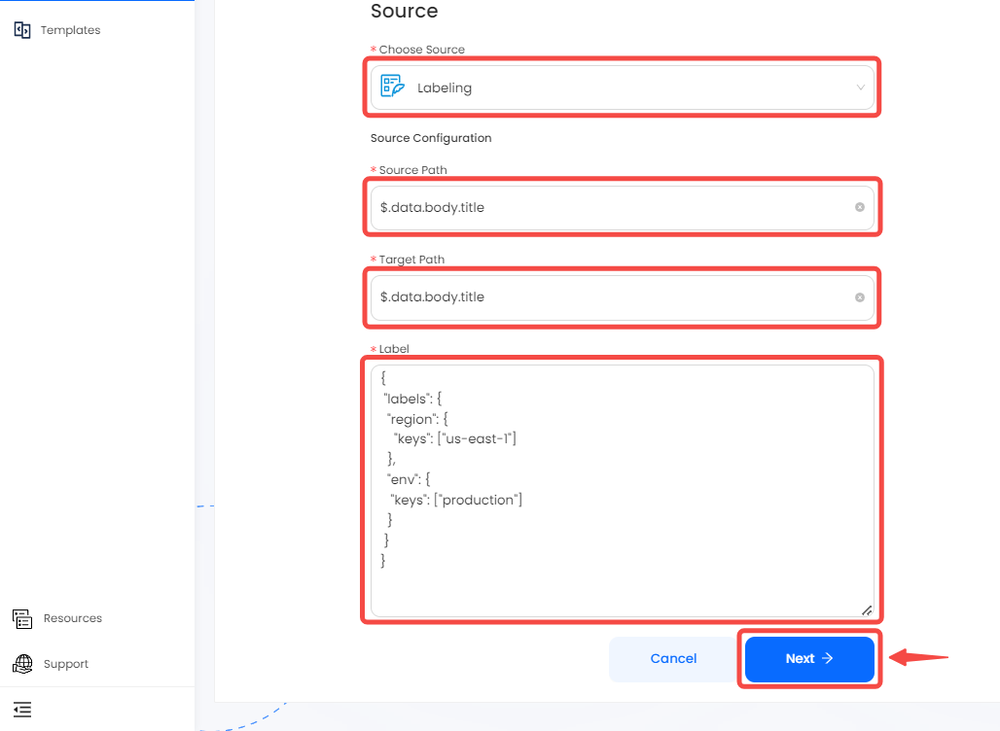

--- 
hide_table_of_contents: true
hide_title: true
---

## Prerequisites

- Have a CloudEvents HTTP client.

---

**Perform the following steps to configure your labeling Source:**

## Create your connection in Vanus Cloud


1. Insert the following:
    - **Source Path:** A Source path refers to a field in body to label.
    - **Target Path:** A Target path refers to a field in body where the output is placed. The output is a list of labels.
    
**Example of a Path**

A JSON path would be structure in this format; `$.data.body.title`

In this example, the JSON path specifies the location of the title attribute within the body object of a CloudEvent's data attribute. The path consists of several components, separated by the dot (.) operator:

- `$`: The root object of the JSON document.
- `data`: The key of a property within the root object.
- `body`: The key of a property within the data object.
- `title`: The key of a property within the body object.
By following this path, you can access the value of the title attribute within the body object of a CloudEvent's data attribute.

    - Label: The config of label, an example as below:
    ```json
    {
        "label1": {
            "keys": ["key1", "key2"]
        },
        "label2": {
            "keys": ["key3", "key4", "key5"]
        }
    }
    ```
    If "key1" or "key2" is present in the field of `Source Path`, the `Target Path` will have "label1".
    If "key3" or "key4" or "key5" is present in the field of `Source Path`, the `Target Path` will have "label2".
    
    

2. There will be more steps Once you finish creating the connection. Click on the link to open a new page with the details on completing the connection.
   

3. Click **Next** and continue the configuration.

---

Learn more about Vanus and Vanus Cloud in our [documentation](https://docs.vanus.ai).
