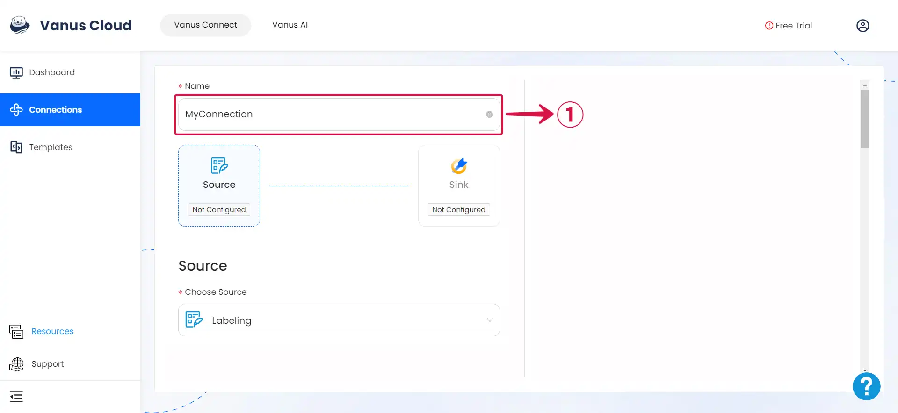

--- 
hide_table_of_contents: true
hide_title: true
---

### Prerequisites

- Have a HTTP client
- A [**Vanus Cloud account**](https://cloud.vanus.ai)

---

**Perform the following steps to configure your labeling Source.**

### Labeling Connection Settings

1. Write a **Name**① for your connection in Vanus Connect.



2. Insert the following:

- **Source Path②:** A Source path refers to a field in the body for labeling.
- **Target Path③:** A Target path refers to a field in the body where the output, which is a list of labels, is placed.


**Example of a Path**

A JSON path is structured in this format: `$.data.body.title`.

In this example, the JSON path designates the location of the title attribute within the body object of a CloudEvent's data attribute. The path comprises multiple components, which are separated by the dot (.) operator:

- `$`: Represents the root object of the JSON document.
- `data`: Refers to the key of a property within the root object.
- `body`: Signifies the key of a property within the data object.
- `title`: Indicates the key of a property within the body object.

By following this path, you can retrieve the value of the title attribute within the body object of a CloudEvent's data attribute.

- Label: The label configuration is defined as shown in the example below:

```json
{
    "label1": {
        "keys": ["key1", "key2"]
    },
    "label2": {
        "keys": ["key3", "key4", "key5"]
    }
}
```

If either "key1" or "key2" is found in the field specified by the `Source Path`, the `Target Path` will be set to "label1." Similarly, if "key3," "key4," or "key5" is detected in the `Source Path` field, the `Target Path` will be assigned the value "label2."

3. Input your **Label**④  and then click **Next**⑤ to complete the setup.


---

Learn more about Vanus and Vanus Connect in our [**documentation**](https://docs.vanus.ai).
