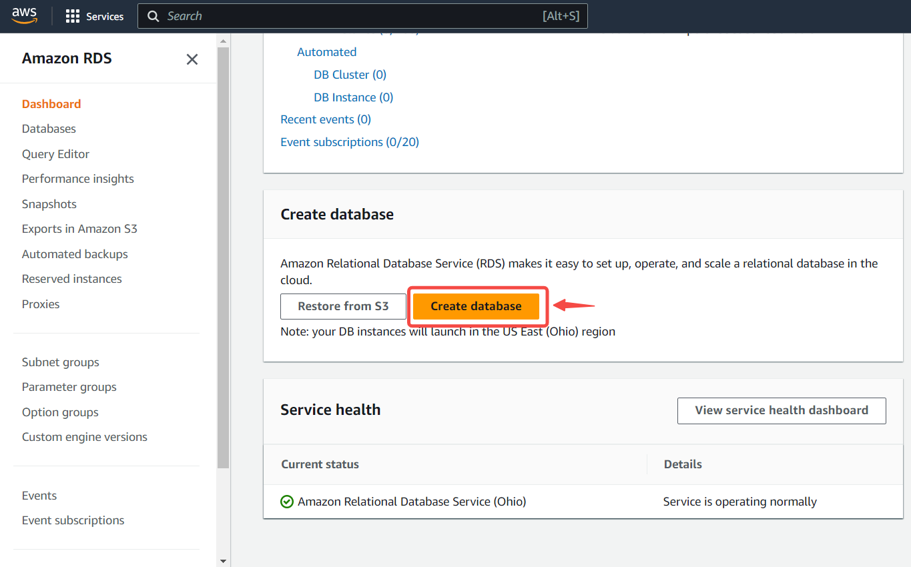
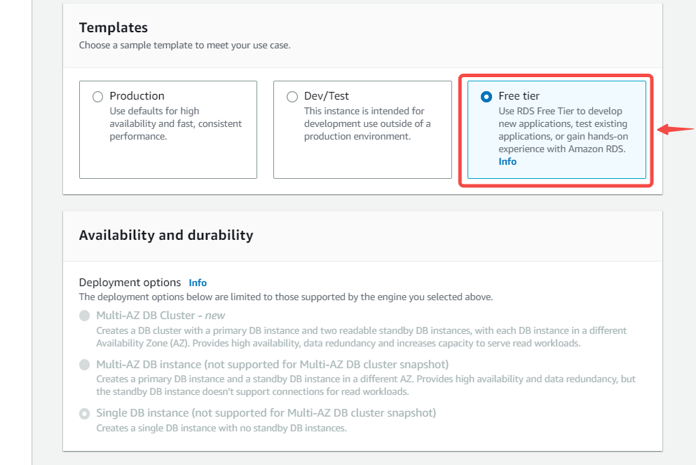
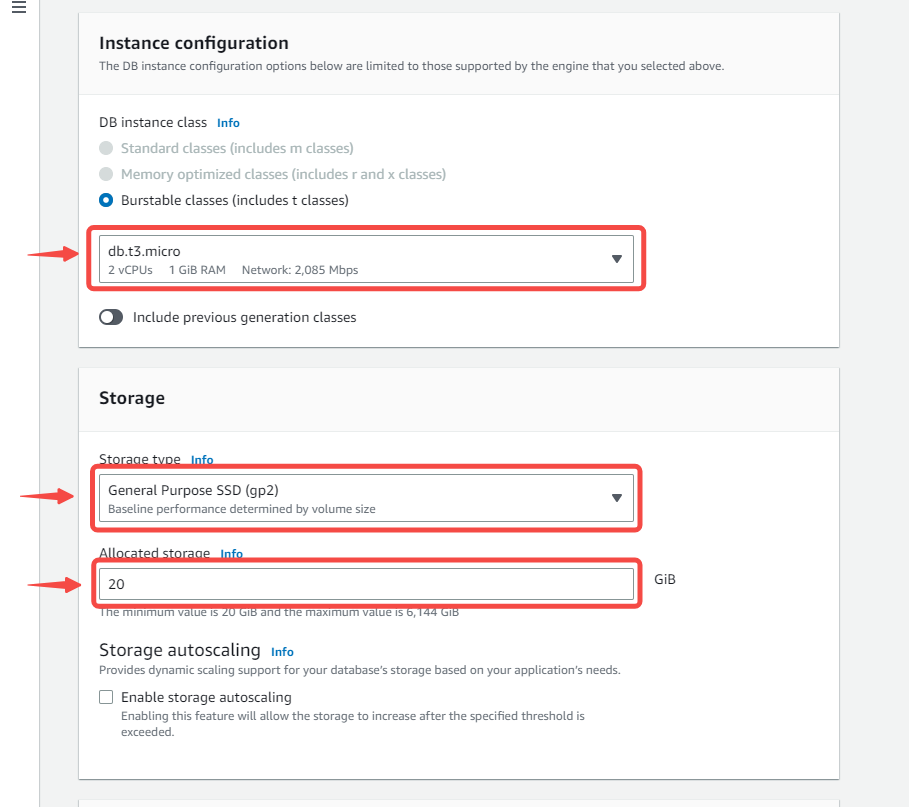
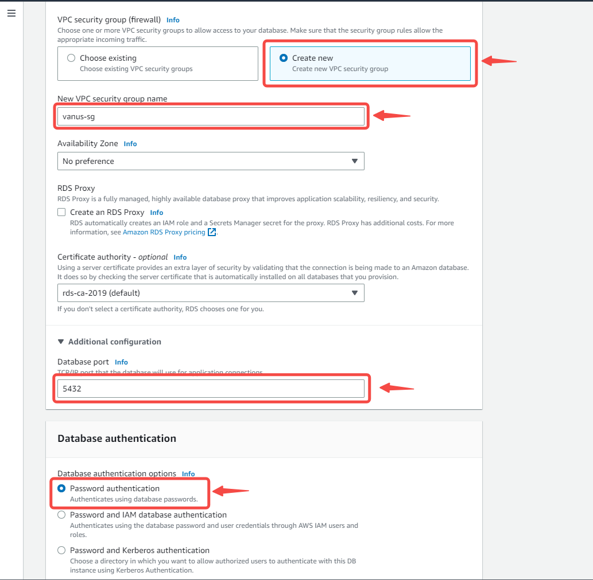
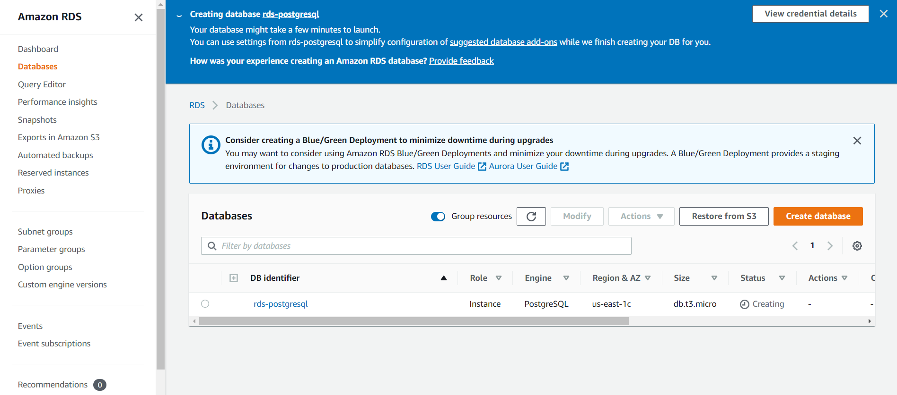

--- 
hide_table_of_contents: true
hide_title: true
---

### Prerequisites

- An SQL client
- A running PostgreSQL server
- A database, schema and Table

---

**Perform the following steps to configure your Amazon RDS PostgreSQL Source.**

### Step 1: Setup PostgreSQL Server in AWS (Optional)

1. Log in to the [AWS Management Console](https://aws.amazon.com/).  

2. Navigate to the [RDS](https://console.aws.amazon.com/rds/) service by searching for RDS and clicking the **RDS service**. 

3. Click on **Create database** in the Create Database section.  

4. Select standard create and choose the PostgreSQL icon.   
   

5. Select a tier template that suits your needs.   
  

:::note
Multi-AZ deployment is only available for paid tier. A Multi-AZ deployment automatically provisions and maintains a synchronous standby replica in a different Availability Zone.
:::

6. 
    - DB Instance Identifier: Type a name unique to the region your DB instance has been set in.  

    - Master Username: This is the username that you will use to log in to your DB instance.  

    - Master Password: Type a password that takes the given constraints into consideration.  

    - Confirm password: Type the password again.   
       

7. 
    - Leave the default Instance configuration.  

    - Select the GP2 storage type. It's efficient and cost-effective for our intended use.  

    - Turn off autoscaling to avoid extra costs. Unless your use case requires it.   
    

8. 
    - Leave the default VPC and subnet group.  

    - Enable public access. This allocates an IP to your database instance and allows direct connection to the database from your own device.  
       

9. 
   - Your DB is in the process of being created. This will take a few minutes, so move on to the next step while waiting.

   - Leave the database port on 5432

   - Select the password method of authentication.
      

10. 
    - Enable or disable performance insight depending on your database needs. We disabled it for this tutorial.  

    - Set a database name. If you do not provide one, Amazon RDS will not create a database on the instance being created.   
       

11. 
    - Set your preferred backup retention period.  

    - Enable or disable backup replication, based on your database needs. 
       

12. Leave Deletion protection unchecked; checking the box prevents you from being able to delete the database.  
   

13. Click on **Create Database**  

14. Your DB is in the process of being created. This will take a few minutes, so move on to the next step while waiting.

  

---

### Step 2: PostgresSQL Connection Settings
1. Write a name for your connection in Vanus Cloud.

2. Provide the following credentials: 

- Host 
- Port 
- Username 
- Password 
- Database 
- Schemas 
- Tables   

3. Click **Next** and continue the configuration.

---

Learn more about Vanus and Vanus Cloud in our [documentation](https://docs.vanus.ai/getting-started/what-is-vanus).