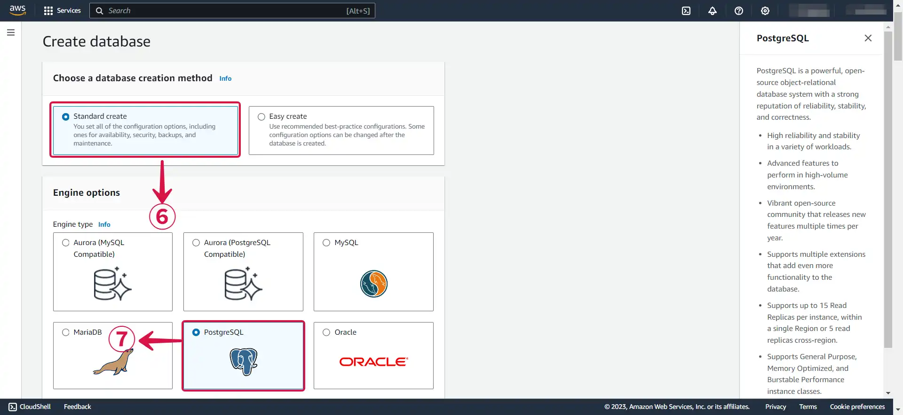
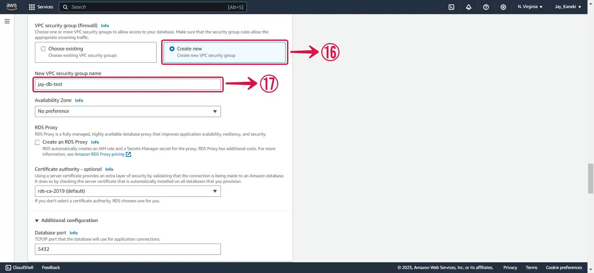
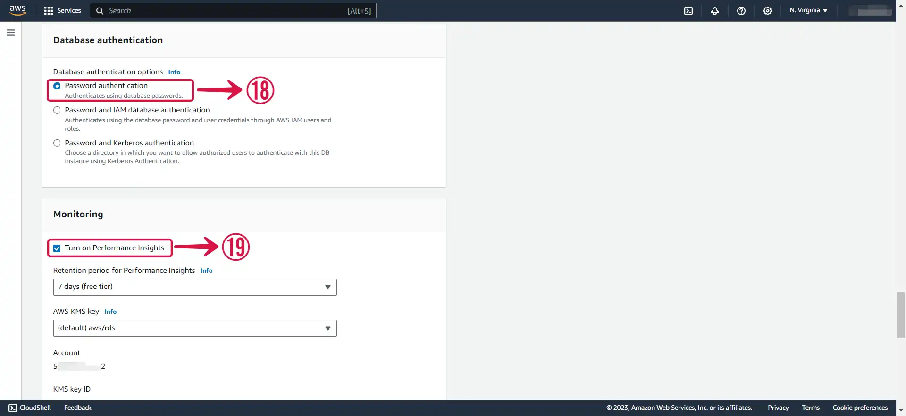
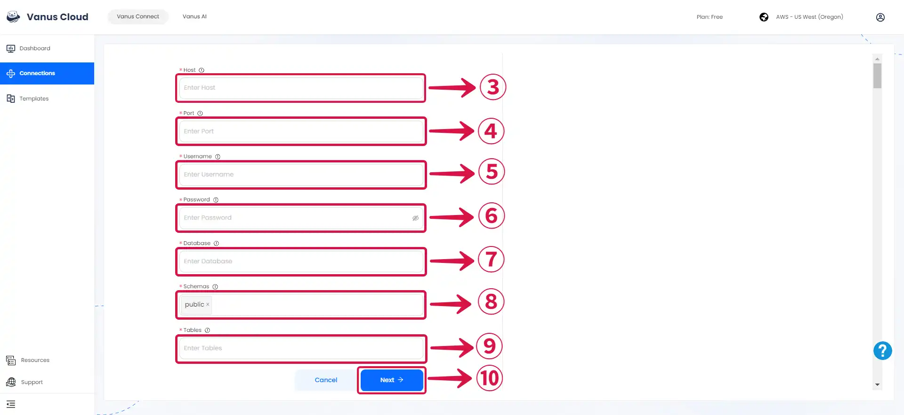

--- 
hide_table_of_contents: true
hide_title: true
---

### Prerequisites

- An [**Amazon Web Services**](https://aws.amazon.com) account.
- A [**Vanus Cloud Account**](https://cloud.vanus.ai).

---

**Perform the following steps to configure your Amazon RDS PostgreSQL Source.**

### Step 1: Set Up a PostgreSQL Server in AWS Using RDS (Optional)

1. Log in to the [**AWS Management Console**](https://aws.amazon.com/) using your root account credentials.

2. Type **RDS**① in the search box and select **RDS**② from the results.

3. Click the **Region name**③ to open the dropdown menu and select the particular **Region**④ in which you want to create the DB instance.

4. Click **Create database**⑤.

5. Select **Standard create**⑥ and choose the **PostgreSQL**⑦ icon.

6. Select the **Free tier**⑧ Template for testing, or opt for one of the other available options based on your specific use case.

:::note
**Multi-AZ DB**⑨ deployment is only available for the paid tier. A Multi-AZ deployment automatically provisions and maintains a synchronous standby replica in a different Availability Zone.
:::

7. Enter the following information.

- **DB instance identifier⑩:** Give a unique name to your instance.

- **Master username⑪:** This is the username that will be used to log in to your DB instance.

- **Master password⑫:** This is the password that will be used to log in with the username.

- **Confirm master password⑬:** Write the password again.

8. Select the **General Purpose SSD (gp2)⑭** storage type. *It's efficient and cost-effective for our intended use*.

9. Enable **Public access**⑮.

:::note
This allocates an IP to your database instance and allows direct connection to the database from the internet.
:::

10. Select **Create new**⑯ to create a new VPC security group, then specify your **New VPC security group name**⑰.

11. Select **Password authentication**⑱.

:::note
Leave **Performance Insights**⑲ checked, or uncheck it if you have no use for it.
:::

12. Input an **Initial database name**⑳, and set your preferred **Backup retention period**㉑.

13. Click the **Create database**㉒ button to complete the process of creating your database.

---

### Step 2: Amazon RDS PostgreSQL Connection Settings

**To set up Amazon RDS PostgreSQL Source in Vanus Connect:**

1. Return to the [**RDS page**](https://console.aws.amazon.com/rds/) and click on the **database**① you just created.

2. Copy your **Endpoint & port**②.

3. Navigate to the Vanus Cloud platform and fill in the following credentials.

- **Host③:** This is your RDS endpoint.
- **Port④:** Enter the port number on which your PostgreSQL server is listening. The default port for PostgreSQL is 5432.
- **Username⑤:** Master username selected during the database creation.
- **Password⑥:** User password.
- **Database⑦:** The initial database name.
- **Schemas⑧:** PostgreSQL schema
- **Tables⑨:** The name of the table you want your events to be sent to.
- Click **Next**⑩ and finish the configurations.

---

Learn more about Vanus and Vanus Connect in our [**documentation**](https://docs.vanus.ai/getting-started/what-is-vanus).
