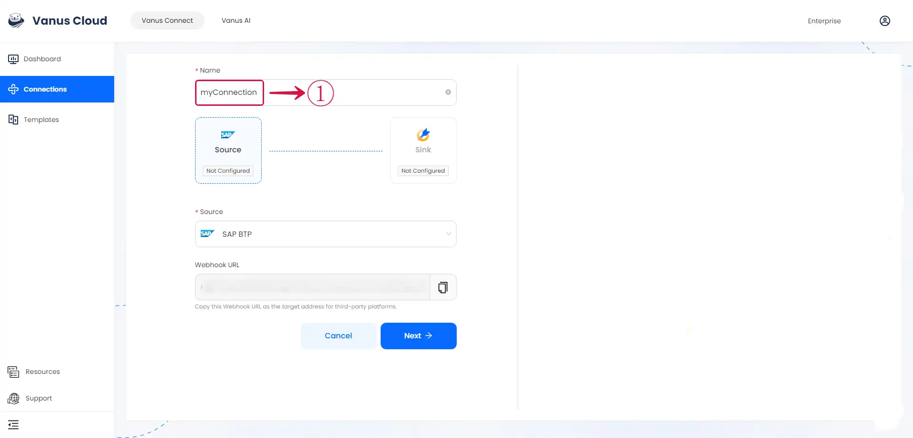
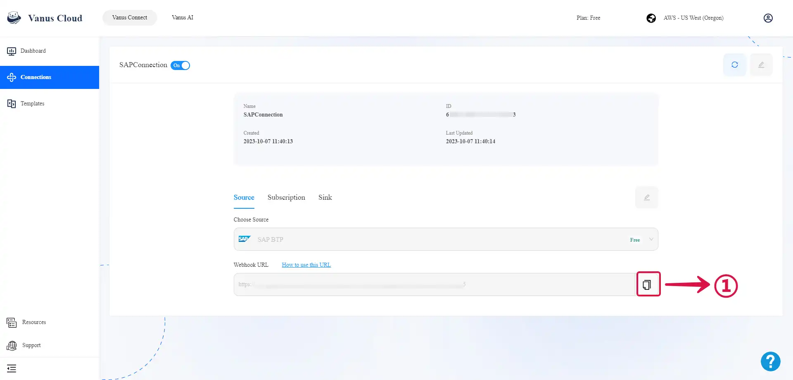
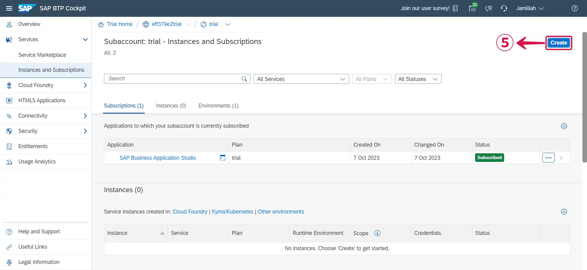
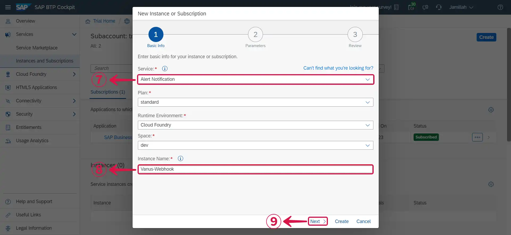
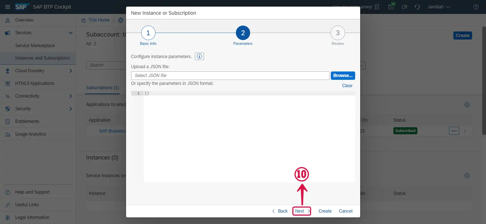
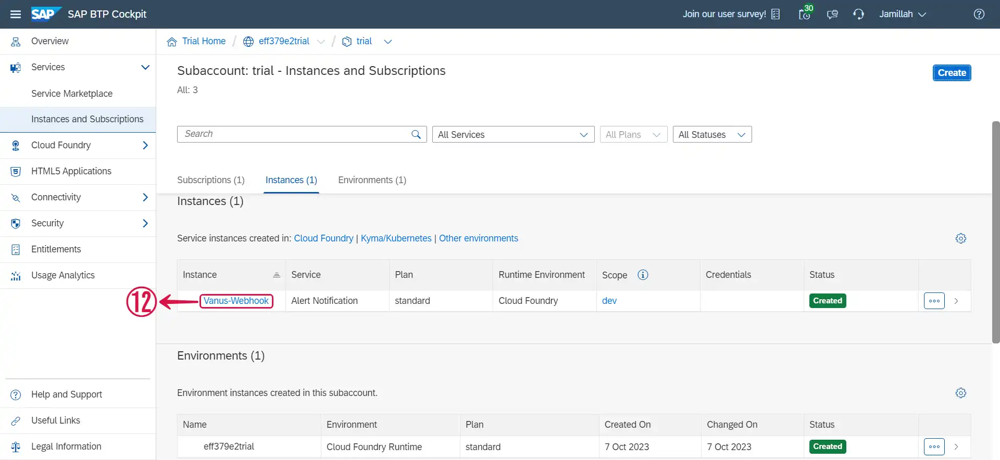
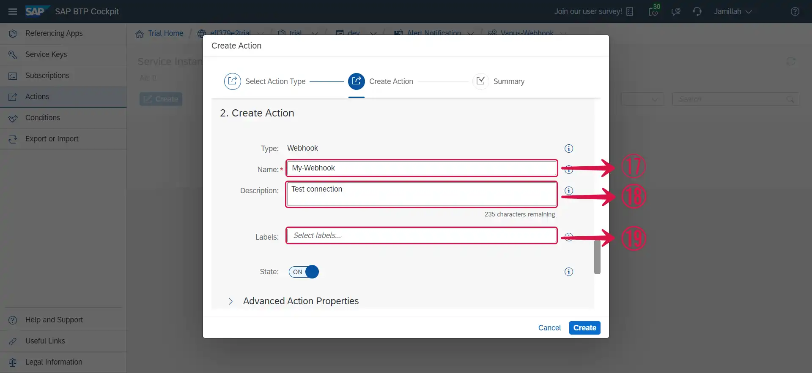
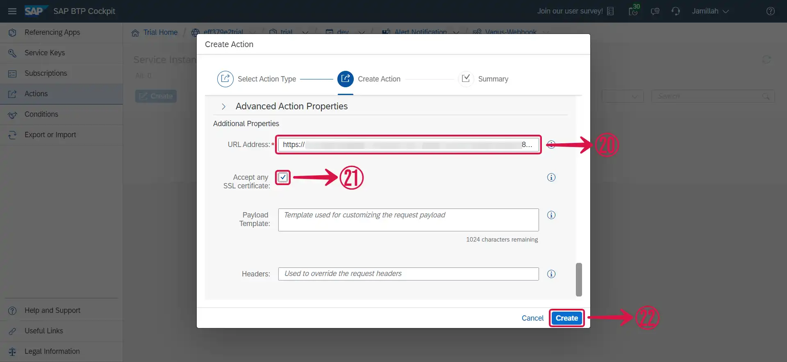
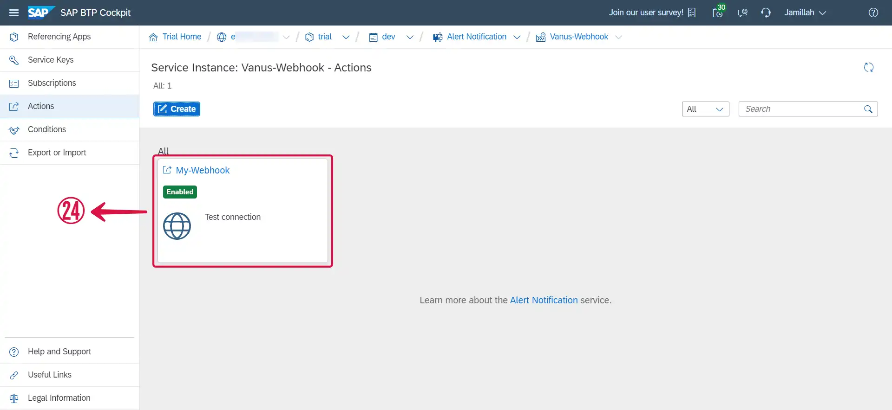

--- 
hide_table_of_contents: true
hide_title: true
---

### Prerequisites

- A SAP BTP account with administrative privileges
- A [**Vanus Cloud account**](https://cloud.vanus.ai)

---

**Perform the following steps to configure your SAP BTP Source**

### SAP BTP Connection Settings

- Write a **Name**① for your connection in Vanus Connect.

### Configuring SAP BTP to Send Webhook Events

#### Step 1: Configure webhook

1. Click the **copy**① icon to copy the webhook url.

2. Log in to your [**SAP BTP account**](https://accounts.sap.com/).

3. Navigate to the **Subaccounts**② page by clicking on it.

4. Click on **Services**③ and select **Instances and Subscriptions**④.

5. Click on the **Create**⑤ button at the top right.

6. Click on **Select Service**⑥ to reveal the dropdown menu.

7. Select **Alert Notification**⑦, choose an **Instance Name**⑧ of your choice and click on **Next**⑨.

8. Leave the Instance parameters as default and click **Next**⑩.

9. Click **Create**⑪.

10. Click on the **name of the Instance**⑫ that was just created.

11. Click on **Actions**⑬.

12. Click on **Create**⑭.

13. Scroll down and select **Webhook**⑮ as the action type and click on **Next**⑯.

:::note
Do not select the **Webhook with Authorization Token** or **Webhook with Basic Authentication** as they would need extra level of authentication.
:::

14. Insert a desired **Name**⑰ for your webhook and **Description**⑱ or **Labels**⑲ if any.

15. Scroll down, paste the webhook URL you copied earlier in the **URL Address**⑳ section, tick the **Accept any SSL certificate**㉑ checkbox and click **Create**㉒.

16. Click on **Close**㉓.

17. A successful webhook integration would look like **this**㉔.

18. Click **Next**㉕ and continue the configuration.

---

Learn more about Vanus and Vanus Connect in our [**documentation**](https://docs.vanus.ai).
