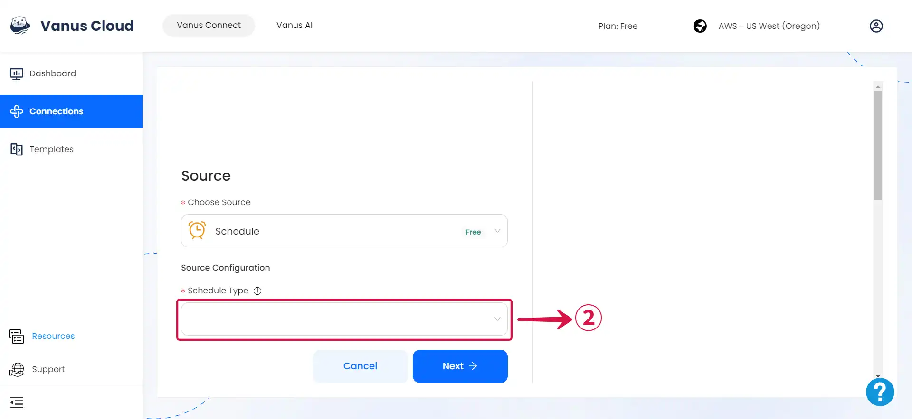
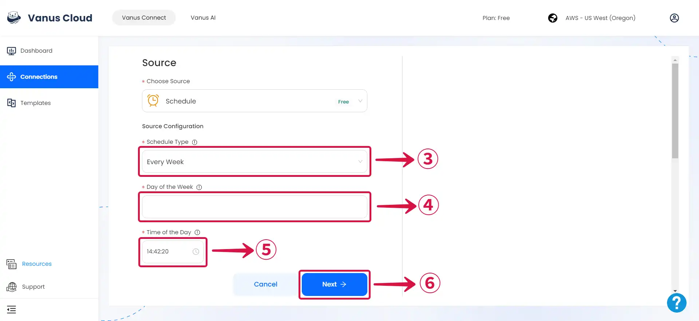

import Tabs from '@theme/Tabs';
import TabItem from '@theme/TabItem';

### Prerequisites

- A [**Vanus Cloud account**](https://cloud.vanus.ai).

---

**Perform the following steps to configure your Schedule Source**

### Step 1: Schedule Connection Settings

1. Write a **Name**① for your connection in Vanus Connect.

2. Click on **Schedule Type**② to choose your schedule type.

<Tabs>

<TabItem label="Hourly" value="hourly">

3. If you opt for an **Hourly schedule**③, you can choose the specific **Minutes and Seconds of the hour**④ when the event will be sent.

:::note
This means that the event will be dispatched at the same minute and second within every subsequent hour that it is scheduled to run.
:::

- Click **Next**⑤ and continue the configuration.

</TabItem>
<TabItem label="Daily" value="daily">

3. Choosing a **Daily schedule**③ provides the freedom to pick the precise **Time of the Day**④, down to the hour, minute, and second, when the event will be sent each day.

:::note
This enables you to specify the event's exact dispatch time, and it will continue to occur at that chosen time on all following days based on your schedule.
:::

- Click **Next**⑤ and continue the configuration.

</TabItem>
<TabItem label="Weekly" value="weekly">

3. If you opt for a **Weekly schedule**③.

- The first step is to choose the **Day of the Week**④ or multiple days when you want the event to be sent.
- After you've chosen the day or days, you can proceed to the second step, where you'll specify the precise **Time of the Day**⑤ when the event should be dispatched on that specific day.

- Click **Next**⑥ and continue the configuration.

</TabItem>
<TabItem label="Monthly" value="monthly">

3. If you opt for a **Monthly**③ schedule.

- The first step is to choose the **Day of the Month**④ (or days, based on your preferences) on which you desire the event to be sent. You can select a specific day of the month (such as the 15th) or multiple days of the month (like the 1st and the 15th).
- The second step is to specify the specify the precise **Time of the Day**⑤ when the event should be dispatched on the selected day(s) of the month.

- Click **Next**⑥ and continue the configuration.

</TabItem>

</Tabs>

---

Learn more about Vanus and Vanus Connect in our [**documentation**](https://docs.vanus.ai/getting-started/what-is-vanus).
