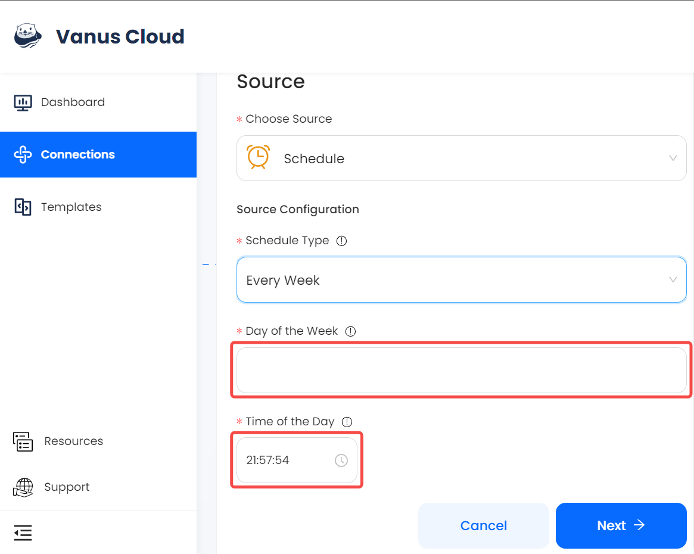

import Tabs from '@theme/Tabs';
import TabItem from '@theme/TabItem';

### Prerequisites

---

**Perform the following steps to configure your Schedule Source**

### Step 1: Schedule Connection Settings
1. Write a name for your connection in Vanus Cloud.

2. Choose your schedule type.

<Tabs>

<TabItem label="Hourly" value="hourly">

3. If you opt for a **Hourly** schedule, you can choose the specific minute and second within every hour when the event will be sent. This means that the event will be dispatched at the same minute and second within every subsequent hour that it is scheduled to run.

</TabItem>
<TabItem label="Daily" value="daily">

3. If you opt for a **Daily** schedule, you have the flexibility to select both the hour and the minute/second at which the event should be sent every day. This allows you to specify the exact time of day when the event will be dispatched, and it will recur at the same time on subsequent days according to the schedule you set.

</TabItem>
<TabItem label="Weekly" value="weekly">

3. If you opt for a **Weekly** schedule.
    - The first step is to choose the day of the week or multiple days when you want the event to be sent.
    - Once you have selected the day or days, you can move on to the second step, which is to specify the hour, minute, and second at which the event should be dispatched on that particular day.

</TabItem>
<TabItem label="Monthly" value="monthly">

3. If you opt for a **Monthly** schedule.
    - The first step is to choose the day or days of the month when you want the event to be sent. You can select a specific day of the month (e.g., the 15th) or multiple days of the month (e.g., the 1st and the 15th).
    - The second step is to specify the time of day when the event should be dispatched. You can choose the hour, minute, and second at which the event should be sent on the selected day(s) of the month.

</TabItem>

</Tabs>

4. Click **Next** and continue the configuration.

---

Learn more about Vanus and Vanus Cloud in our [documentation](https://docs.vanus.ai/getting-started/what-is-vanus)

