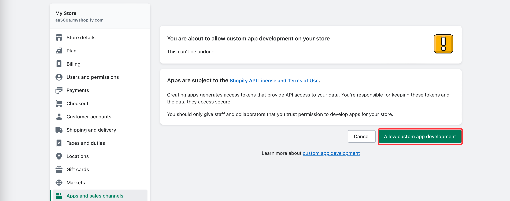
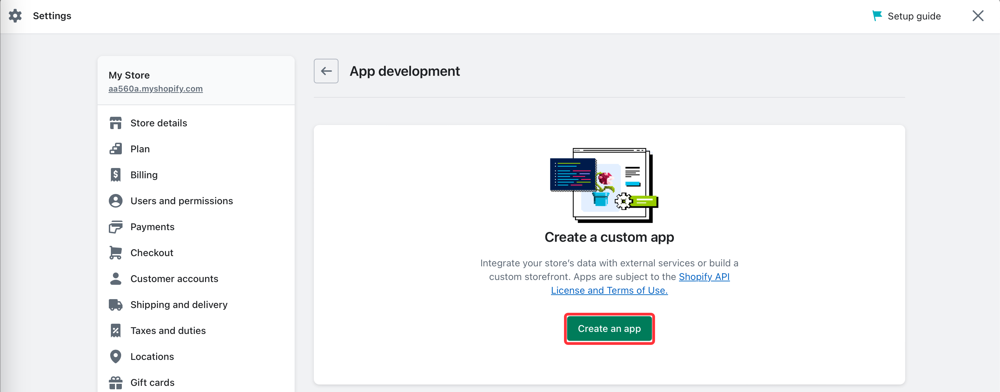
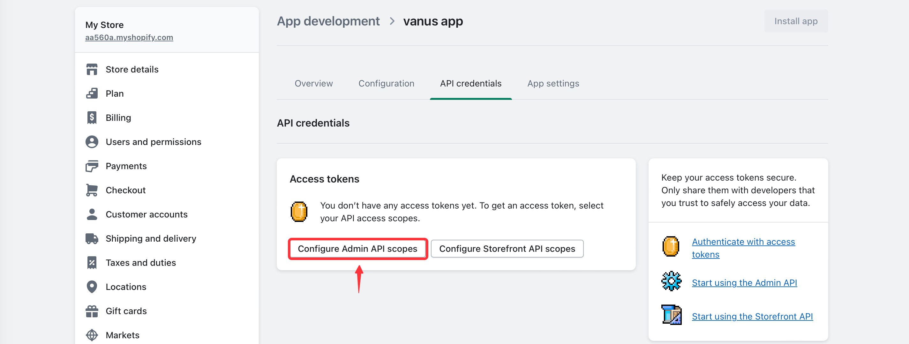
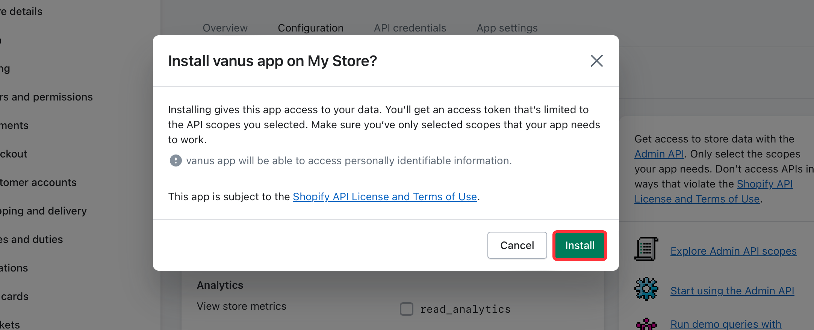
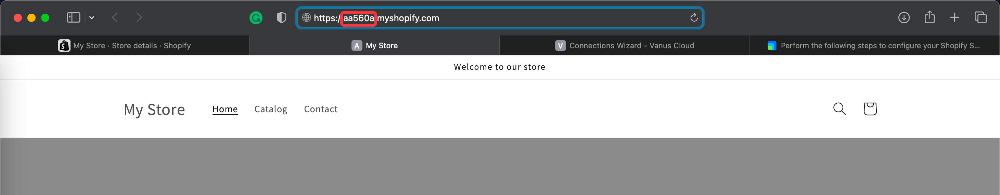

--- 
hide_table_of_contents: true
hide_title: true
---

## Prerequisites

Before obtaining Shopify events, you must have:

- A Shopify shop with administrative privileges 

---

**Perform the following steps to configure your Shopify App Source**

## Step 1: Create an App
1. Go to [shopify](https://shopify.com) and sign in to your account to access the shopify dashboard.
2. Once log in go to `Apps  >` from the side menu a list will appear on top of the page and click **App and sales channel settings**.

3. To create a new app we will need to select **Develop apps** first.

4. Now click **Allow custom app development**.

5. Again click **Allow custom app development**.

6. Let's now create a new app by clicking **Create an app**.

7. Write a name for your app and press **Create app**.

8. Now we need to click Configure Admin API scopes.

9. Select the type of event you would like to receive **read_orders、read_products** and press *Save*.

10. Press **Install app**.

11. And **Install**.

12. Reveal the **Admin API access token** and copy the token.

---

## Step 2: Shopify App Connection Settings
1. Write a name for your connection in Vanus Cloud.

2. Paste the **Admin API access token** into Vanus Cloud.

3. Go to your store home page and copy the name of your store.

4. Paste your shop name into Vanus Cloud.

5. Choose from what moment you would like to start receive the events,
    select how often do you want to receive updates and press **Next**.

---

Learn more about Vanus and Vanus Cloud in our [documentation](https://docs.vanus.ai).