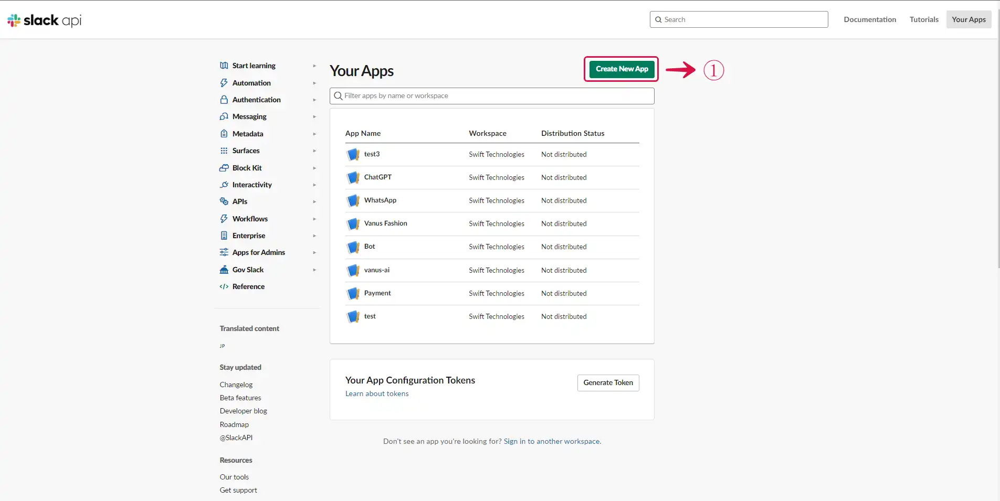
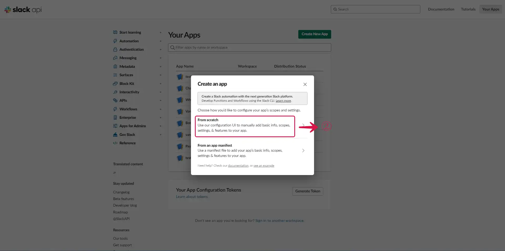
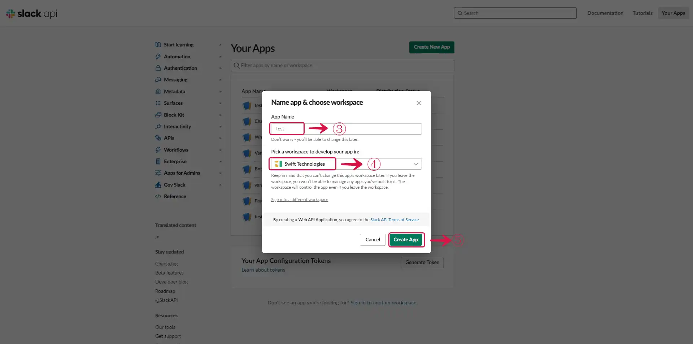
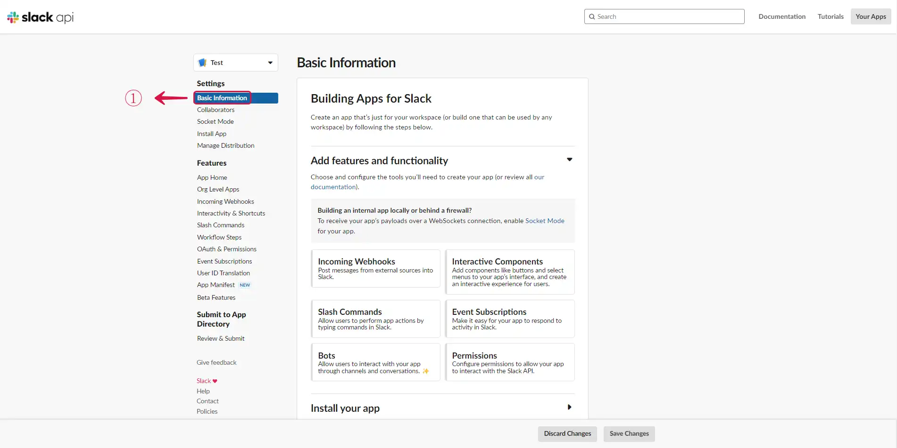

--- 
hide_table_of_contents: true
hide_title: true
---

### Prerequisites

- A [Slack account](https://slack.com).

---

**Perform the following steps to configure your Slack Source.**

### Step 1: Create and Install an App in Slack

1. Go to [Slack API](https://api.slack.com/apps), and click **Create New App**①.

 

2. Select **From Scratch**②.

 

3. Set the **App Name**③, **Workspace**④, and click the **Create App**⑤ button.

 

### Step 2: Get App Credentials

1. Go to **Basic Information**①.

 

2. Scroll down to **App Credentials** and copy the **Verification Token**②, and **Signing Secret**③.

 

3. Go to your Vanus Connection, Give the connection a **Name**④, paste the **Verification Token**⑤ and **Signing Secret**⑥ from Slack as configurations, select the **Events**⑦, and click **Next**⑧.

 

---

Learn more about Vanus and Vanus Connect in our [**documentation**](https://docs.vanus.ai).