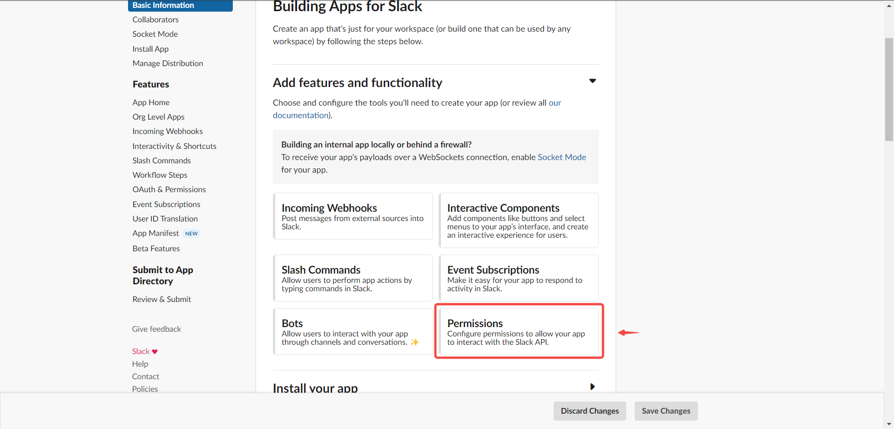
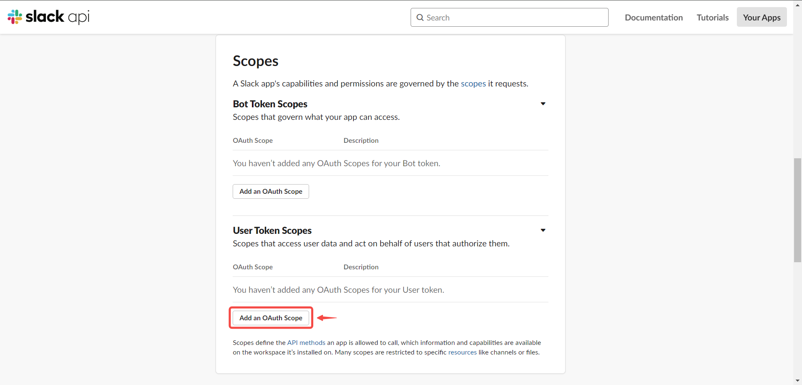
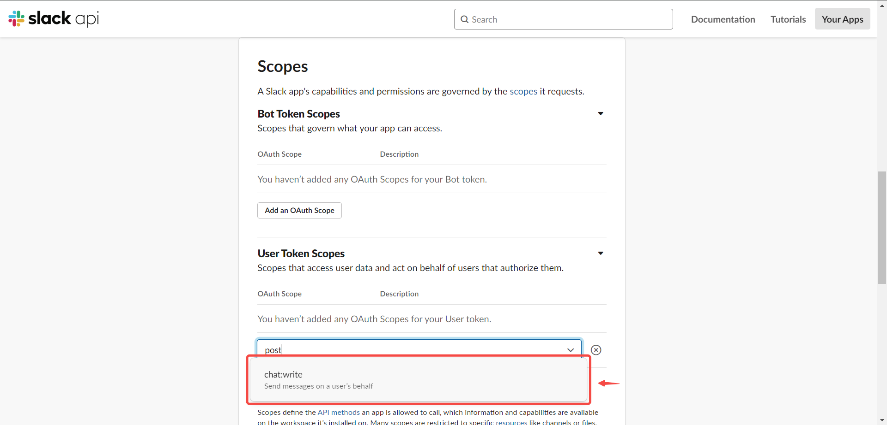
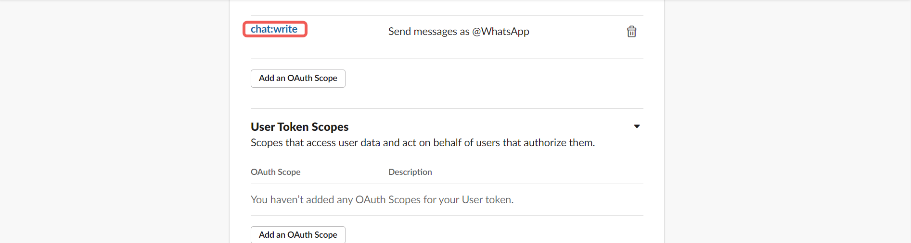
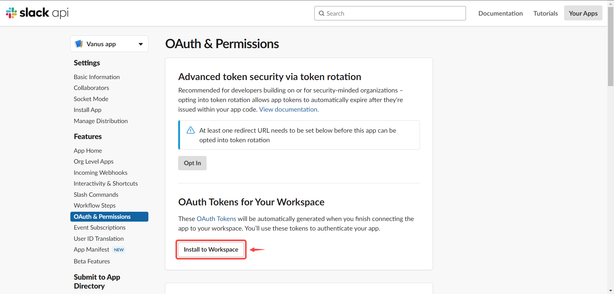

--- 
hide_table_of_contents: true
hide_title: true
---

### Prerequisites

- A [Slack account](https://slack.com).

---

**Perform the following steps to configure your Slack Source.**

### Step 1: Create and Install an App in Slack

1. Go to [Slack API](https://api.slack.com/apps), and click **Create New App**.
   
2. Select **From Scratch.**

3. Set the app name and Workspace.

4. Add **Permissions** feature to your App.

5. Scroll down to **Scopes/Bot Token Scopes**, and click on **Add an OAuth Scope**.

6. Add **chat:write** permission to your App.

7. **Notice:** we only need a **chat:write** permission in Bot Token Scopes.

8. Scroll up to the top of the page, and click **install to Workspace** to install your app.

9. Click **allow** to install the app.

10. There will be a Bot User OAuth Token which will be used later.

---

### Step 2: Get App Credentials

1. Go to **Basic Information**.

2. Scroll down to **App Credentials** and copy the following credentials.
 - Verification Token
 - Signing Secret

3. Don't close this page but continue in Vanus Connect.
4. Paste the two credentials from Slack as configurations.
      
5. Click **Next** and continue the configuration.   

---

Learn more about Vanus and Vanus Connect in our [documentation](https://docs.vanus.ai).