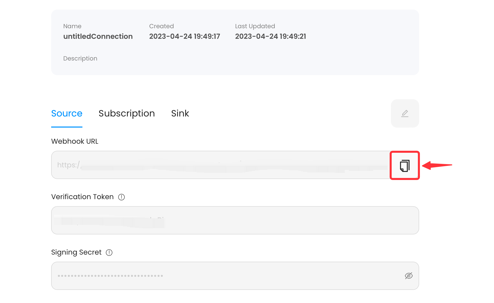
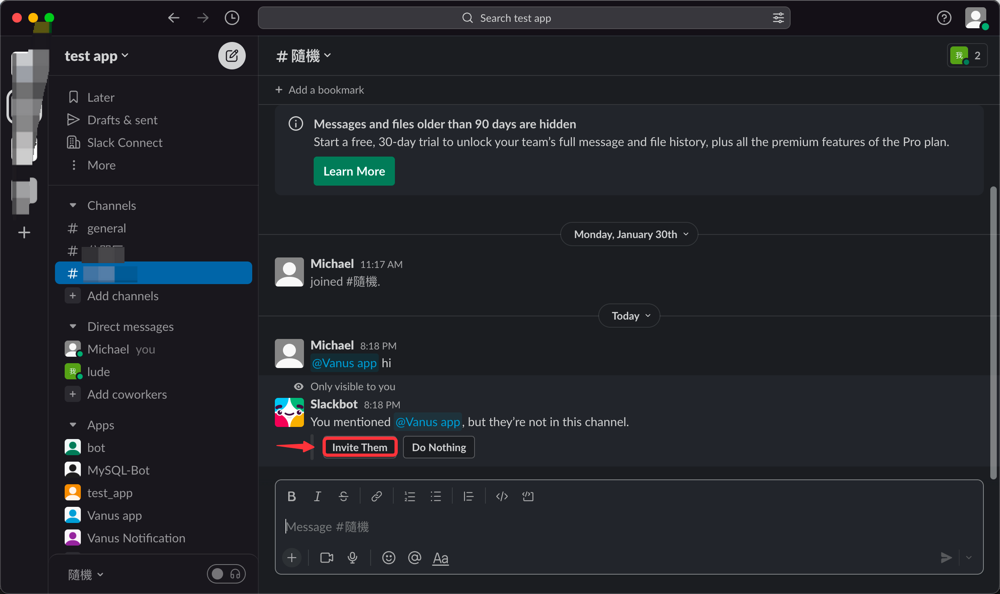

#  
# Prerequisites

Before obtaining Slack events, you must have:
- A [Slack account](https://slack.com).

---

**Perform the following steps to configure your Slack Source:**

# Step 1: Create and Install an App in Slack

1. Go to [Slack API](https://api.slack.com/apps), and click **Create New App**.
   
2. Select From Scratch.

3. Set the app name and Workspace.

---

#  Step 2: Get App Credentials

1. Go to **Basic Information**.

2. Scroll down to **App Credentials** and copy the two following credentials.
 - Verification Token
 - Signing Secret

3. Don't close this page but continue in Vanus Cloud
4. Paste the two credentials from Slack as configurations.
      

---

# Step 3: Configure Event Subscription
1. Click the **copy icon** to copy the webhook url.

2. Go back to **Slack API**.

3. Now click on **Event Subscriptions** in the side menu.

4. **Enable Events** by turning on the switch.

5. Use the URL we've previously **copy and paste** it in **Request URL**. You should see a green `Verified` indicating our Source is verified by Slack.

---

# Step 4: Subscribe to bot events

Generally speaking, Slack Source can subscribe any events you need from Slack.

But, if you're using some **Vanus Templates** like `Send a custom greeting message when new members join the Slack channel`, then you've to subscribe to some specific events.

| Templates                                                              | Events need to subscribe |
|------------------------------------------------------------------------|:------------------------:|
| Send a custom greeting message when new members join the Slack channel | `member_joined_channel`  |

**How to subscribe**  
---

1. Scroll down, click **Subscribe to bot events** and after you will be able to click **Add Bot User Event**.

2. Select the events you would like to receive, for example you can select `member_joined_channel` to receive events whenever a new member joins your Slack Channel.

3. Finally you can **Save Changes** to complete your configuration.

---

# Step 5: Install the Slack App to your Slack workspace

1. Go to **Install Apps** from the side menu and click **Install to Workspace**.
   
2. Allow it to be installed into your workspace.
      
3. Mention your bot in slack and invite it to the channel.
   

---

# Step 6: Connection in Vanus Cloud

1. Write a name for your connection.
   

2. Click **next** and finish the configurations.  

---

Learn more about Vanus and Vanus Cloud in our [documentation](https://docs.vanus.ai).