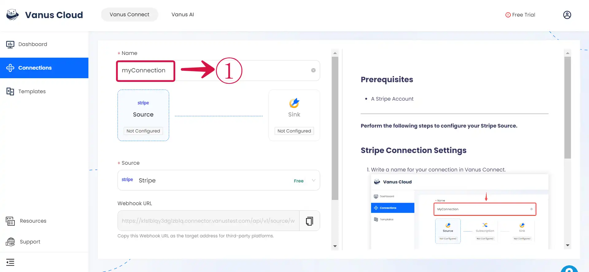
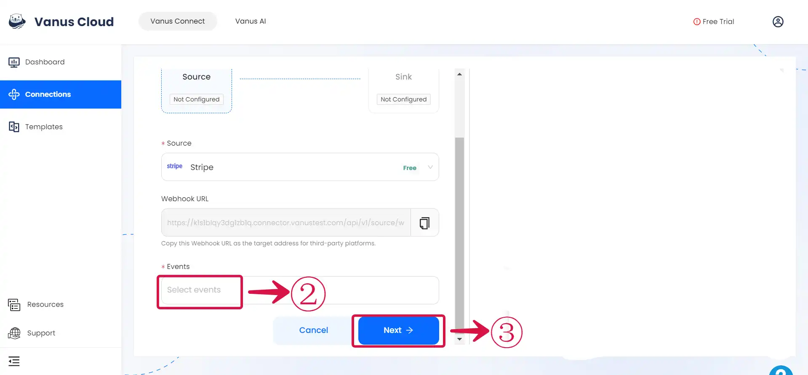

--- 
hide_table_of_contents: true
hide_title: true
---

### Prerequisites

- A Stripe Account

---

**Perform the following steps to configure your Stripe Source.**

### Stripe Connection Settings

1. Write a **Name**① for your connection.

2. Select the **Events**② you want and click **Next**③.

---

Learn more about Vanus and Vanus Connect in our [documentation](https://docs.vanus.ai).
