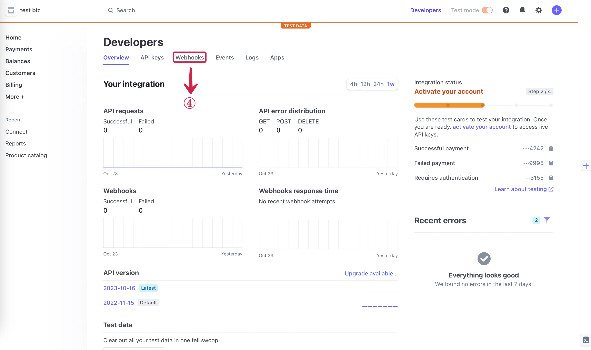
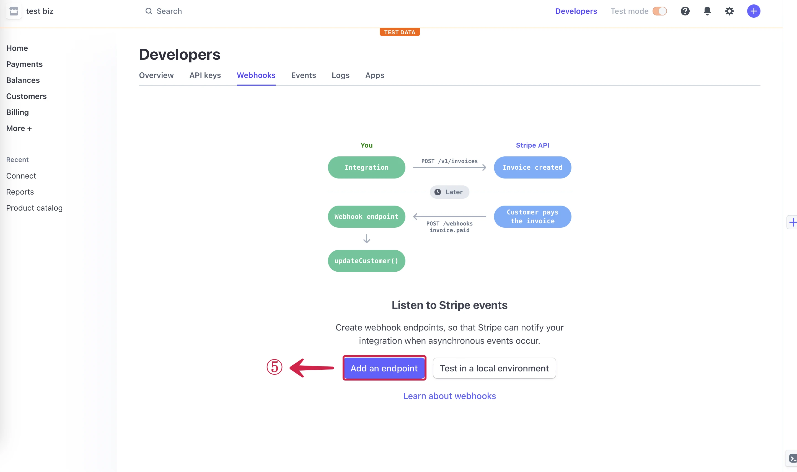

--- 
hide_table_of_contents: true
hide_title: true
---

### Prerequisites

- A Stripe Account

---

**Perform the following steps to configure your Stripe Source.**

### Stripe Connection Settings

1. Write a connection **Name**① and **Copy**② the Webhook URL.

2. Go to your Stripe **Developers**③ Dashboard.

3. Select the **Webhooks**④ tab.

5. Click on **Add an endpoint**⑤.

6. Paste the webhook URL to the **Endpoint URL**⑥ field from Vanus AI, and click on **Select events**⑦.

7. **Select all events**⑧ and click on **Add events**⑨.

8. Now scroll down and click **Add endpoint**⑩.

9. Select the **Events**⑪ you want to receive and Press **Next**⑫ to continue.

---

Learn more about Vanus and Vanus Connect in our [documentation](https://docs.vanus.ai).
