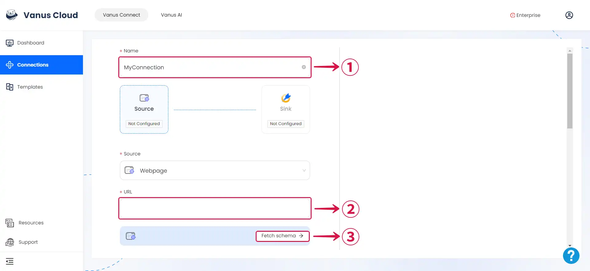
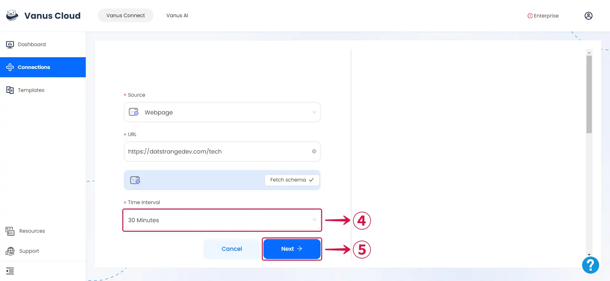

--- 
hide_table_of_contents: true
hide_title: true
---

### Prerequisites

- A [**Vanus Cloud account**](https://cloud.vanus.ai)

**Perform the following steps to configure your Webpage Source.**

### Webpage Connection Settings

1. Write a **Name**① for your connection in Vanus Connect, enter the **URL**② from which you'd like to retrieve content, and then click on **Fetch schema**③.

:::note
Clicking the **Fetch schema** button guarantees receiving a sample event to complete the connection with your chosen sink connector. You won't receive any sample events if you forget to click **Fetch Schema**.
:::

2. Set your **Time Interval**④ to specify the exact times at which you want to receive events, and then proceed by clicking **Next**⑤.

---

Learn more about Vanus and Vanus Connect in our [**documentation**](https://docs.vanus.ai).
