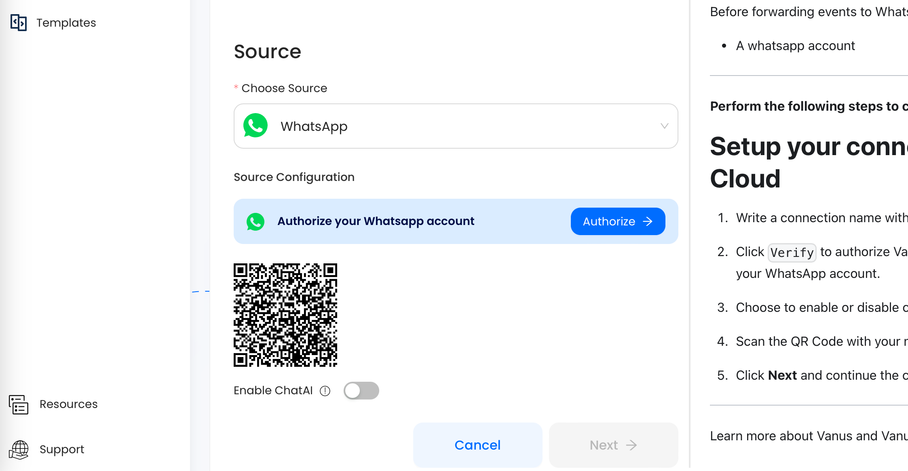

--- 
hide_table_of_contents: true
hide_title: true
---

## Prerequisites

- A [WhatsApp account](https://www.whatsapp.com)

---

**Perform the following steps to configure your WhatsApp Source:**

## whatsApp Connection Settings

1. Write a connection name without any spaces.

2. Click `Verify` to authorize Vanus to establish a connection with your WhatsApp account. 

3. Choose to enable ChatAI to use OpenAI. 

4. Scan the QR Code with your mobile WhatsApp 

5. Click **Next** and continue the configuration. 

---

Learn more about Vanus and Vanus Cloud in our [documentation](https://docs.vanus.ai).
