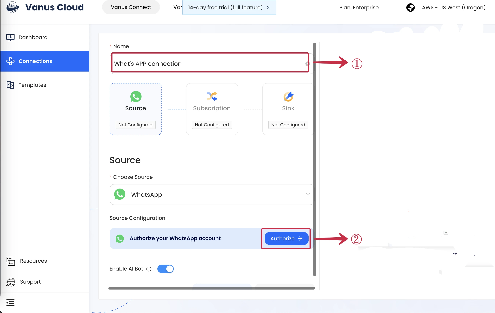
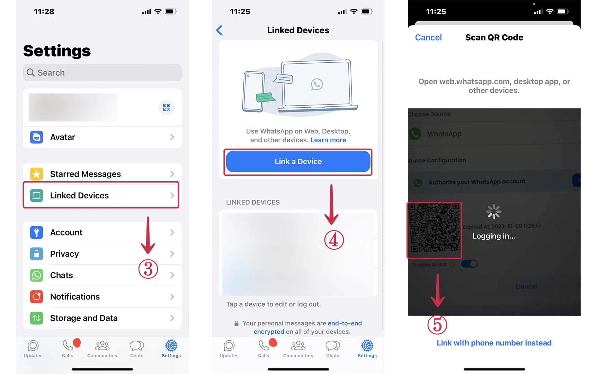
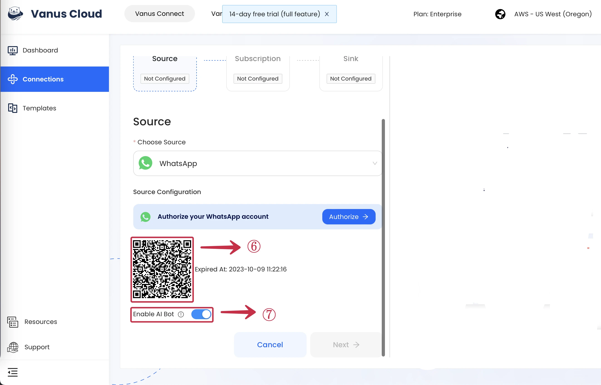
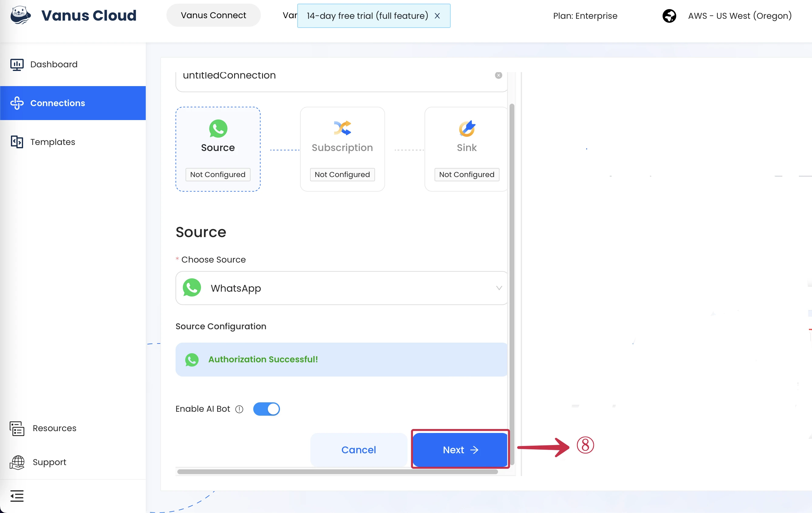

--- 
hide_table_of_contents: true
hide_title: true
---

### Prerequisites

- A [WhatsApp account](https://www.whatsapp.com)

---

**Perform the following steps to configure your WhatsApp Source.**

### WhatsApp Connection Settings

1. Write a **connection name**①.
2. Click **Authorize**②  to create a QR code to establish a connection with your WhatsApp account.

3. On your phone go to **Settings** and click **Linked Devices**③.
4. Click **Link a Device**④ 

3. Scan the **QR Code**⑤ ⑥ with your mobile WhatsApp.

4. Utilizing the **Click Toggle On**⑦  Function for a ChatGPT connection only. When creating non related ChatGPT connection toggle it off.

5. Click **Next**⑧ and continue the configuration. 

---

Learn more about Vanus and Vanus Connect in our [documentation](https://docs.vanus.ai).
