--- 
hide_table_of_contents: true
hide_title: true
---

### Prerequisites

- A [**Vanus Cloud account**](https://cloud.vanus.ai)
- A [Zoho CRM account](https://crm.zoho.com/crm/org813836165/tab/Home/begin)

---

**Perform the following steps to configure your Zoho CRM Source**

### Zoho CRM Connection Settings

To obtain Zoho CRM events in Vanus Connect, follow these steps:

- Write a **Name**① for your connection in Vanus Connect.

- Copy the Webhook URL by clicking on the **copy icon**②.

### Configure Zoho CRM to Send Webhook Events 

#### Step 1: Configure webhook

1. Log in to your [**Zoho CRM account**](https://crm.zoho.com/crm/org813836165/tab/Home/begin)

2. Navigate to the Setup page by clicking on the **gear icon**①.

3. Click on **Actions**②.

4. Click on **Webhooks**③.

5. Click on the **Configure Webhook**④ button.

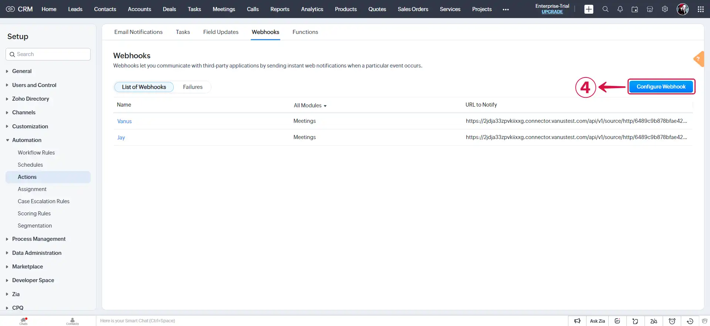

6. **Name**⑤ your Webhook, paste the payload URL retrieved from Vanus Connect into the **URL to Notify**⑥ field, and make your **Module**⑦.

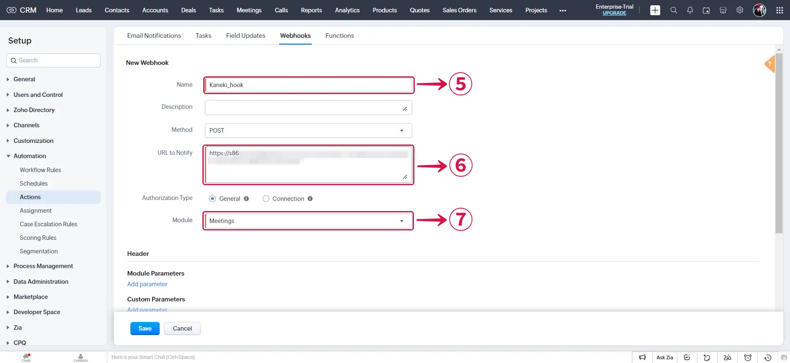

7. Click on **Add parameter**⑧ to specify the necessary parameters.

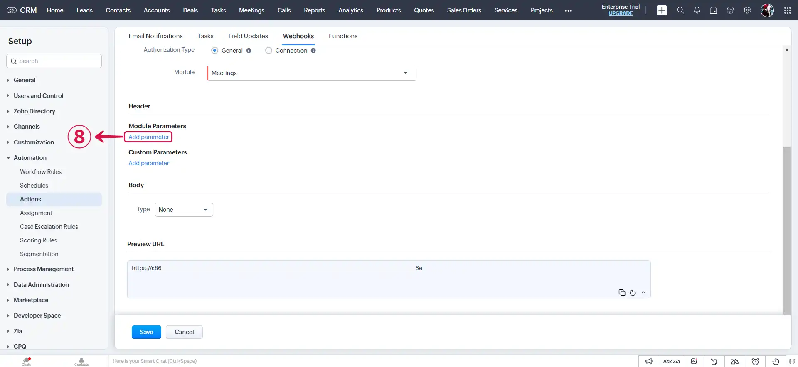

8. Specify the **Body Type**⑨.

:::note
You can choose to use **Form-Data** or **Raw** from the picklist, to configure the body session.
:::

- **Raw:** If you choose the Raw Data option as the body type in the text editor, you have the flexibility to write your own data values. You can input data in various **Format**⑩ such as XML, JSON, HTML, or plain text. Additionally, you can utilize the # merge field feature to reference specific field values within the script.

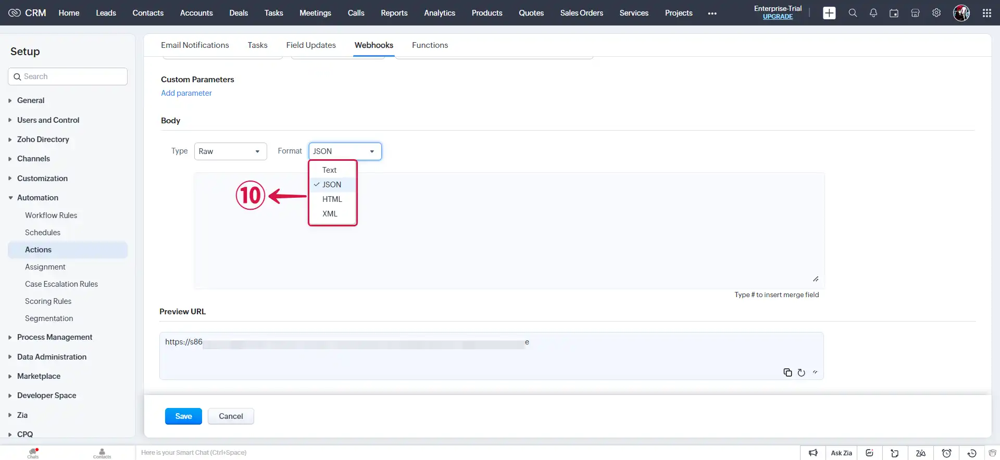

- **Form Data:** This feature enables you to construct the body section of the URL by seamlessly appending the parameter name, parameter type, or parameter value. You can create Form-Data in three distinct ways: **Module Parameters**⑪, **Custom Parameters**⑫, and **User defined Format**⑬.

9. Once you have configured your settings, remember to **Save**⑭ them.

---

#### Step 2: Associate webhook to a workflow rule

1. Select **Workflow Rules**①.

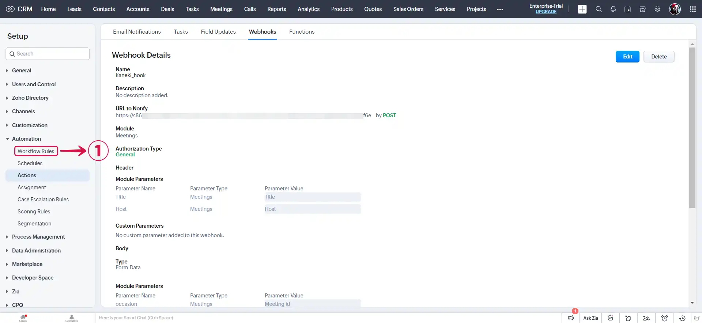

2. Click on **Create Rule**②.

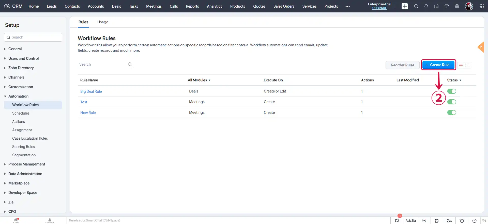

3. Choose your **Module**③, provide a **Rule Name**④, and proceed by selecting **Next**⑤.

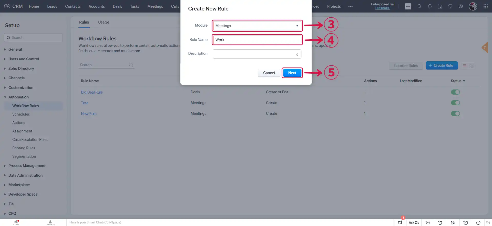

4. Select **Record action**⑥.

5. Select the **action**⑦ to record and click **Next**⑧.

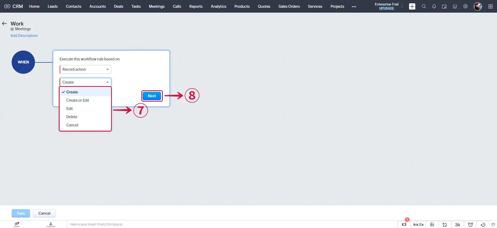

6. Specify the **CONDITION**⑨ to be met for the event to be triggered, and then click **Next**⑩.

7. Select **Webhook**⑪.

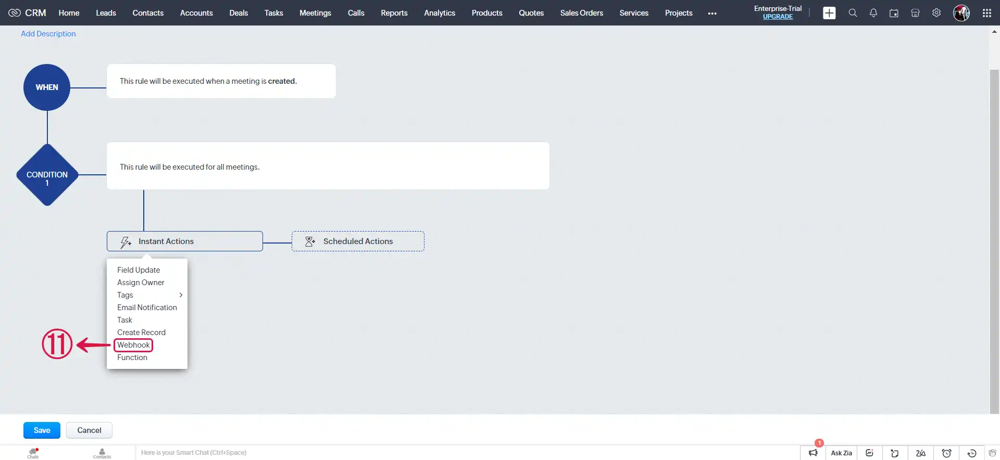

8. **Select**⑫ the created webhook and click on **Associate**⑬.

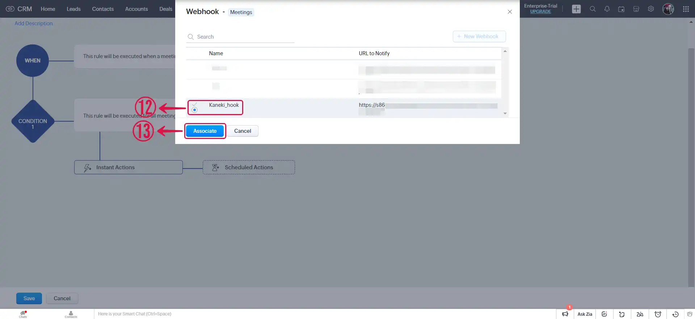

9. Click **Save**⑭.

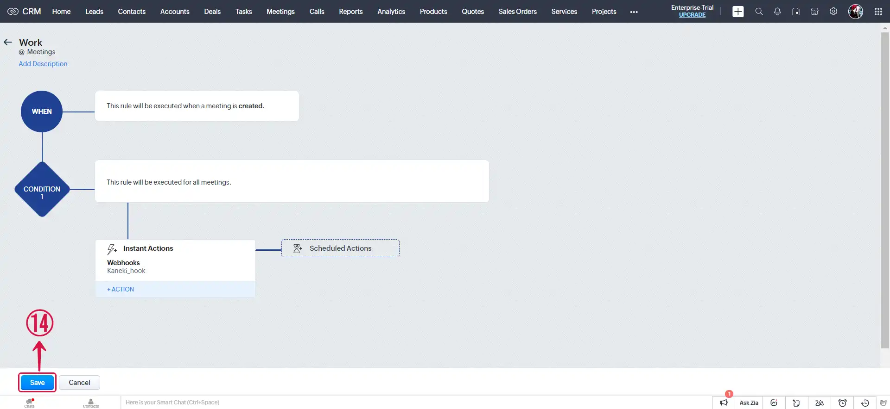

10. Click **Next**⑮ and continue the configuration.

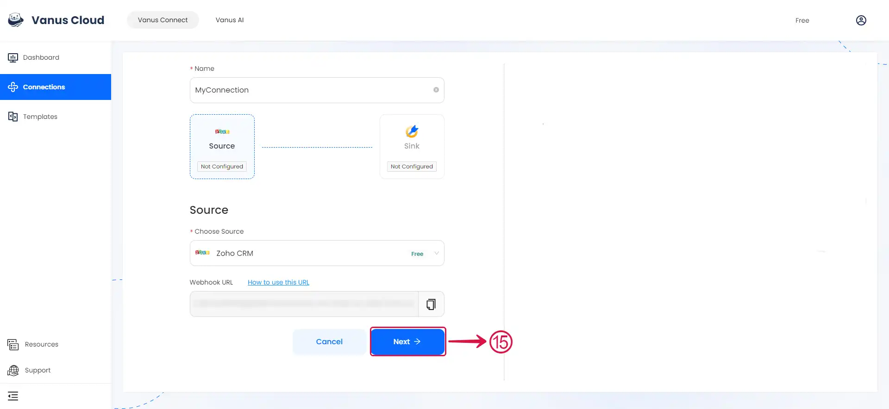

---

Learn more about Vanus and Vanus Connect in our [**documentation**](https://docs.vanus.ai).
