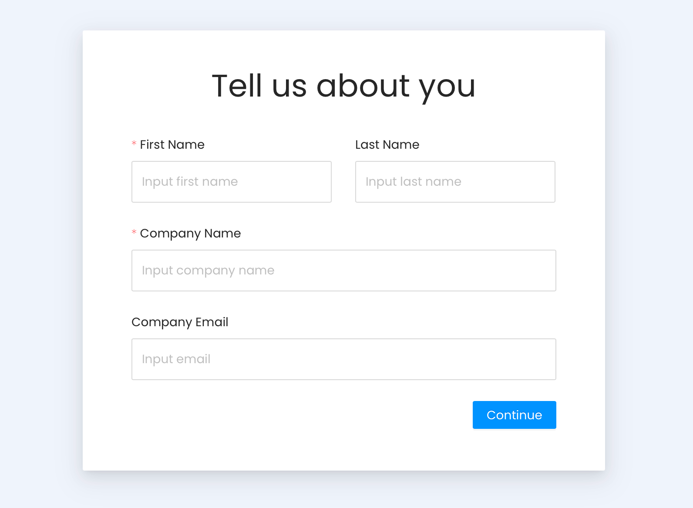

# Vanus AI
Vanus AI is a user-friendly platform powered by artificial intelligence that seamlessly integrates Large Language Models (LLMs), SaaS, Databases, and other systems. It enables users to rapidly build AI applications without coding, providing broad access to information and knowledge-based content.
The platform offers LLM integration for leveraging powerful language models, Integration with SaaS services such as WordPress, WhatsApp, Amazon Web Services, and other web applications. Additionally, it enables the development of knowledge bases for storing and retrieving information, complemented by real-time data streaming for responsive and up-to-date applications.

Vanus AI's code-free development approach makes it accessible to all users, while scalability, security, and support are additional advantages. Users simply need to select their desired service, connect it with Vanus AI using relevant credentials, and leverage integrated LLMs to create AI applications customized with user-specific data, with various functions like language translation, content generation, acting as a chatbot and FAQ bot.

## Getting Started
Become part of our thriving community of businesses and developers who harness the power of **[Vanus AI](https://ai.vanus.ai)** to build AI-powered applications and seamlessly integrate them with their preferred SaaS applications.

- Join Vanus AI by visiting [ai.vanus.ai](https://ai.vanus.ai)
- Sign up to Vanus AI using one of the following methods, GitHub login, Google login, Microsoft login, or by email.

- Please provide some information about yourself. Thank you for providing us with the required information to create your account.

- Signing up is a breeze! Now that you've successfully registered, you can effortlessly begin creating your AI application. Let's get started right away on building your new AI application.
