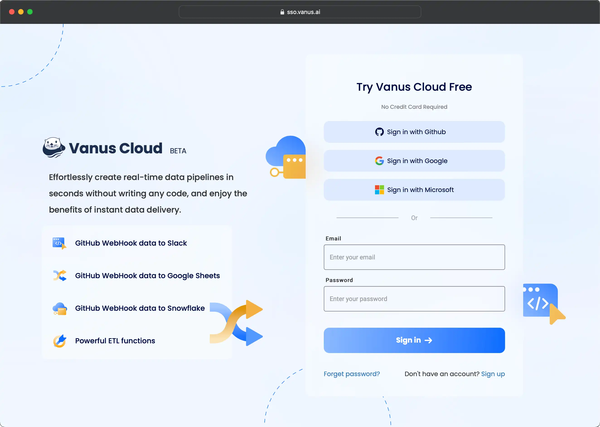
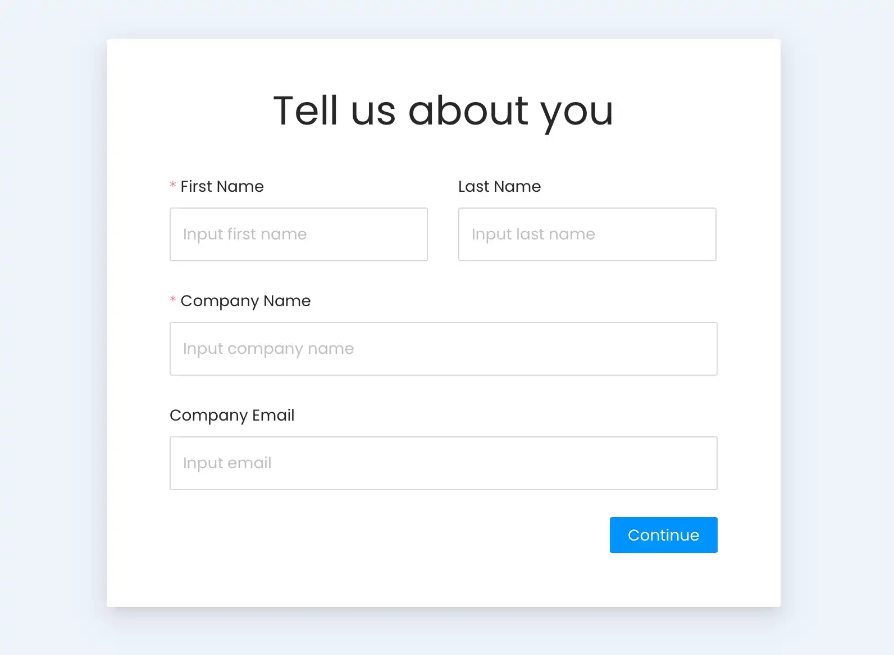

# Vanus AI

Vanus AI revolutionizes the development of AI Applications by offering a cutting-edge cloud-based platform. With Vanus Cloud and Vanus Connect working seamlessly together, users and enterprises can effortlessly build groundbreaking AI applications that integrate with external services. The best part? No coding is required; these applications can be created in minutes.

When building their applications, users can choose from a diverse selection of extensive models. Currently, Vanus AI provides models such as GPT-3.5, GPT-4.0, and ERNIE Bot, with plans to introduce even more large models soon.

One of the standout features of Vanus AI is its knowledge base, which simplifies the training process for your AI Application. This central repository effectively stores the data necessary for training your application.

The AI Applications created using Vanus AI can seamlessly interact with existing apps, databases, and search engines to enhance functionality. Whether it's connecting to your company's database server or integrating with third-party Apps like WhatsApp, your AI application stays up-to-date and efficient, receiving continuous data updates.

The possibilities for AI applications developed with Vanus AI are vast across all business fields.

## Getting Started
Become part of our thriving community of businesses and developers who harness the power of **[Vanus AI](https://ai.vanus.ai)** to build AI-powered applications and seamlessly integrate them with their preferred SaaS applications.

- Join Vanus AI by visiting [ai.vanus.ai](https://ai.vanus.ai)
- Sign up to Vanus AI using one of the following methods, GitHub login, Google login, Microsoft login, or by email.

- Please provide some information about yourself. Thank you for providing us with the required information to create your account.
