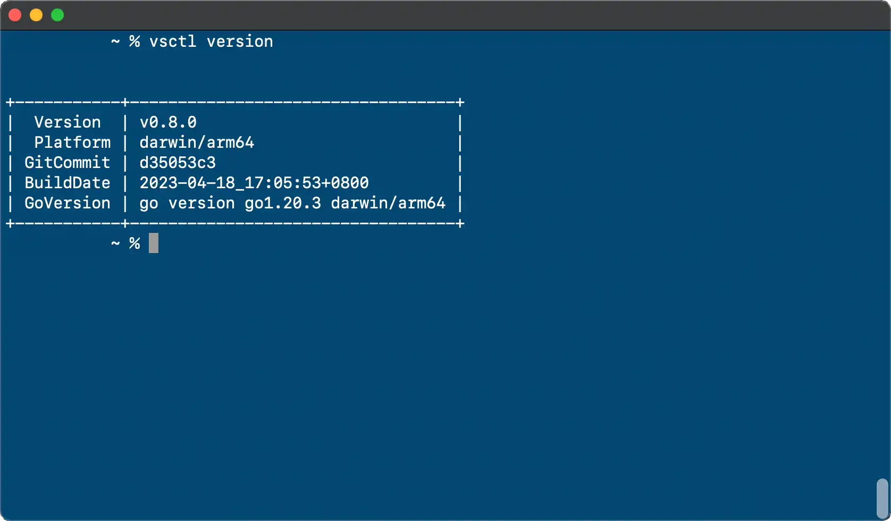

# Vanus Open Source

Vanus Open Source (Vanus OSS) is a community-driven, open-source version of Vanus. It provides a flexible and customizable solution for creating event pipelines, automating processes, and integrating software applications.

## Getting Started

To install Vanus OSS on your own infrastructure, please refer to the [installation guide instructions](https://docs.vanus.ai/vanus-open-source/installation).
