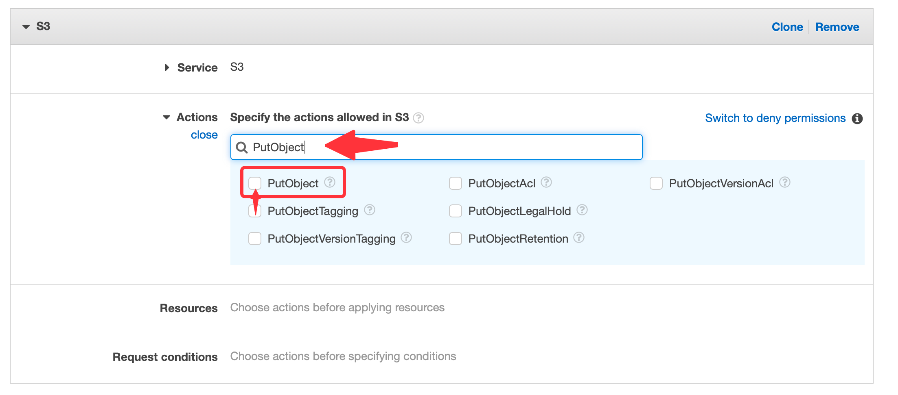
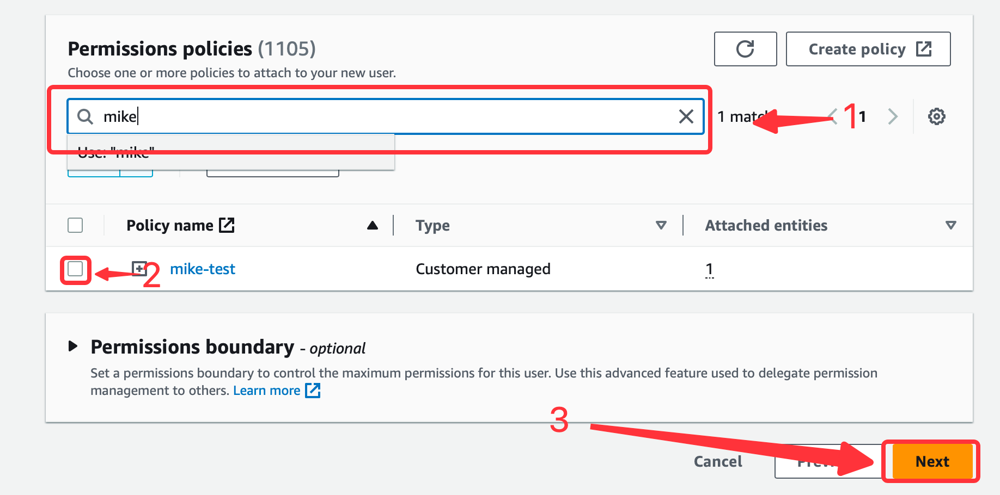

# S3

This guide contains information to set up S3 Sink in Vanus Cloud.

## Introduction

Amazon S3 (Simple Storage Service) is a highly scalable and durable object storage service provided by Amazon Web Services (AWS). It is designed to store and retrieve any amount of data from anywhere on the internet, making it ideal for a wide range of use cases such as backup and restore, disaster recovery, data archiving, content delivery, and big data analytics.

With Amazon S3 Sink in Vanus Cloud, you can easily forward data or events to your S3 bucket automatically. The S3 Sink connector lets you save the events you need to any bucket of your choosing.


## Prerequisites

Before forwarding events to an S3 bucket, you must have:

- A [Vanus Cloud account](https://cloud.vanus.ai).
- An [Amazon Web Services](https://aws.amazon.com) account.

## Getting Started

### Step 1: Create an AWS User
Create a new user and set the proper IAM policy.

1. Log in to the [AWS](https://aws.amazon.com) Management Console using your root account credentials.
2. Navigate to the IAM service by clicking on the Services menu and selecting IAM.
   
3. Click on the Users tab in the left navigation menu, and then click the Add user button.
   
4. Write the name for your user and click next.
5. select attach policy directly, and Create policy.
   
6. select the Service 's3' and give it the following policy. You can search for each rule.
    - "PutObject",
    - "GetObject",
    - "GetObjectVersion",
    - "DeleteObject",
    - "DeleteObjectVersion"

7. press **next** and review.
8. Name your policy and click **create policy**.
9. Go back to the previous **TAB** to continue creating your account.
10. **search** for your custom policy and add it to your account, and press **next**.

11. Review and press create user.


### Step 2: Get your Access and secret key
1. Now click on the user you just created.
2. Go to 'Access Key' Click **Create access key**.
    
3. Select Command line interface CLI, and press **next**.
4. Save your access key and secret key safely.
    

### Step 3: Config your connection
**To set up S3 Sink in Vanus Cloud:**

1. After selecting a source connector you can select `S3` as you sink connector.
2. Enter your `Access Key` and `Secret Key` in Vanus Cloud from previous steps.
3. Now let go back to Amazon Web Services under the [Amazon S3 service](https://s3.console.aws.amazon.com).
4. At this point you can either **create a new bucket** or **select a existent** bucket.
5. Once you've chosen or created a bucket keep in my your bucket name and region.

6. Write you `bucket name` and select your `region` in Vanus Cloud.

7. Select the interval time of upload; `HOURLY` or `DAILY`
8. Click **Next** to continue.

## Required Data Format

The event data must be in JSON format with the following way:

```json
{
  "data": {
    "myData": "simulation event data"
  }
}
```
