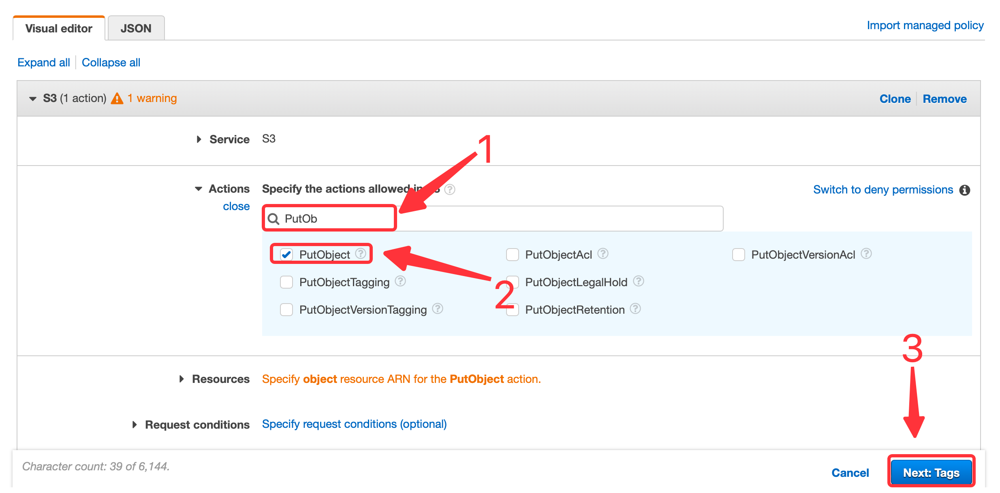
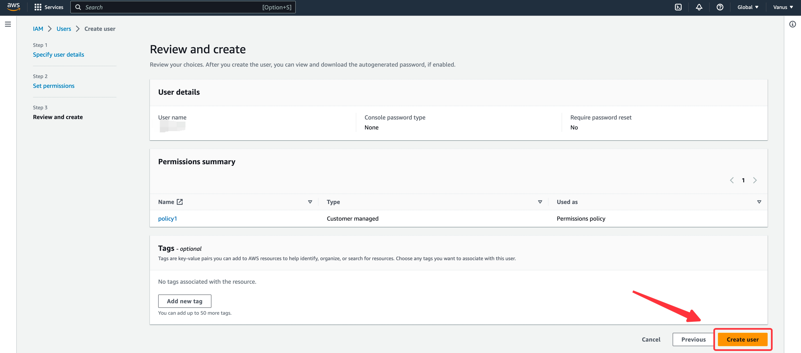
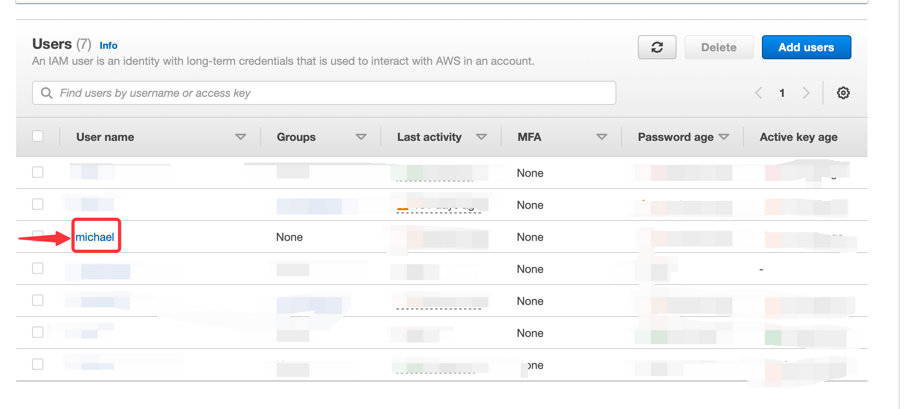
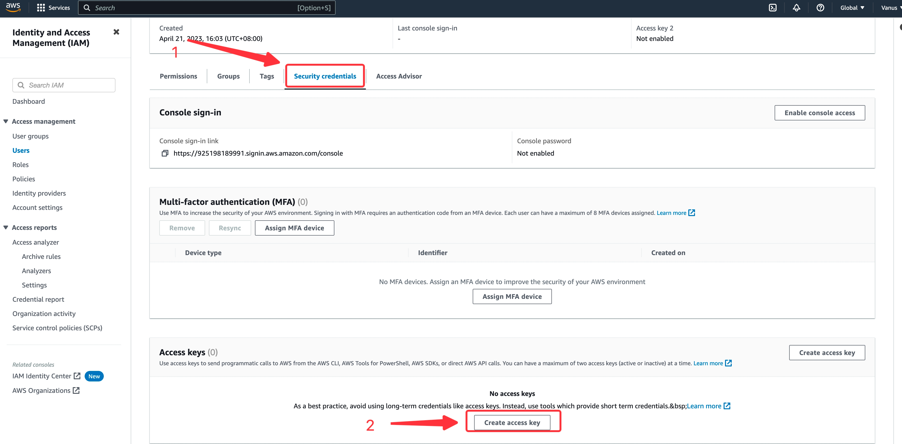
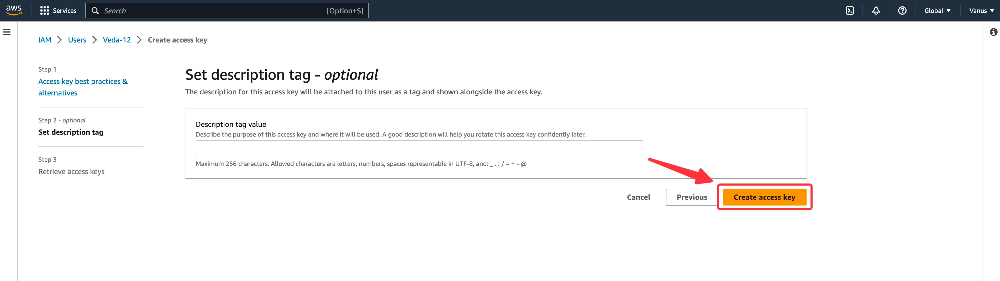
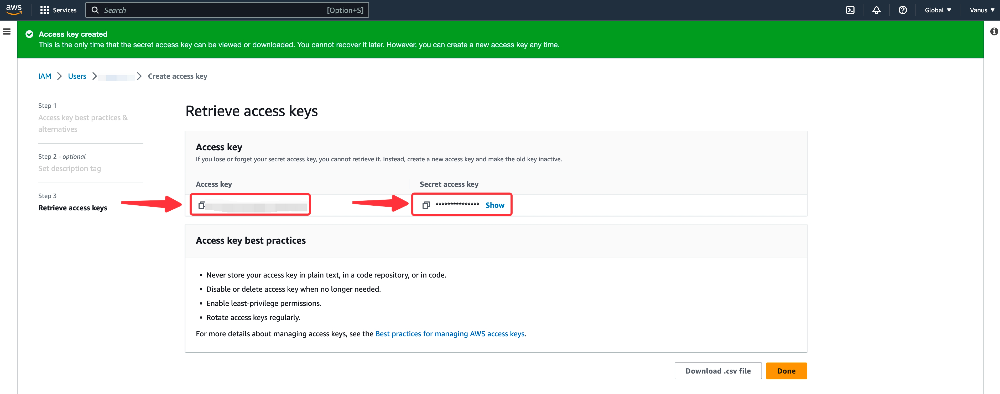
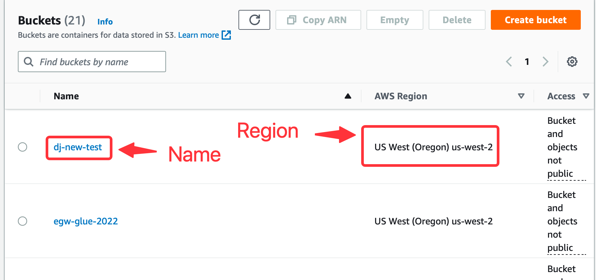
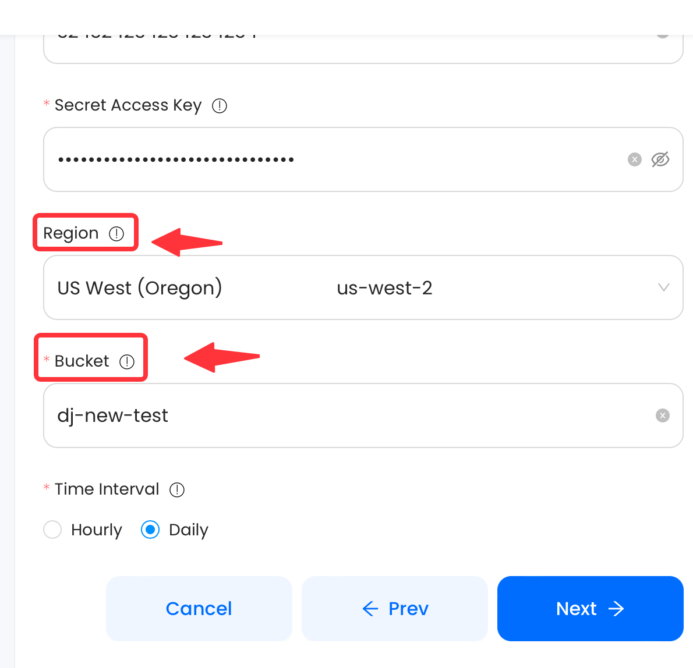

# S3

This guide contains information to set up S3 Sink in Vanus Cloud.

## Introduction

Amazon S3 (Simple Storage Service) is a highly scalable and durable object storage service provided by Amazon Web Services (AWS). It is designed to store and retrieve any amount of data from anywhere on the internet, making it ideal for a wide range of use cases such as backup and restore, disaster recovery, data archiving, content delivery, and big data analytics.

With Amazon S3 Sink in Vanus Cloud, you can easily forward data or events to your S3 bucket automatically. The S3 Sink connector lets you save the events you need to any bucket of your choosing.


## Prerequisites

Before forwarding events to an S3 bucket, you must have:

- A [Vanus Cloud account](https://cloud.vanus.ai).
- An [Amazon Web Services](https://aws.amazon.com) account.

## Getting Started

### Step 1: Create an AWS User

1. Log in to the AWS [Management Console](https://aws.amazon.com) using your root account credentials.
2. Navigate to the [IAM](https://console.aws.amazon.com/iam/) service by searching for IAM and click the IAM service.
   
3. Click on the **Users tab** in the left navigation menu, and then click the **Add user** button.
   
4. Write the name for your user and click **next**.
   
5. Select **Attach policy directly**, and **Create policy**.
   
6. Search for s3 and select it.
   
7. Next search for the following policy.
    - "PutObject",
    - "GetObject",
    - "GetObjectVersion",
    - "DeleteObject",
    - "DeleteObjectVersion"
      
8. Press **Next** and proceed to the next page.
   
9. Name your policy and click **Create policy**.
10. Return back to your previous `TAB`.
    
11. Search for your custom policy and add it to your account, and press **Next**.
    
12. Review and press **Create user**.
    

### Step 2: Get your Access and secret key

1. Now click on the user you just created.
   
2. Under **Security and credential** scroll down the page to `Access Key`, and Click **Create access key**.
   
3. Select Command line interface CLI, and press **Next**.
   
4. Click **Create sccess key**.
   
5. Save your `Access key` and `Secret key` safely.
   

### Step 3: Config your connection
**To set up S3 Sink in Vanus Cloud:**

1. Enter your `Access Key` and `Secret Key` in Vanus Cloud from previous steps.
2. Now let go back to Amazon Web Services under the [Amazon S3 service](https://s3.console.aws.amazon.com).
3. At this point you can either **create a new bucket** or **select a existent** bucket.
4. Once you've chosen or created a bucket keep in my your bucket name and region.

5. Write you `bucket name` and select your `region` in Vanus Cloud.

6. Select the interval time of upload; `HOURLY` or `DAILY`
7. Click **Next** to continue.

## Required Data Format

The event data must be in JSON format with the following way:

```json
{
  "data": {
    "myData": "simulation event data"
  }
}
```
