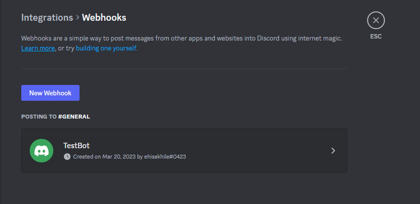

# Discord

This guide contains information to set up a Discord Sink in Vanus Cloud.

## Introduction

Discord is a popular messaging and voice chat application designed for gamers, but has since been adopted by many different communities. It allows users to create or join "servers" where they can chat with friends or join public channels to communicate with others who share similar interests.

## Prerequisites

Before forwarding events to Slack, you must have:

- A Discord Account
- A [Vanus Cloud account](https://cloud.vanus.ai)

## Getting Started

**To set up an app for receiving events in your Discord server:**

1. Create a channel on Discord and Click on the Settings icon
   

2. Click on Integrations and Select Webhooks
   

3. Click on the button **New Webhook**
   

4. Copy the Webhook URL

5. In Vanus Cloud, select Discord Sink and paste the Webhook URL into the "URL" field.

Click "Next" to continue.

## Required Data Format

The event data must be JSON format, here a simple message, example:

```json
{
  "data": {
    "username": "Test",
    "content": "Hello, This is a Discord Message!"
  }
}
```

## Template Scenario

Here are some easy to use scenarios for this connector.

- [Amazon EventBridge CreateBucket | DeleteBucket event triggers a Discord message Receive](https://cloud.vanus.ai/connections/wizard?source=aws-eventbridge&sink=http&id=20230406_2)
- [AWS Billing event triggers a Discord message](https://cloud.vanus.ai/connections/wizard?source=aws-billing&sink=http&id=20230410_1)
- [Auth0 login event triggers a Discord message](https://cloud.vanus.ai/connections/wizard?source=auth0&sink=http&id=20230329_1)
- [GitHub star event triggers a Discord message](https://cloud.vanus.ai/connections/wizard?source=github&sink=http&id=20230320_1)
- [GitHub issue event triggers a Discord message](https://cloud.vanus.ai/connections/wizard?source=github&sink=http&id=20230320_2)
- [GitHub issue comment event triggers a Discord message](https://cloud.vanus.ai/connections/wizard?source=github&sink=http&id=20230320_3)
- [GitHub opened pull-request event triggers a Discord message](https://cloud.vanus.ai/connections/wizard?source=github&sink=http&id=20230321_1)
- [Grafana resource utilization threshold event triggers a Discord message](https://cloud.vanus.ai/connections/wizard?source=grafana&sink=http&id=20230330_1)
- [Stripe Invoice Payment event triggers a Discord message](https://cloud.vanus.ai/connections/wizard?source=stripe&sink=http&id=20230407_1)
