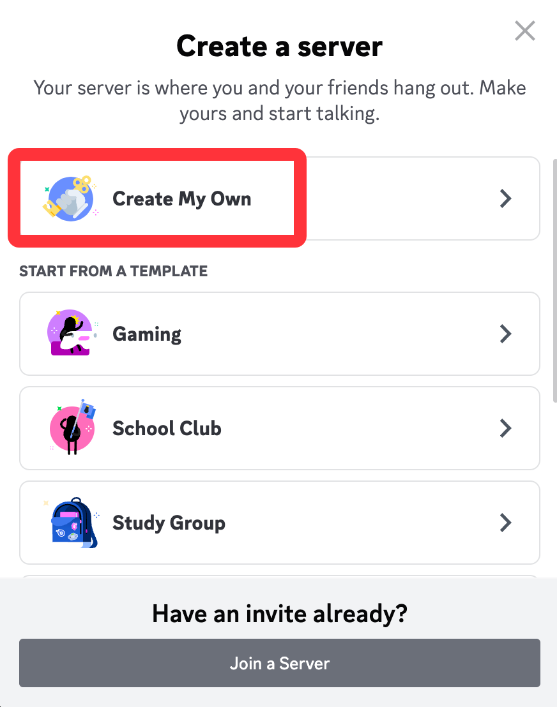
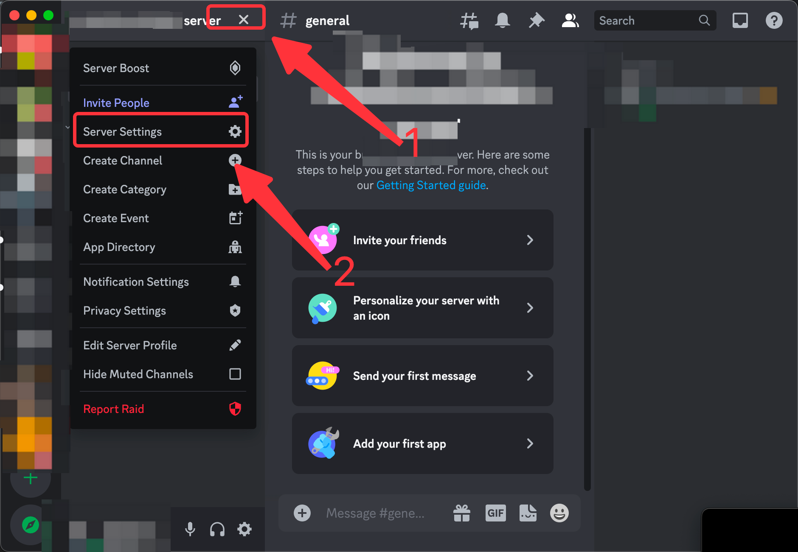
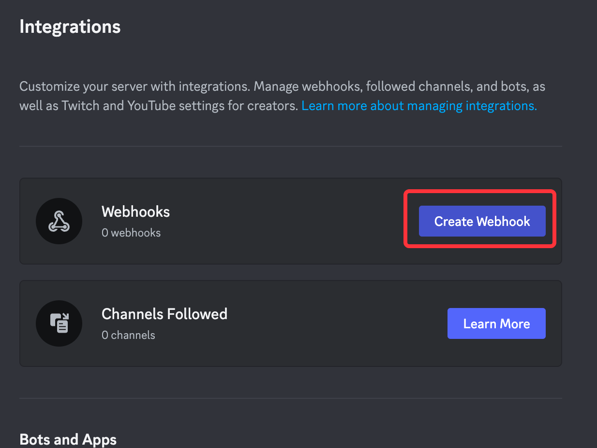
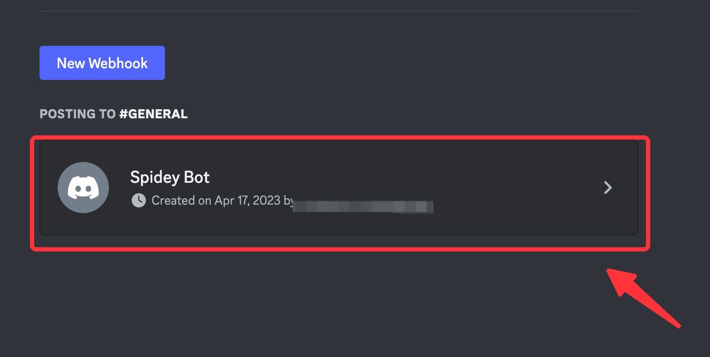

# Discord

This guide contains information to set up a Discord Sink in Vanus Cloud.

## Introduction

Discord is a platform that provides free voice, video, and text chat for groups, making it popular among online communities, teams, and remote workers.

Using Discord Sink connector in Vanus Cloud, you can easily forward real-time updates to a Discord group chat, allowing your team to stay up-to-date on all events generated by your application.


## Prerequisites

Before forwarding events to Slack, you must have:

- A Discord Account
- A [Vanus Cloud account](https://cloud.vanus.ai)

## Getting Started

**To set up an app for receiving events in your Discord server:**

### Step 1: Create a server
1. go to the Discord application.
2. Create a new server by clicking the `+`.

3. Choose a template or create your own.

4. Finish setting up your server.

### Step 2: get a webhook url
1. Go to **Server Settings**.

2. Click **integration** in the sidebar under APPS.

3. Click **create Webhook**.

4. Click on the webhook you just created.

5. Copy and save your payload URL


### Connection Setup
1. Paste your webhook URL in the `URL` field.
2. Click "Next" to continue.

## Required Data Format

The event data must be JSON format, here a simple message, example:

```json
{
  "data": {
    "username": "Test",
    "content": "Hello, This is a Discord Message!"
  }
}
```

## Template Scenario

Here are some easy to use scenarios for this connector.

- [Amazon EventBridge CreateBucket | DeleteBucket event triggers a Discord message Receive](https://cloud.vanus.ai/connections/wizard?source=aws-eventbridge&sink=http&id=20230406_2)
- [AWS Billing event triggers a Discord message](https://cloud.vanus.ai/connections/wizard?source=aws-billing&sink=http&id=20230410_1)
- [Auth0 login event triggers a Discord message](https://cloud.vanus.ai/connections/wizard?source=auth0&sink=http&id=20230329_1)
- [GitHub star event triggers a Discord message](https://cloud.vanus.ai/connections/wizard?source=github&sink=http&id=20230320_1)
- [GitHub issue event triggers a Discord message](https://cloud.vanus.ai/connections/wizard?source=github&sink=http&id=20230320_2)
- [GitHub issue comment event triggers a Discord message](https://cloud.vanus.ai/connections/wizard?source=github&sink=http&id=20230320_3)
- [GitHub opened pull-request event triggers a Discord message](https://cloud.vanus.ai/connections/wizard?source=github&sink=http&id=20230321_1)
- [Grafana resource utilization threshold event triggers a Discord message](https://cloud.vanus.ai/connections/wizard?source=grafana&sink=http&id=20230330_1)
- [Stripe Invoice Payment event triggers a Discord message](https://cloud.vanus.ai/connections/wizard?source=stripe&sink=http&id=20230407_1)
