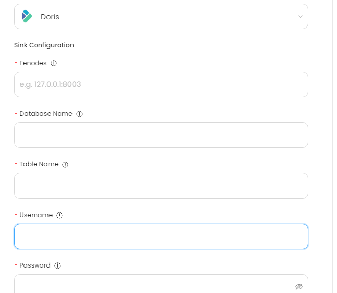

# Doris

This guide contains information to set up a Feishu Sink in Vanus Cloud.

## Introduction

Apache Doris is an open-source, distributed analytical database that is designed to be highly scalable and efficient. It is particularly well-suited for OLAP (Online Analytical Processing) workloads, which involve complex queries on large amounts of data.

## Prerequisites

Before forwarding events to Feishu, you must have:

- A Doris cluster
- A [Vanus Cloud account](https://cloud.vanus.ai)

## Getting Started

**To set up Doris Sink in Vanus Cloud:**

1. In Vanus Cloud, go to "Sinks" and select "Doris".
2. Provide the following credentials
   - Fenodes
   - Database Name
   - Table Name
   - Username
   - Password
     
3. Click Next and finish the configurations.

## Required Data Format

The event data must be JSON format, here a simple message, example:

```json
{
  "data": {
    "id": 1,
    "username": "name",
    "birthday": "2022-11-20"
  }
}
```
