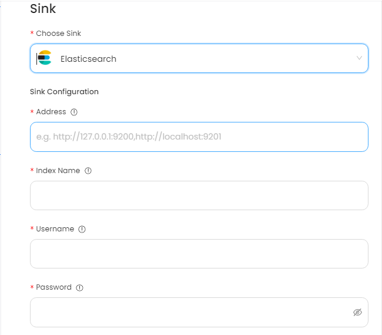

# Elasticsearch

This guide contains information to set up a Elasticsearch Sink in Vanus Cloud.

## Introduction

Elasticsearch is a distributed, open-source search and analytics engine designed to be highly scalable and reliable. It is commonly used to store, search, and analyze large volumes of data in real-time, and is used by many organizations for a wide range of applications, including logging, e-commerce, content management, and business intelligence.

## Prerequisites

Before forwarding events to Elasticsearch, you must have:

- A [Vanus Cloud account](https://cloud.vanus.ai)
- Have an Elasticsearch cluster.

## Getting Started

**To set up Elasticsearch Sink in Vanus Cloud:**

1. In Vanus Cloud, go to "Sinks" and select "Elasticsearch".
2. Provide the following credentials
   - Address: Elasticsearch address split by ","
   - Index Name: Elasticsearch index name
   - Username: Elasticsearch cluster username
   - Password: Elasticsearch cluster password
     
3. Click Next and finish the configurations.

## Custom Connection

Create your template following the structure of your database, an example:

```json
{
  "_index": "vanus_test",
  "_type": "_doc",
  "_id": "CqFnBIEBzJc0Oa5TERDD",
  "_version": 1,
  "_source": {
    "id": 123,
    "date": "2022-06-13",
    "service": "test data"
  }
}
```
