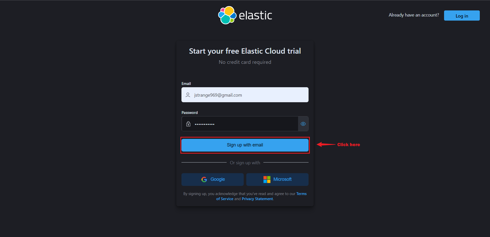

# Elasticsearch

This guide contains information to set up a Elasticsearch Sink in Vanus Cloud.

## Introduction

Elasticsearch is a fast and scalable search and analytics engine used as a backend for search-heavy applications. One of the key features of Elasticsearch is its scalability, which allows it to handle large volumes of data across multiple nodes in a cluster. It also has a powerful query language and a rich set of APIs that make it easy to interact with and integrate into a wide range of applications and systems.

The Elasticsearch Sink simplifies the process of delivering data to your Elasticsearch cluster. With this tool, you can easily and efficiently transfer your data to your Elasticsearch cluster, making it searchable and accessible for analysis and other processing needs.

## Prerequisites

Before forwarding events to Elasticsearch, you must have:

- A [Vanus Cloud account](https://cloud.vanus.ai).
- Have an Elasticsearch cluster. 

## Getting Started

### Step 1: Setup an Elasticsearch cluster 

1. Got to the [Elasticsearch](https://www.elastic.co/) official website and sign up for an account.  
   


2. Input your name and company, select your interest and reason for using Elastic search, and click next.  
   


3. Create your deployment  
   

4. A deployment includes Elasticsearch, kibana, and other elastic stack features.  
   

- Name your deployment.  

- Choose the cloud provider you want to make use of.  

- Select your region.  

- You can leave the other settings on default or customize your settings further, depending on your use case. We left them on default because the default settings are sufficient for our use case.  

- Click on **create deployment** to finish creating your deployment.  


5. Download your deployment credentials, you will need them to log in to your endpoint, and they would also be needed for your Vanus connection.  
   


6. Wait for the creation of your deployment to be completed.  
   


7. Your deployment has been successfully created, click **continue**  
   

### Getting your server endpoint 
1. Click on the **settings** icon at the right side of your deployment.  
   


2. Copy your Elasticsearch endpoint.  
   


3. Paste the copied endpoint in your browser, fill in the credentials you downloaded while creating your deployment and click on sign in. 
   

   

### Creating an Index 
1. Click on API Console  
   

2. Select the **PUT** option, write the name of your index, and click submit. For this tutorial we named our index **"my_index".** 
   


3. Add a backslash and your index name to your endpoint, to see the content of your index. 
   


**To set up Elasticsearch Sink in Vanus Cloud:**

1. In Vanus Cloud, go to "Sinks" and select "Elasticsearch".  


2. Provide the following credentials
   - Server Endpoint: The endpoint of your elasticsearch cluster.  
   - Index: The name of the index you created.  
   - Username: The username you downloaded during the creation of your deployment.   
   - Password: The password you downloaded during the creation of your deployment.  
    
3. Click `Next` and finish the configurations.

## Custom Connection

Create your template following the structure of your database, an example:

```json
{
  "_index": "vanus_test",
  "_type": "_doc",
  "_id": "CqFnBIEBzJc0Oa5TERDD",
  "_version": 1,
  "_source": {
    "id": 123,
    "date": "2022-06-13",
    "service": "test data"
  }
}
```
