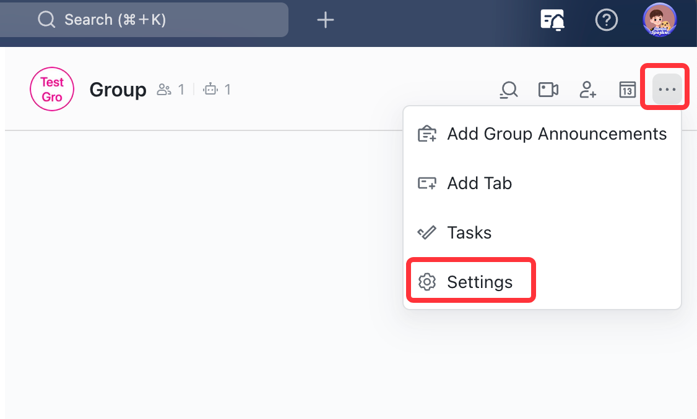
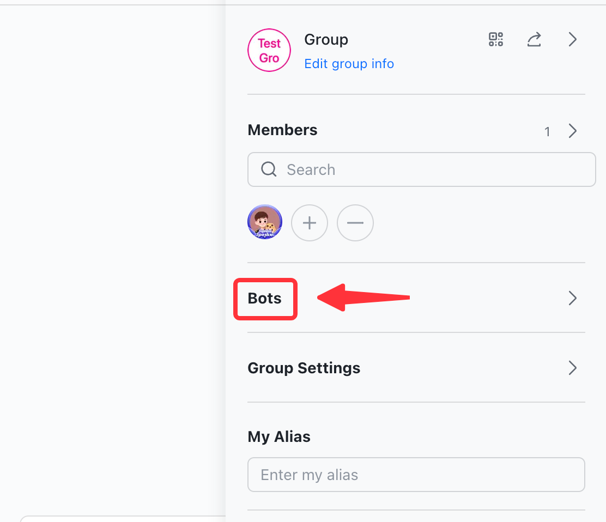
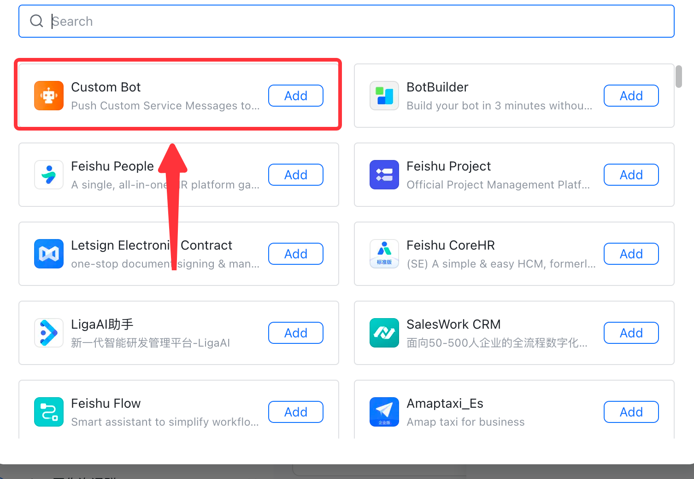
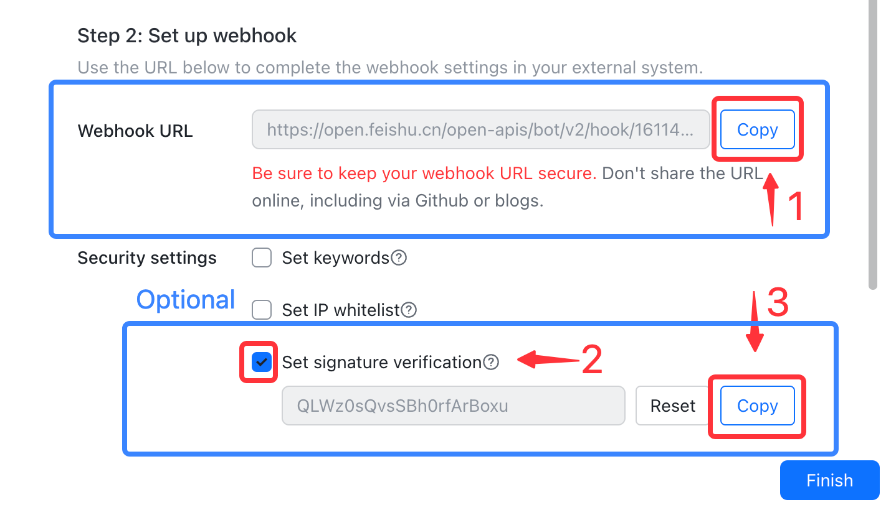

# Feishu

This guide contains information to set up a Feishu Sink in Vanus Cloud.

## Introduction

Feishu provides a powerful platform for team communication and collaboration.

With Feishu Sink connector in Vanus Cloud, you can easily forward real-time updates to a Feishu group chat, allowing your team to stay up-to-date on all events generated by your application.

## Prerequisites

Before forwarding events to Feishu, you must have:

- A [Feishu](https://www.feishu.cn) account.
- A [Vanus Cloud account](https://cloud.vanus.ai).

## Getting Started

### Step 1: Setup a Feishu bot
1. Create a new Group chat

2. In the feishu group click `...` and then **settings**.

3. Now click **Bots**.
   
4. Click on **Add Bot** and select **Custom bot**.
   
5. Enter a name for your bot and click **Continue**.
6. Copy the payload URL for your bot.
7. (Optionally) you can also set a **signature verification** for added security.
   

### Step 2: Finish you subscription

1. In Vanus Cloud, select Feishu Sink

2. paste the payload URL into the "URL" field.

3. Optionally add your Signature.

4. Click "Next" to continue.


## Required Data Format
The event data must be text format, here a simple message, example:

```text
Hello <client_name>, User <user_name> just used <connection> to sign in to <client_name>. User <user_name> has logged in <number_of_login> times.
```

:::caution
**ChatGPT Source**
If you created a connection with chatGPT Source after submitting you will need to finish the connection by setting up
the URL [click here](../../source/chatgpt/setup.md) to open the configuration step for chatGPT.
:::


## Template Scenario
Here are some easy to use scenarios for this connector.

- [Chat with ChatGPT via Feishu bot](https://cloud.vanus.ai/connections/wizard?source=chatgpt&sink=http&id=20230329_0)
- [Amazon EventBridge CreateBucket | DeleteBucket event triggers a Feishu message](https://cloud.vanus.ai/connections/wizard?source=aws-eventbridge&sink=http&id=20230329_1)
- [GitHub star event triggers a Feishu message](https://cloud.vanus.ai/connections/wizard?source=github&sink=http&id=20230306_1)
- [GitHub issue event triggers a Feishu message](https://cloud.vanus.ai/connections/wizard?source=github&sink=http&id=20230307_2)
- [GitHub issue comment event triggers a Feishu message](https://cloud.vanus.ai/connections/wizard?source=github&sink=http&id=20230307_3)


Check out this article on how to get a [Feishu Webhook](https://www.vanus.ai/blog/retrieve-feishu-webhook-url/) for more details.