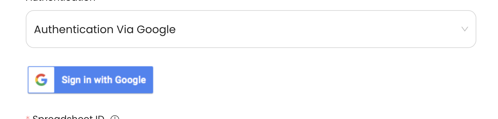

# Google Sheets

This guide contains information to set up a Google Sheets Sink in Vanus Cloud.

## Introduction

Google Sheets is a powerful spreadsheet tool that can be used to store and analyze data. 

With Google Sheets Sink connector in Vanus Cloud, you can easily forward real-time updates to a designated sheet in your Google Sheets account, allowing you to track events generated by your application.

## Prerequisites

Before forwarding events to Google Sheets, you must have:

- A Google account with administrative privileges.
- A [Vanus Cloud account](https://cloud.vanus.ai).

## Getting Started

**To set up a Google Sheets Sink in Vanus Cloud:**

### Step 1: Create a Google spreadsheet
1. Go to [Google Sheets](https://docs.google.com/spreadsheets/u/0/) and **Sign in**.
2. Create a new blank spreadsheet.

3. Copy the `ID` of the spreadsheet found in the link.


### Step 2: Create a connection

import Tabs from '@theme/Tabs';
import TabItem from '@theme/TabItem';

<Tabs>

<TabItem label="Authentication via Google" value="authentication-via-google">

1. Click on "Sign in with Google" and follow the process to sign in to your Google account.
   

</TabItem>

<TabItem label="Service Account Credentials" value="service-account-credentials">

Service Account Credentials

</TabItem>

</Tabs>

2. Paste the string `id` Example: `1i9b80jHcKzkUSOUDE9RAjnGevdWKScq_6Jnpofvb4CU` from Step 1.
3. Obtain the name of the sheet at the bottom of the spreadsheet.
   
4. Paste the sheet name default: `Sheet1`.
5. Click **Next** to continue.


## Required Data Format

The event data must be in JSON format with the following keys:

```json
{
    "Title": "value",
    "date": "value",
    "ect...": "value"
}
```
