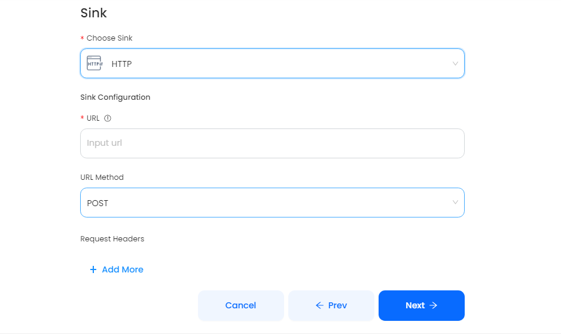

# HTTP

This guide contains information to set up a HTTP Sink in Vanus Cloud.

## Introduction

HTTP is a protocol for fetching resources such as HTML documents. It is the foundation of any data exchange on the Web and it is a client-server protocol, which means requests are initiated by the recipient, usually the Web browser.

## Prerequisites

To set up HTTP Sink, you must have:

- A [Vanus Cloud account](https://cloud.vanus.ai)
- A payload URL

## Getting Started

In Vanus Cloud, select HTTP Sink and paste the payload URL into the "URL" field. You can also select the URL Method (POST, GET, PATCH, DELETE, PUT). Click "Next" to continue.

