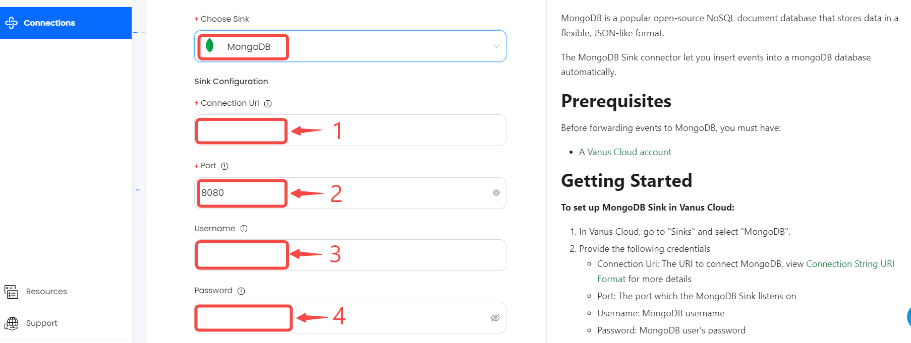

# MongoDB

This guide contains information to set up a MongoDB Sink in Vanus Cloud.

## Introduction

MongoDB is a popular open-source NoSQL document database that stores data in a flexible, JSON-like format.

The MongoDB Sink connector let you insert events into a mongoDB database automatically.

## Prerequisites

Before forwarding events to MongoDB, you must have:

- A [Vanus Cloud account](https://cloud.vanus.ai)

## Getting Started

**To set up MongoDB Sink in Vanus Cloud:**

1. In Vanus Cloud, go to "Sinks" and select "MongoDB".
2. Provide the following credentials
   - Connection Uri: The URI to connect MongoDB, view [Connection String URI Format](https://www.mongodb.com/docs/manual/reference/connection-string/) for more details
   - Port: The port which the MongoDB Sink listens on
   - Username: MongoDB username
   - Password: MongoDB user's password
   - Auth Source
   - Auth Mechanism
   - Auth Mechanism Properties
     
3. Click Next and finish the configurations.

## Custom Connection

Create your template following the structure of your database, an example:

```json

{
   "inserts": [
      {
        "scenario": "quick-start"
      }
  ]
}
```
