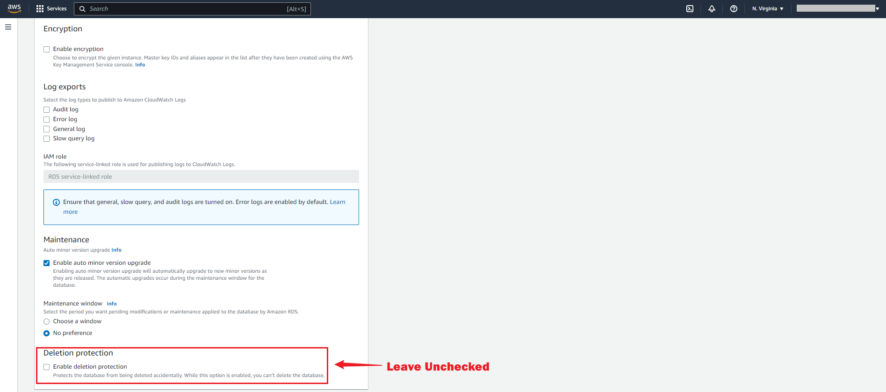

# MySQL

This guide contains information required in setting up an Amazon MySQL Sink in Vanus Cloud.  

## Introduction  

### MySQL 
MySQL is a popular system for managing databases that uses Structured Query Language (SQL) to handle and manipulate data. It provides a range of features for effective data management, including the capability to generate indexes to enhance the speed of data retrieval, the ability to replicate data across multiple servers for backup and fault tolerance, and stored procedures, which consist of pre-written SQL commands that can be saved in the database and executed later, simplifying complex operations. Users value MySQL for its simplicity, versatility, and dependability, and it can be incorporated seamlessly with a broad variety of programming languages and operating systems.


### AWS MySQL  
AWS MySQL is a cloud-based service that offers a relational database, leveraging the open-source MySQL database management system, provided by Amazon Web Services. The service enables users to deploy and administer MySQL databases in the cloud without the necessity of configuring and managing infrastructure on their own. AWS MySQL provides a host of functionalities, such as automatic backups, scalability, high availability, and security, making it an attractive option for businesses of all sizes. Additionally, AWS MySQL supports easy integration with widely used MySQL tools and applications, facilitating the migration of existing MySQL databases to the cloud.

### AWS MySQL Sink Connector  
The AWS MySQL sink connector in Vanus Cloud, allows you to easily move data or events from a source system to a MySQL database and table of your choice. The MySQL sink connector can extract data from a range of sources, modify it as necessary with pre-set filters, and then load it into the MySQL database. It lets you save the events you need to any database and table of your choosing. They can be set up in various modes of operation, including "upsert" mode to update existing data or "insert" mode to add new data.  

## Prerequisites

Before forwarding events to MySQL, you must have:

- A [Vanus Cloud account](https://cloud.vanus.ai) 
- An SQL client 
- Have a running MySQL server.
- Have a Database and Table created.

## Getting Started 
### Step 1: Setup A Mysql database server in AWS using RDS  

#### Create an RDS account  
1. Log in to the [AWS Management Console](https://aws.amazon.com/) using your root account credentials.  
   


2. Click on the left navigation pane called services and select **RDS**.  
   


Or type "RDS" in the search box and select it from the results.   
   


3. In the top right corner of the Amazon RDS console, select the Region in which you want to create the DB instance.   
   


4. Click on **Create database** in the **Create Database** section.  
   


#### Create Database   
Now you have options to select your engine.  

1. Select **standard create** and choose the MySQL icon.  
   


2. Leave the default value for edition, and select the **Free Tier** template.   
   


>**Note** 
Multi-AZ deployment is not available for the free tier, you will have to pay for it. Using a Multi-AZ deployment automatically provisions and maintains a synchronous standby replica in a different Availability Zone.  

   


##### Settings   
   

- **DB Instance Identifier:** Type a name unique to the region your DB instance has been set in.  

- **Master Username:** This is the username that would be used to log in to your DB instance.  

- **Master Password:** Type a password that takes the given constraints into consideration.  

- **Confirm password:** Type the password again.  


##### Instance configuration and storage   
1. Leave the default Instance configuration. 

2. Select the gp2 storage type, it's efficient and cost effective for our intended use.  
   


##### Connectivity   
1. Leave the default subnet group.  

2. Enable public access, this allocates an IP to your database instance and allows direct connection to the database from your own device.  
  


3. Select **Create new VPC security group**. This would create a security group that allows connection from the IP address of the device that you are currently using, to the database you created.  

4. Leave **Database port** on 3306   
   


5. Select the password method of authentication.   

6. Leave **enabled monitoring** unchecked, to stay within the free tier limit.  
  

 
7. Set a database name. If you do not provide one, Amazon RDS will not create a database on your instance being created.  

8. Set your preferred backup retention period.  
  


9. Leave **Deletion protection** unchecked, checking the box prevents you from being able to delete the database.  
   


10. Click on **create database**  
   


11. Your DB is now being created. This could take a few minutes, so move on to the next step while you wait. 
   


#### Download an SQL client
After the database instance is successfully created and its status changes to "available," you will be able to connect to a database on the DB instance through a standard SQL client. To accomplish this, we will download MySQL Workbench, which is a widely used SQL client, as part of the next step.   

1. Navigate to the [download MySQL Workbench](https://dev.mysql.com/downloads/workbench/) page and click on **download.**  
   


2. You would be prompted to log in or sign up. You can choose neither and just click on **No thanks, just start my download** for a quick download.  
   


#### Connect to the MySQL database   
Now it's time to connect to the database you created using MySQL workbench.  

1. Launch the MySQL Workbench application and click on **Database**.  
   


2. Click on **Connect Database**   
  


3. Fill the dialog box with the appropriate information.   
  

- You can find the **hostname** on the Amazon RDS console.  

- The username is the Amazon RDS database Master Username we created during your RDS setup.  

- For your **password**, choose **Store in vault** and enter the password created while creating the Amazon RDS database. After that, choose ok.  


*You are  now connected to the database.*  

   


#### Create a table for the connection 
- Select the created database with the following command. 
```
USE dbname;  
```

   


- Run the query to create the table with your desired values.  
   


- Confirm the creation of your table.   
   


**To set up MySQL Sink in Vanus Cloud:**

1. In Vanus Cloud, go to **"Sink"** and select **"MySQL"**.   
   


2. Provide the required credentials.  
   
- **Host:** This is your RDS endpoint.  

- **Port:** Enter the port number on which your MySQL server is listening. The default port for MySQL is 3306.   

- **Username:** Master username selected during the database creation.    

- **Password:** User password.  

- **Database Name:** The initial database name.  

- **Table Name:** The name of the table you want your events to be sent to.   


3. Click `Next` and finish the configurations.


## Custom Connection

The event data must be in JSON format and created following the structure of your database, here's an example:

```json
{
  "title": "value",
  "date": "value",
  "ect...": "value"
}
```
