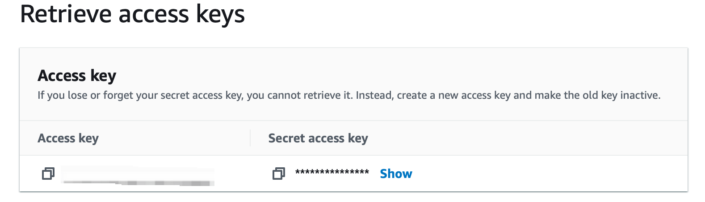

# S3

This guide contains information to set up S3 Sink in Vanus Cloud.

## Introduction

Amazon S3 (Simple Storage Service) is a highly scalable and durable object storage service provided by Amazon Web Services (AWS). It is designed to store and retrieve any amount of data from anywhere on the internet, making it ideal for a wide range of use cases such as backup and restore, disaster recovery, data archiving, content delivery, and big data analytics.

## Prerequisites

Before forwarding events to an S3 bucket, you must have:

- A [Vanus Cloud account](https://cloud.vanus.ai)
- An Amazon S3 bucket.
- AWS IAM Access Key.
- AWS permissions for the IAM user:
  - s3:PutObject

## Getting Started
### Create a new AWS user
Create a new user and set the proper IAM policy.
1. Log in to the AWS Management Console using your root account credentials.
2. Navigate to the IAM service by clicking on the Services menu and selecting IAM.
   
3. Click on the Users tab in the left navigation menu, and then click the Add user button.
   
4. Write the name for your user and click next.
5. select attach policy directly, and Create policy.
   
6. select the Service 's3' and give it the following policy
    - "s3:PutObject",
    - "s3:GetObject",
    - "s3:GetObjectVersion",
    - "s3:DeleteObject",
    - "s3:DeleteObjectVersion"
7. press next and review.
8. Name your policy and click create policy.
9. search for your custom policy and add it to your account, and press next.
10. Review and press create user.
11. Now click on the user you just created.
12. Go to 'Access Key' Click Create access key.
    
13. Select Command line interface CLI, and press next.
14. Save your access key and secret key safely.
    

### Config your connection
**To set up S3 Sink in Vanus Cloud:**

1. In Vanus Cloud, go to "Sinks" and select "S3".
2. Provide the following credentials
   - Access Key ID
   - Secret Access Key
   - Region
   - Bucketname
     
3. Select the interval you want the files uploaded; `HOURLY` or `DAILY`
4. Click next and finish the configurations.
5. Click "Next" to continue.

## Required Data Format

The event data must be in JSON format with the following keys:

```json
{
  "data": {
    "myData": "simulation event data"
  }
}
```
