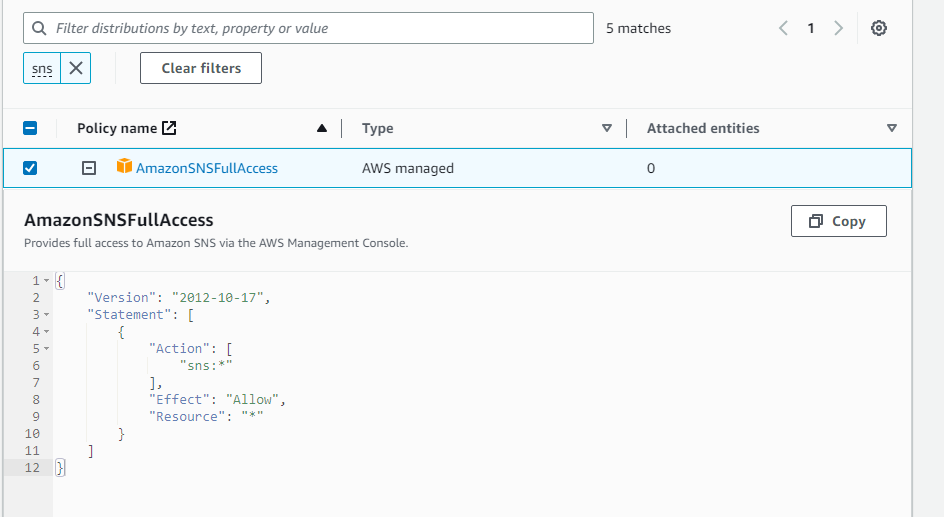

# Amazon SNS

This guide contains information to set up a SNS Source in Vanus Cloud.

## Introduction

Amazon Simple Notification Service (Amazon SNS) is a fully-managed messaging service provided by Amazon Web Services (AWS).

It enables you to send and receive messages between distributed systems or microservices, mobile devices, and other AWS services.

## Prerequisites

Before obtaining SNS events, you must have:

- A [Vanus Cloud account](https://cloud.vanus.ai)
- Have an AWS SNS Topic.
- AWS IAM Access Key.
- AWS permissions for the IAM user:
  - sns:Subscribe
  - sns:ConfirmSubscription
  - sns:Unsubscribe

## Getting Started

### Create a new AWS user

Create a new user and set the proper IAM policy.

1. Log in to the AWS Management Console using your root account credentials.
2. Navigate to the IAM service by clicking on the Services menu and selecting IAM.
   
3. Click on the Users tab in the left navigation menu, and then click the Add user button.
   
4. Write the name for your user and click next.
5. Select attach policy directly, and Create policy.
   
6. Search for the Service `sns` and select `AmazonSNSFullAccess`
   
7. Press next and review.
8. Review and press create user.
9. Now click on the user you just created.
10. Go to `Access Key` Click Create access key.
    
11. Select Command line interface CLI, and press next.
12. Save your access key and secret key safely.
    

### Config your connection

To obtain Amazon SNS events using the SNS source connector in Vanus Cloud, follow these steps:

1. Log in to your [Vanus Dashboard](https://cloud.vanus.ai/dashboard).
2. Click on the **create connection** button under connections.
3. From the list of sources, choose **Amazon SNS**
4. Enter the following credentials:
   - Port
   - Access Key ID
   - Secret Access Key
   - SNS ARN
   - Endpoint
   - Protocol
     
5. To get **SNS ARN**, **Endpoint** and **Protocol**, let's go back to our Amazon Web Services Account
6. Search for SQS, Click on it and Create a Queue.
7. Select type as FIFO and provide a name. Scroll down and click the **Create queue** Button. This will give you the Endpoint. The Protocol is **SQS**.
   
8. To obtain the **SNS ARN**, Search for **SNS** and Click on it to open the SNS Console.
9. Click on the **Create Topic** Button, Select the type as **FIFO** and name the Topic. Scroll down and click the **Create topic** button to create a Topic.
10. Copy the **SNS ARN** and paste on the field in Vanus Cloud.
11. Click next to continue.

## Supported Events

This Vanus Cloud Source connector offers support for various events. Below is a list of the supported events:

- [Amazon S3 Events](events.md#amazon-s3-events)
  - S3:ObjectCreated
  - S3:ObjectRemoved
  - S3:ObjectRestore

Learn more about Vanus and Vanus Cloud in our [documentation](https://docs.vanus.ai).
