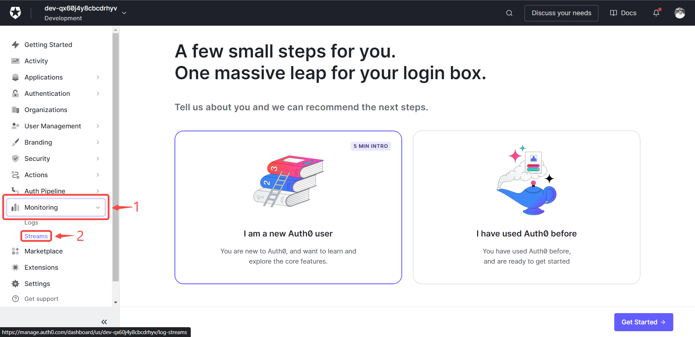
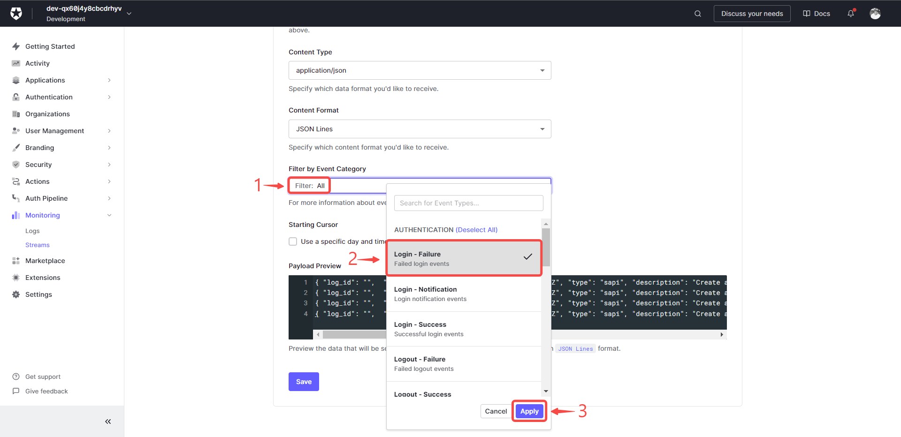
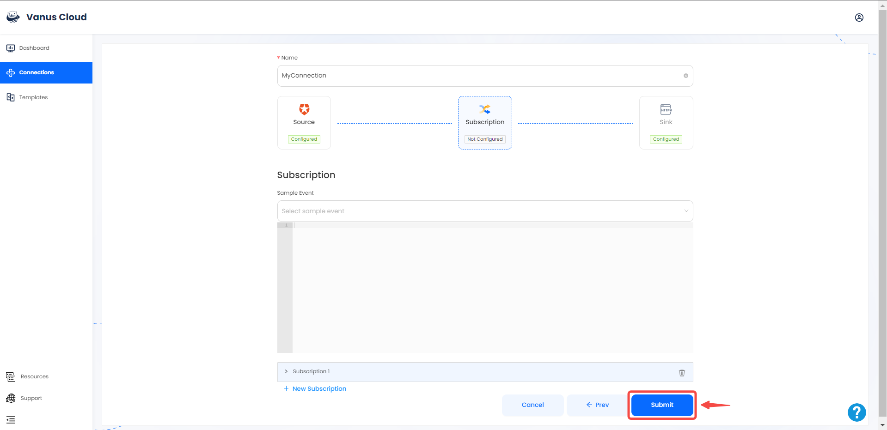
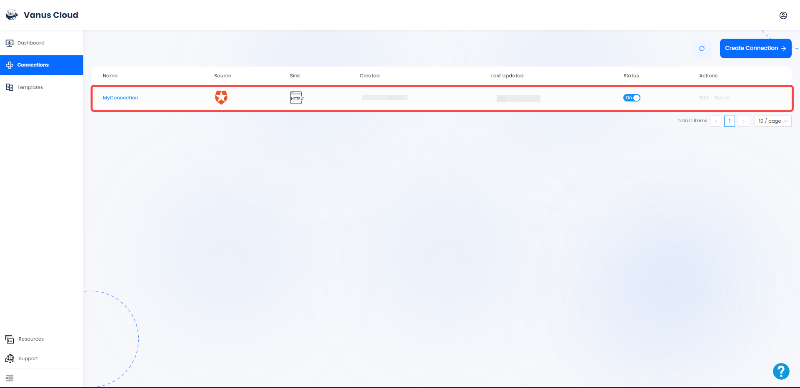

# Auth0

This guide contains information to set up a Auth0 Source in Vanus Cloud.

## Introduction

Auth0 is an authentication and authorization platform that provides security solutions for applications, websites, and APIs. It offers features such as single sign-on, multi-factor authentication, and social logins, among others.

The Auth0 Source is a webhook server that enables you to establish an endpoint for receiving events from your Auth0 application. To achieve this, it is necessary to establish a connection within Auth0.

---
## Prerequisites

Before obtaining Auth0 events, you must have:

- An Auth0 account with administrative privileges
- A [Vanus Cloud account](https://cloud.vanus.ai)

---

## Getting Started

### Step1: Create your connection in Vanus Cloud

1. Log in to your [Vanus](https://cloud.vanus.ai) account and click on **connections**  
  

2. Click on **Create Connections**  
  

3. Write a name for your connection.  
  

4. Click on source and click **auth0**

5. Click on the icon to copy the webhook url

---

### Step2: Configuring Auth0 to Send Webhook Events

1. Log in to your Auth0 account.

2. Navigate to the **Streams** menu under **Monitoring**.

3. Click on the **Create Log Stream** button.

4. Select the **Webhook** option.

5. Write a name for your webhook stream.

6. Provide the payload URL of your Auth0 source connector in Vanus Cloud, and select `Json line` under **Content Format**.

7. Select the event you want to receive notifications for.

8. Save your settings.  

---

### Step3: Complete your connection in Vanus cloud

1. Choose your sink and click **Next**

2. Click on submit to finish the configuration.
  

3. You've successfully created your Vanus auth0 source connection.  

:::caution
At this time you can only select one event.
:::

Learn more about Vanus and Vanus Cloud in our [documentation](https://docs.vanus.ai).
