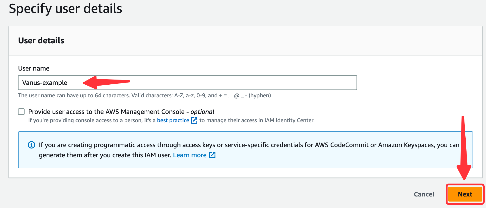
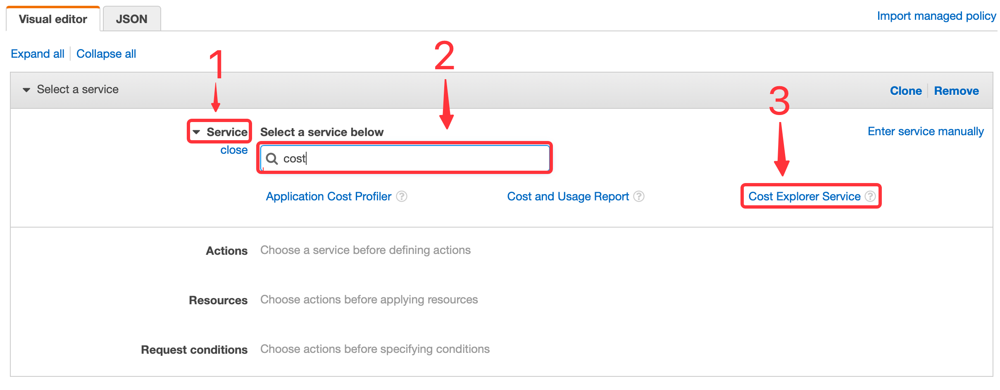
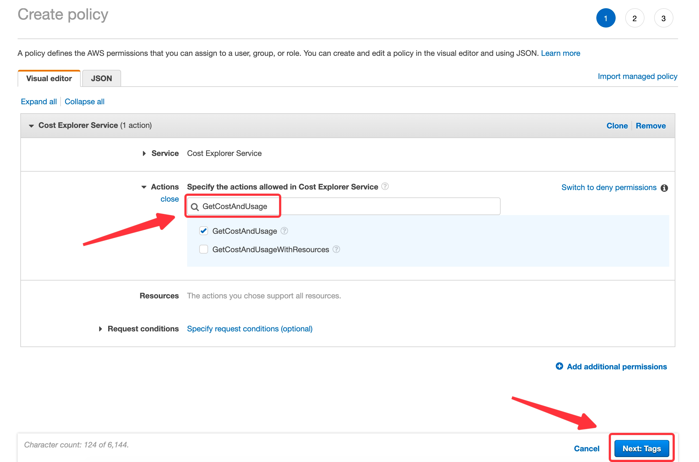
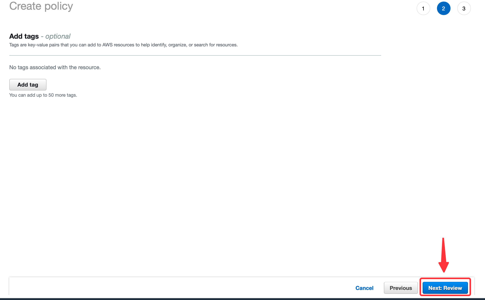
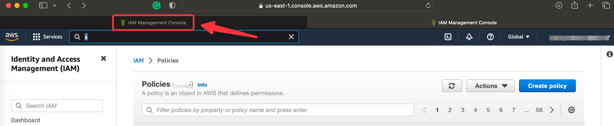
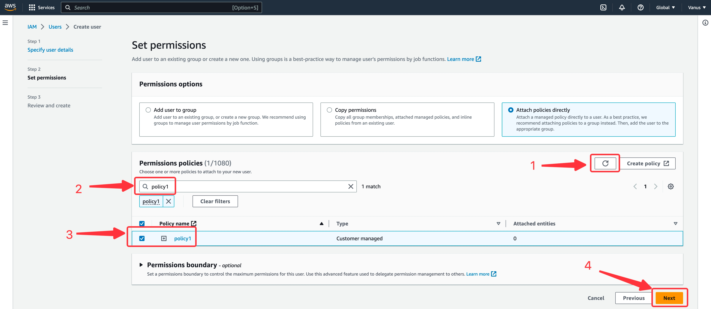
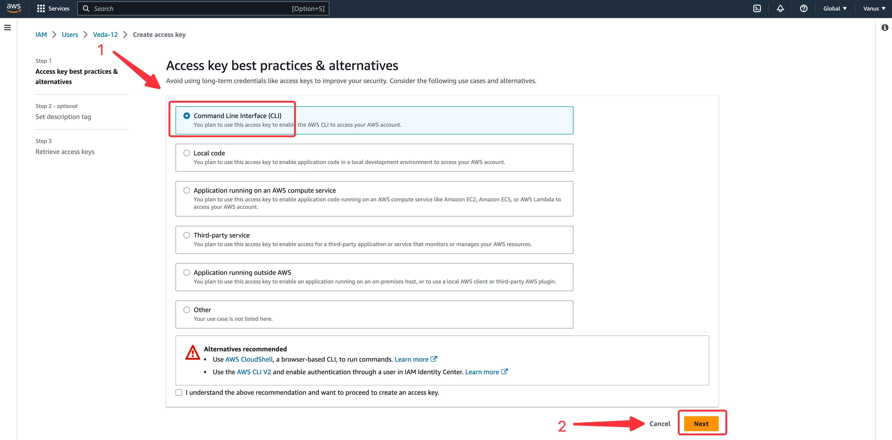
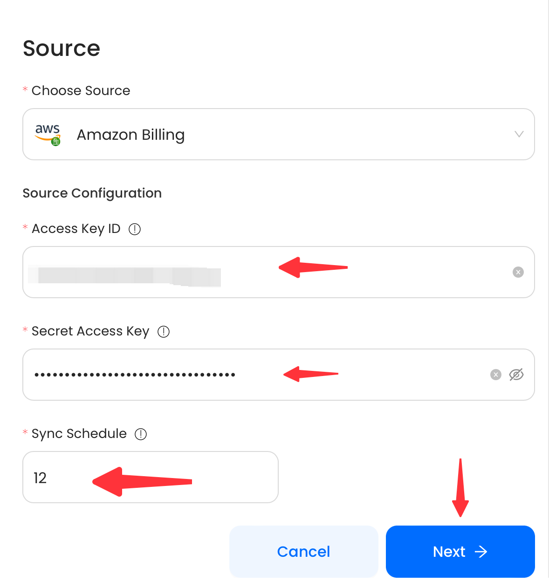

# Amazon Billing

This guide contains information to set up a Amazon Billing Source in Vanus Cloud.

## Introduction

AWS Billing is an AWS service for monitoring and managing your cloud usage and costs. It provides comprehensive usage and expense data to help you optimize resources and control spending.

Amazon Billing Source is a connector provided by Vanus that retrieves daily or hourly spending information from Amazon Cloud Services and converts it into CloudEvents. To use cloud billing, you need to provide a user access key and secret key, which are required to authenticate and authorize access to your AWS account. By providing these keys, the Amazon Billing Source connector can access your billing information and retrieve the spending data from your AWS account.

## Prerequisites

- A [Vanus Cloud account](https://cloud.vanus.ai)
- AWS IAM Access Key.
- AWS permissions ce:GetCostAndUsage for the IAM user.

## Getting Started

1. Log in to your [Vanus Dashboard](https://cloud.vanus.ai/dashboard).
2. Click on the **create connection** button under connections

### Step 1: How to create a new AWS user

1. Log in to the AWS [Management Console](https://aws.amazon.com) using your root account credentials.
2. Navigate to the [IAM](https://console.aws.amazon.com/iam/) service by searching for IAM and click the IAM service.
   
3. Click on the **Users tab** in the left navigation menu, and then click the **Add user** button.

4. Write the name for your user and click **next**.

5. Select **attach policy directly**, and **Create policy**.

6. Select the Service `Cost Explore Service`.

7. Next search for the following policy.
   - "GetCostAndUsage", 

8. Press **next** and proceed to the next page.

9. Name your policy and click **create policy**.
10. Return back to your previous `TAB`.

11. Search for your custom policy and add it to your account, and press **next**.

12. Review and press **create user**.

### Step 2: Create an Access Key and Secret Key
1. Now click on the user you just created.

2. Under **Security and credential** scroll down the page to `Access Key`, and Click **Create access key**.
    
3. Select Command line interface CLI, and press **next**.

4. Save your access key and secret key safely.
    

### Step 3: Config your connection

1. Write a name for your connection.
      
2. From the list of sources, choose **Amazon Billing**.
3. Fill in your Access Key ID and your Secret Key and click next
4. Click **`Next`** to save the Amazon Billing Source

Learn more about Vanus and Vanus Cloud in our [documentation](https://docs.vanus.ai)