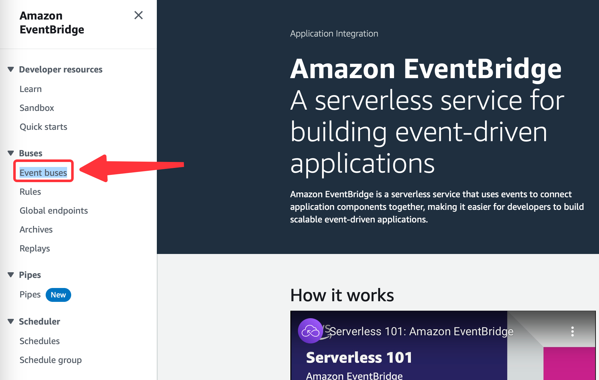
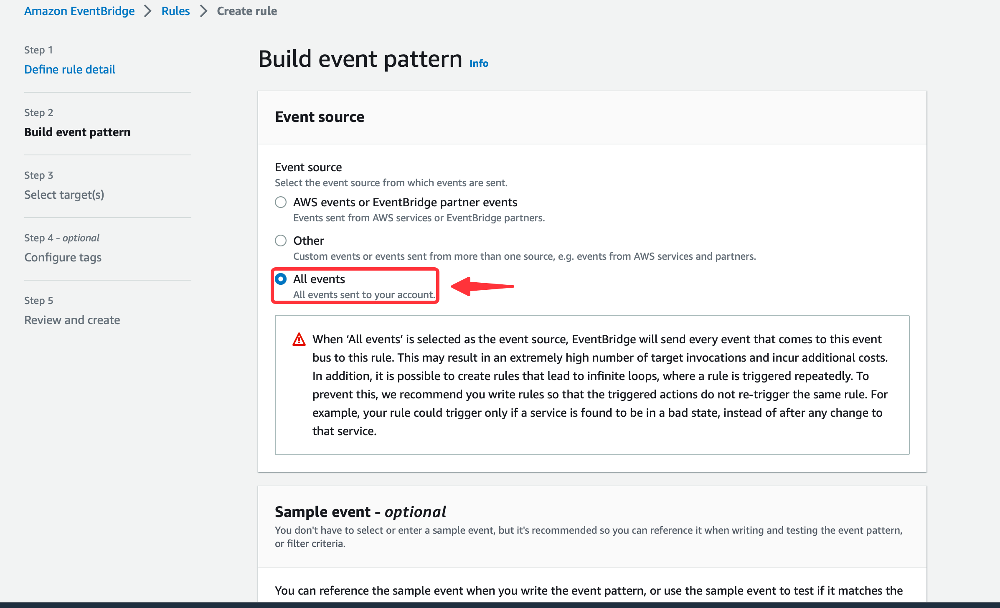
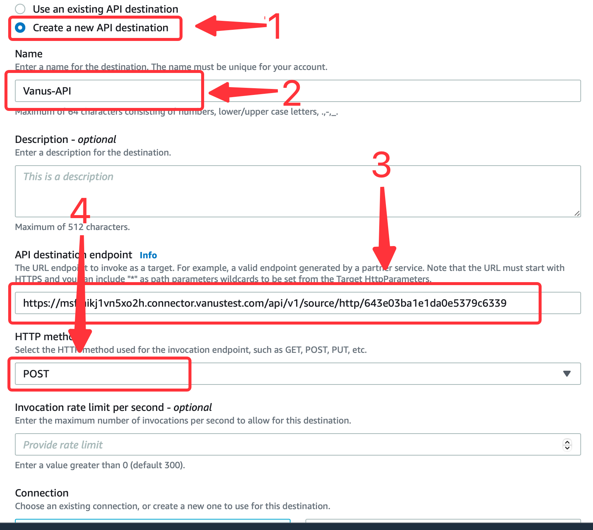
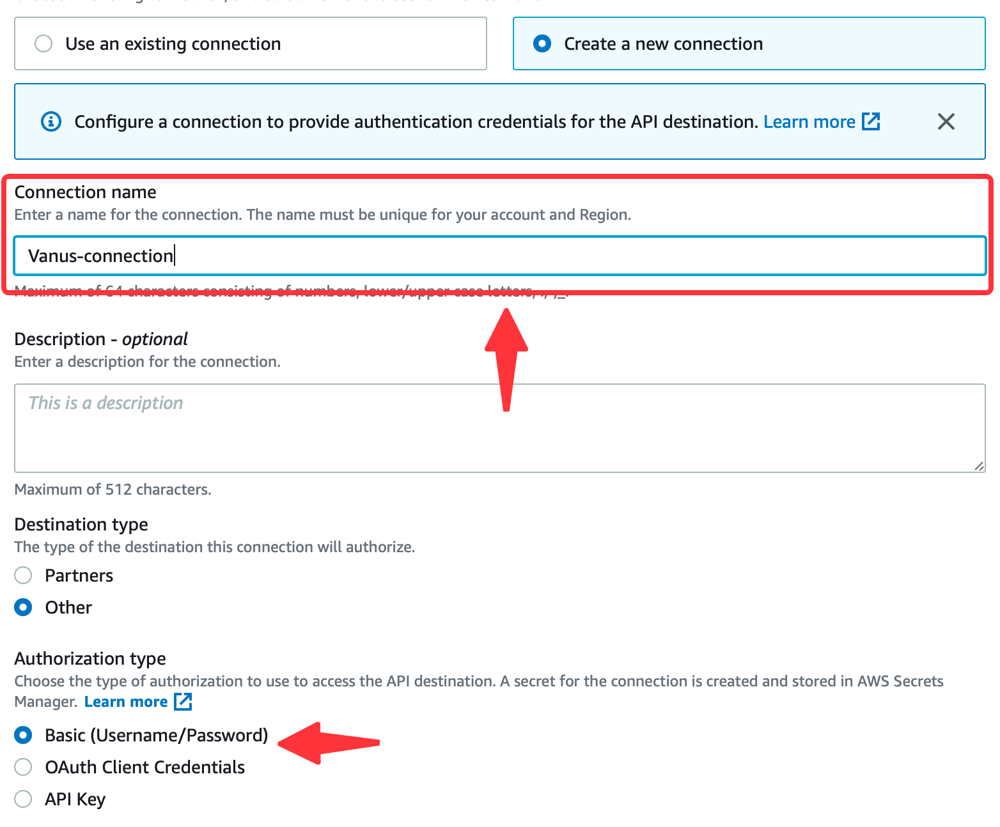

# Amazon Eventbridge

This guide contains information to set up a Amazon Eventbridge Source in Vanus Cloud.

## Introduction

Amazon EventBridge is a serverless service that uses events to connect application components together, making it easier for you to build scalable event-driven applications.

The Amazon EventBridge Source is a webhook server that enables you to establish an endpoint for receiving events from Amazon EventBridge. To achieve this, it is necessary to establish a connection within Amazon EventBridge.

## Prerequisites

- A [Vanus Cloud account](https://cloud.vanus.ai)
- An AWS Account with Administrative Privileges

## Getting Started

### Create your connection in Vanus Cloud

To obtain all Amazon Eventbridge events in Vanus Cloud, follow these steps:

1. Log in to your [Vanus Dashboard](https://cloud.vanus.ai/dashboard).
2. Click on the **create connection** button under connections.
3. From the list of sources, choose **Amazon Eventbridge**.
4. Click **Next** and finish the configurations.

### How to use the webhook URL
**Configuring Amazon Eventbridge**

1. Click the copy icon to copy the webhook url.

2. Navigate to the [EventBridge console](https://console.aws.amazon.com/events/home).
3. In the side menu click **Event buses**.

4. Create a new event bus if you haven't already. 

5. Write a name and press **create**.

6. Go to rule from the side menu and click **create rule**.

7. Name your rule, select your Event bus and press **Next**.

8. Select all events.

9. Press **Next** to continue.
10. Select EventBridge API connection.

11. Now select create new **Create a new API destination** under API destination.
12. Write a name,set the API destination endpoint to the URL from Vanus Cloud and set the HTTP method as `POST`.

13. Next, select create a connection.

14. Write a name for you connection and select **Basic (Username/Password)** under Authorization type.

15. Create a **Username** and a **Password** of your choice, this won't be needed in this scenario and press **Next**.

16. Under Configure tags - optional press **Next**.
17. Review and press **Create rule**.
Now every event sent to your Event Bus will be send to your Vanus connection.

Learn more about Vanus and Vanus Cloud in our [documentation](https://docs.vanus.ai).
