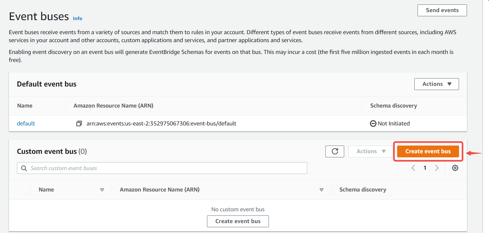
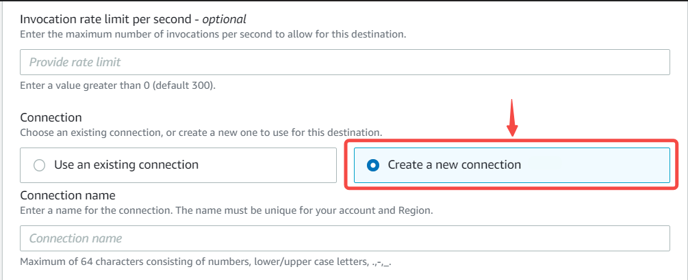
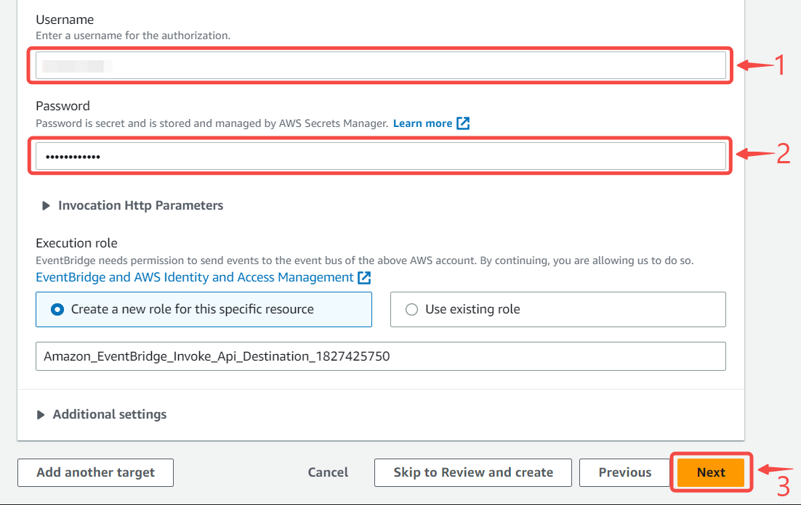
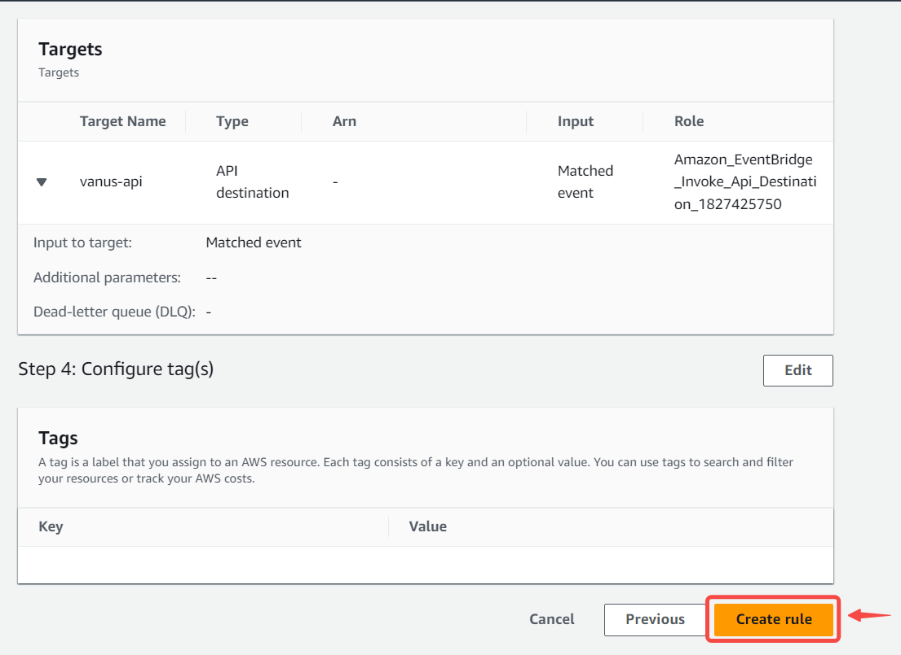
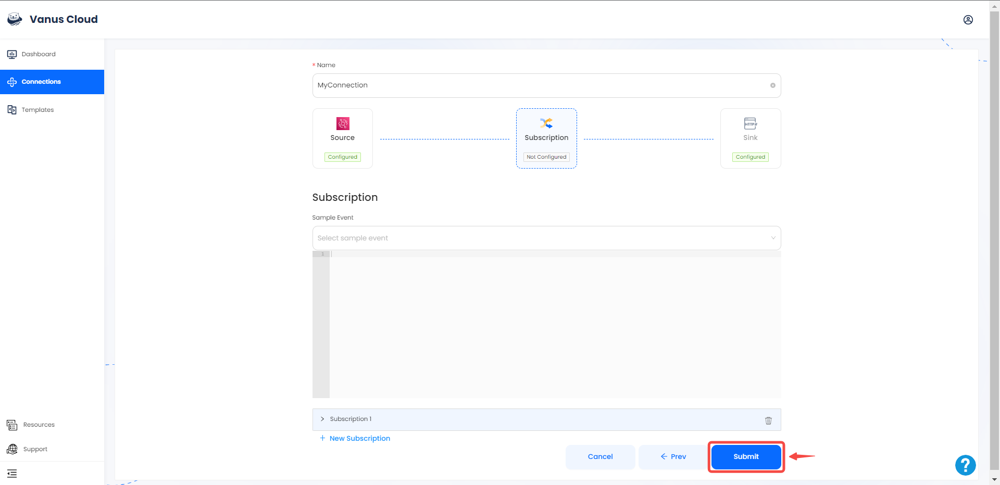
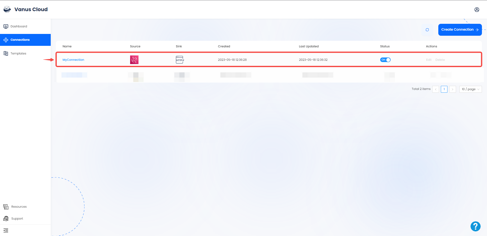

# Amazon Eventbridge

This guide contains information to set up a Amazon Eventbridge Source in Vanus Cloud.

## Introduction

Amazon EventBridge is a serverless service that uses events to connect application components together, making it easier for you to build scalable event-driven applications.

The Amazon EventBridge Source is a webhook server that enables you to establish an endpoint for receiving events from Amazon EventBridge. To achieve this, it is necessary to establish a connection within Amazon EventBridge.

---

## Prerequisites

- A [Vanus Cloud account](https://cloud.vanus.ai)
- An AWS Account with Administrative Privileges

---
## Getting Started

### Step1: Create your connection in Vanus Cloud

To obtain all Amazon Eventbridge events in Vanus Cloud, follow these steps:

1. Log in to your [Vanus](https://cloud.vanus.ai) account and click on **connections**  
  

2. Click on **Create Connections**  
  

3. Write a name for your connection.
  

4. Click on source and select **aws-eventbridge** 
  

5. Click the copy icon to copy the webhook url. 

6. Click next to continue configuration. 

---

### Step2: **Configuring Amazon Eventbridge** 

1. Navigate to the [EventBridge console](https://console.aws.amazon.com/events/home).

#### Create an Event Bus

1. In the side menu click **Event buses**.

2. Create a **new event bus** if you haven't already.

3. Write a name and press **create**.

---
#### Create a Rule. 

1. Go to **Rules** from the side menu and click **Create rule**.

2. Name your rule, select your **Event bus** and press **Next**.

3. Select **all events**.

4. Press **Next** to continue.

---

#### Create an API Destination and Connection

1. Select EventBridge API destination.

2. Now select create new **Create a new API destination** under API destination. 

- Write a connection Name. 

- Set the **API destination endpoint** to the URL from Vanus Cloud from **[step 1](#configuring-amazon-eventbridge)**. 

- Set the **HTTP method** as `POST`.

3. Next, select **Create a new connection**.

4. Write a name for you connection and select **Basic (Username/Password)** under Authorization type.

5. Create a **Username** and a **Password** of your choice, this won't be needed in this scenario but it is required and press **Next**.

6. Under Configure tags - optional press **Next**.

7. Review and press **Create rule**.
 

---

### Step3: Complete your connection set up in Vanus cloud 

1. Choose your sink and click **Next** 
 

2. Click on submit to finish the configuration. 
  

3. You've successfully created your Vanus aws-eventbridge source connection.  
  

Now every event sent to your Event Bus will be send to your Vanus connection.

Learn more about Vanus and Vanus Cloud in our [documentation](https://docs.vanus.ai).
