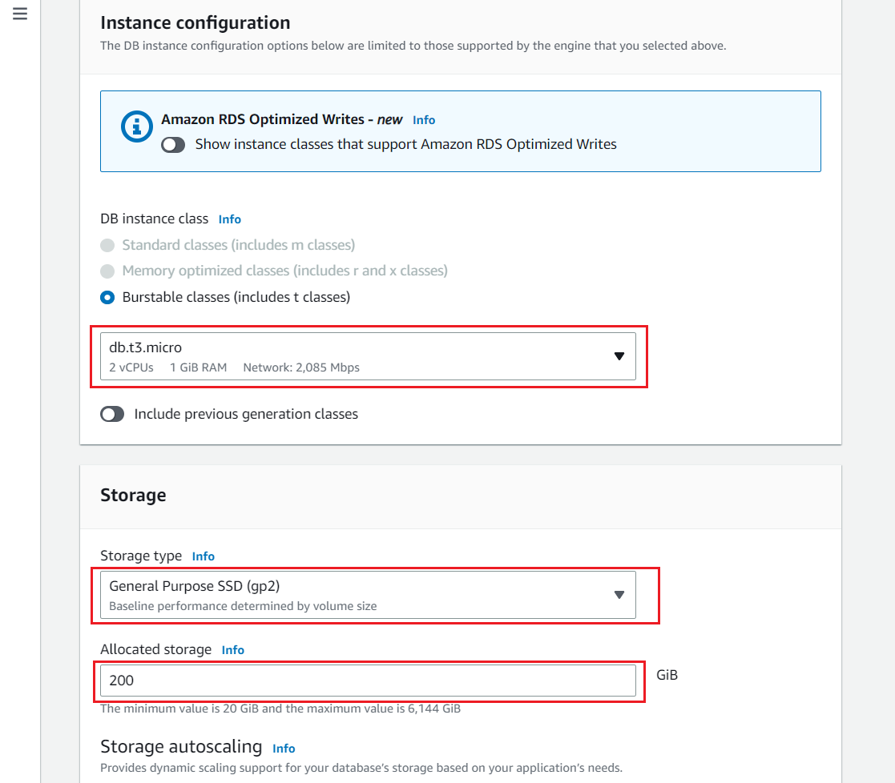
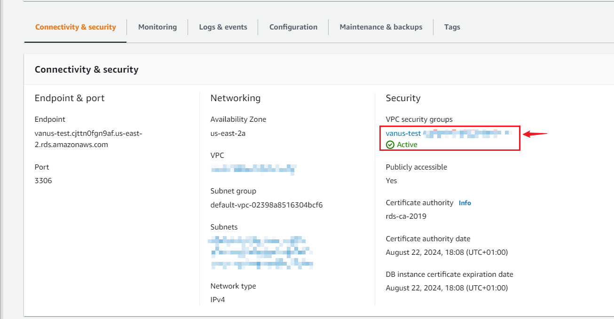
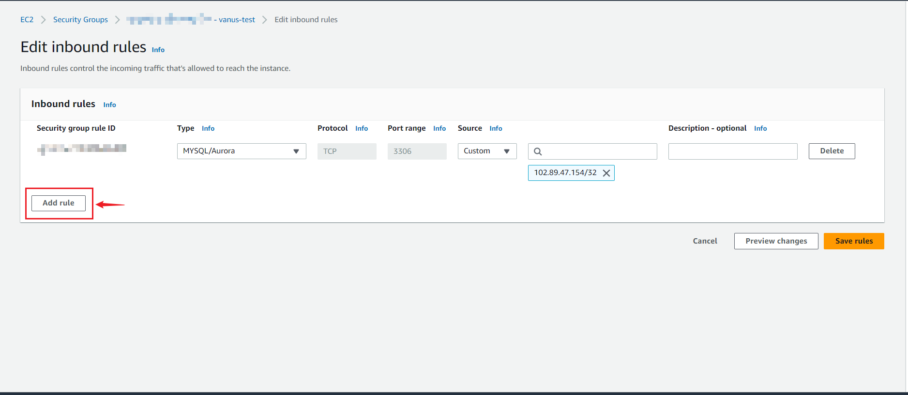
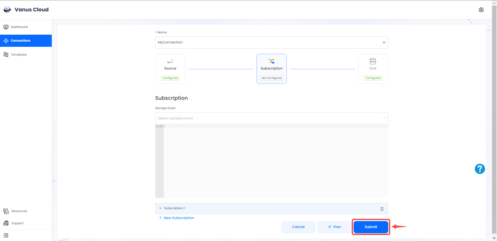
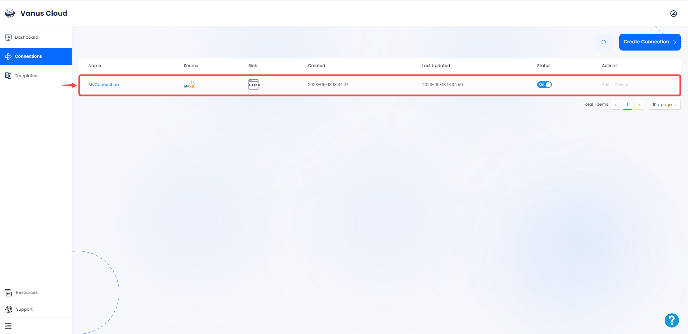

# AWS-MySQL  

This guide contains information required in setting up an Amazon MySQL Source in Vanus Cloud.  

## Introduction   

### MySQL  
MySQL is a widely used database management system that helps manage and manipulate data using Structured Query Language (SQL). It offers several capabilities to manage data effectively, including the ability to **create indexes**, which improves the speed of data retrieval. **Replication** which allows data to be duplicated across multiple servers, providing backup and fault tolerance. And stored procedures, which are a set of pre-written SQL commands that can be saved in the database and executed later, making it easier to manage complex operations. MySQL is appreciated for its ease of use, flexibility and reliability. It can be integrated with a wide range of programming languages and operating systems.  

### AWS-MySQL  
AWS MySQL is a cloud-based relational database service provided by Amazon Web Services, which utilizes the open-source MySQL database management system. This service allows users to deploy and manage MySQL databases in the cloud without the need to configure and administer infrastructure on their own. AWS MySQL provides numerous features, including automatic backups, scalability, high availability, and security, making it a highly sought-after option for businesses of all sizes. Furthermore, AWS MySQL supports seamless integration with popular open-source MySQL tools and applications, which enables users to migrate their existing MySQL databases to the cloud effortlessly.   

---

## Prerequisites   
Before creating your MySQL connection, you must have:  

- A Vanus cloud account
- An SQL client 
- A running MySQL server
- A database and Table

---
## Getting Started

### Step 1: Setup A Mysql database server in AWS using RDS  

#### Create an RDS account  

1. Log in to the [AWS Management Console](https://aws.amazon.com/) using your root account credentials.  
   

2. Click on the left navigation pane called services and select **RDS**.  
Or type "RDS" in the search box and select it from the results.   
   

3. In the top right corner of the Amazon RDS console, select the Region in which you want to create the DB instance.   
   

4. Click on **Create database** in the **Create Database** section.  
   

---

#### Create Database   

Now you have options to select your engine.  

1. Select **standard create** and choose the MySQL icon.  
   

2. Leave the default value for edition, and select the **Free Tier** template.   
   

>**Note** 
Multi-AZ deployment is not available for the free tier, you will have to pay for it. Using a Multi-AZ deployment automatically provisions and maintains a synchronous standby replica in a different Availability Zone.  

   

---

##### Settings   

   
- **DB Instance Identifier:** Type a name unique to the region your DB instance has been set in.  

- **Master Username:** This is the username that would be used to log in to your DB instance.  

- **Master Password:** Type a password that takes the given constraints into consideration.  

- **Confirm password:** Type the password again.  

---

##### Instance configuration and storage   

1. Leave the default Instance configuration. 

2. Select the gp2 storage type, it's efficient and cost effective for our intended use.  
   

---

##### Connectivity   

1. Leave the default subnet group.  

2. Enable public access, this allocates an IP to your database instance and allows direct connection to the database from your own device.  
  

3. Select **Create new VPC security group**. This would create a security group that allows connection from the IP address of the device that you are currently using, to the database you created.  

4. Leave **Database port** on 3306   
   

5. Select the password method of authentication.   

6. Leave **enabled monitoring** unchecked, to stay within the free tier limit.  
 

7. Set a database name. If you do not provide one, Amazon RDS will not create a database on your instance being created. 

8. Set your preferred backup retention period.  
  

9. Leave **Deletion protection** unchecked, checking the box prevents you from being able to delete the database.  
   

10. Click on **create database**  
   

11. Your DB is now being created. This could take a few minutes, so move on to the next step while you wait. 
   

>**Note** If you have errors during connection, make sure you go to the security group on your RDS instance and ensure that the IP it has given access to is your IP. Change the settings from "custom" to **"my IP"**.    

---

##### Modify your VPC security groups

1. Click on the server you just created in AWS RDS.

2. Now, Click on your **VPC Security Group**.

3. Under the **Inbound rules** click **Edit inbound rules**.

4. We will need to add a new rule to be able to connect to server, by clicking **Add rule**.

5. Change the type to 'All traffic', Source 'Anywhere-IPv4' and click **Save rules**

Now you can connect to your server and create a table and database. 

---
### Step 2: Continue your connection set up in Vanus Cloud

**To set up rds-mysql Source in Vanus Cloud:**

1. Log in to your [Vanus](https://cloud.vanus.ai) account and click on **connections**  
  

2. Click on **Create Connections**  
  

3. Name your connection and choose your source 
  

4. Fill in the required credentials 
  

- **Host:** This is your RDS endpoint. 

- **Port:** Enter the port number on which your MySQL server is listening. The default port for MySQL is 3306. 

5. Click on the server you just created in AWS RDS.
 

6. Now copy and paste your **Endpoint** and **Port** into vanus.
 

- Enter the rest of your credentials 
- **Username:** Master username selected during the database creation.
- **Password:** User password.
- **Databases:** The initial database name.
- **Tables:** The name of the table you want to get your events from.
- Chose the insertion mode. 

7. Click `Next`.  

8. Choose your sink and click **Next** 
 

9. Click on submit to finish the configuration. 
  

10. You've successfully created your Vanus aws-mysql source connection.  
 

Learn more about Vanus and Vanus Cloud in our [documentation](https://docs.vanus.ai/getting-started/what-is-vanus)
